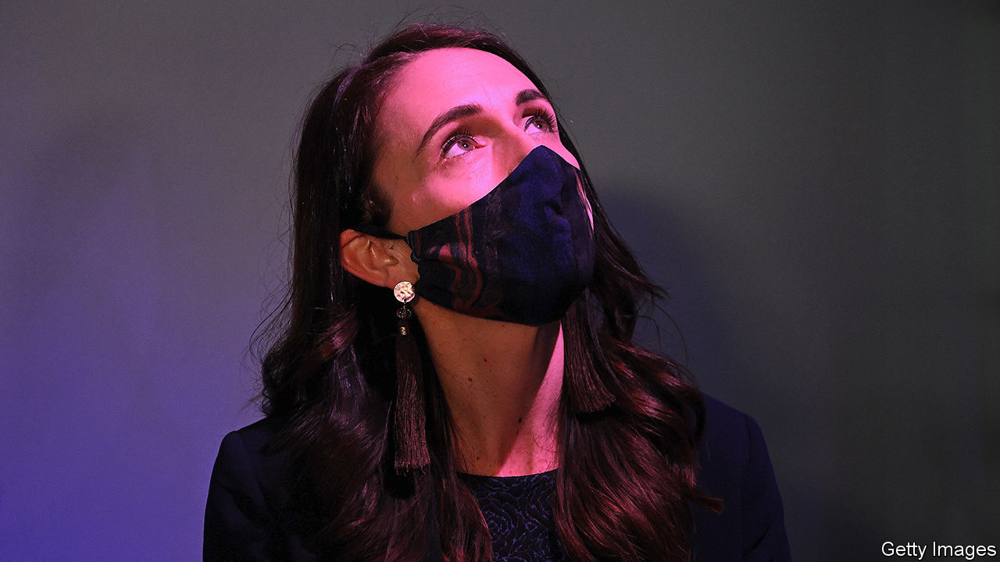

###### Jacindarella

# A fairy-tale election result beckons for New Zealand’s prime minister 

##### But the more popular she gets, the less transforming Jacinda Ardern becomes 

 

> Oct 3rd 2020 


JACINDA ARDERN’S staff ran into a problem after she declared New Zealand free of the coronavirus in June. It was impossible to keep the prime minister on schedule, they griped, because she was constantly mobbed by supporters. Patrons jumped up to applaud her when she went out for dinner. Passers-by hung out of car windows to yell their thanks. At the convention of her party, Labour, one eulogiser declared her “our nation’s saviour”.


Even after a modest resurgence of the disease, New Zealanders continued to commend Ms Ardern for averting the worst. She closed their borders to foreigners and rallied a “team of 5m” (ie, everyone in the country) to support one of the toughest lockdowns in the world. As a result, New Zealand has seen only 25 deaths from covid-19. Many voters, says Ben Thomas, a former government staffer under the opposition National Party, feel that Ms Ardern has “literally saved them”.


All this puts the prime minister on track for a big victory in an election on October 17th. The latest polls suggest that Labour may win 47% of the vote, which would give it 59 seats in the unicameral parliament. It needs 61 seats in the 120-seat chamber for an outright majority—a feat never achieved since New Zealand adopted a proportional voting system in 1996.


Either way, Ms Ardern will be in a far stronger parliamentary position than she is now. Labour actually lost the most recent election, in 2017, securing just 46 seats to National’s 56. Ms Ardern was able to form a government only with the support of New Zealand First, a populist party. Even then, she needed backing from the Greens, not formally part of the coalition.


This time around, New Zealand First is unlikely to win any seats: it is polling well below the 5% minimum needed to guarantee a seat in parliament. Ms Ardern will not be losing any sleep about that. Winston Peters, New Zealand First’s leader, has obstructed her plans on everything from stronger hate-speech laws to a capital-gains tax. If Ms Ardern falls short of a majority, she will find a more compliant coalition partner in the Greens. Together, they might form the first wholly left-wing coalition to run the country in 20 years.


What makes such a prospect all the more striking is that, before the pandemic, Ms Ardern was on track to lose the election. She came into office with lofty plans to “build a fairer, better New Zealand” by reducing child poverty, ending homelessness and erecting 100,000 cheap houses—none of which she has managed to do. She is lauded overseas for her forthright defence of immigrants after a massacre at two mosques in Christchurch in 2019, as well as for her upbeat, no-nonsense demeanour, especially regarding her pregnancy and maternity leave while in office. Many New Zealanders, however, used to grumble that she had achieved little of substance. “On almost every front, this government has been a failure,” says Oliver Hartwich of the New Zealand Initiative, a think-tank.


New Zealand’s rebuffing of covid-19 has put paid to that complaint. It helps, too, that the opposition has been in turmoil. National has churned through three leaders since May, and several of its senior MPs have resigned. Its latest boss, Judith “Crusher” Collins, is trying to look even tougher than Ms Ardern on the virus. She complains that the government allowed covid-19 back into New Zealand because it did not test officials who came into contact with returning travellers. National would guard the borders more fiercely, she says.


National typically relies on votes from people who worry about the economy, which is in recession. To pep it up, Ms Collins pledges to cut income tax temporarily, returning NZ$3,000 ($2,000) to middle-income earners. But she undermined her own credibility on the subject by releasing an “alternative budget” which was subsequently found to include accounting errors of as much as NZ$8bn (2.5% of GDP). In contrast, the finance minister, Grant Robertson, has won acclaim by spending carefully before the pandemic, and then creating a popular wage-subsidy scheme. Polling suggests that Kiwis now have more faith in Labour than National to steer the economy.


If things go well for Ms Ardern, it might follow that she would pursue a more radical agenda. Some right-wing voters shudder at the thought of what she could do if unshackled from a relatively conservative partner. Yet Labour’s policies are far less ambitious than last time round. The most contentious is a plan to increase income taxes. It applies only to people earning more than NZ$180,000—the top 2%—and even then at a rate of 39%, much lower than in many rich countries. This points to a potential conundrum. Ms Ardern positioned herself as a transforming leader. But to win enough seats to bring about sweeping change, she must secure votes from centrists who are wary of grandiose ideas. The more successful she becomes, the less radical she is likely to be. ■

