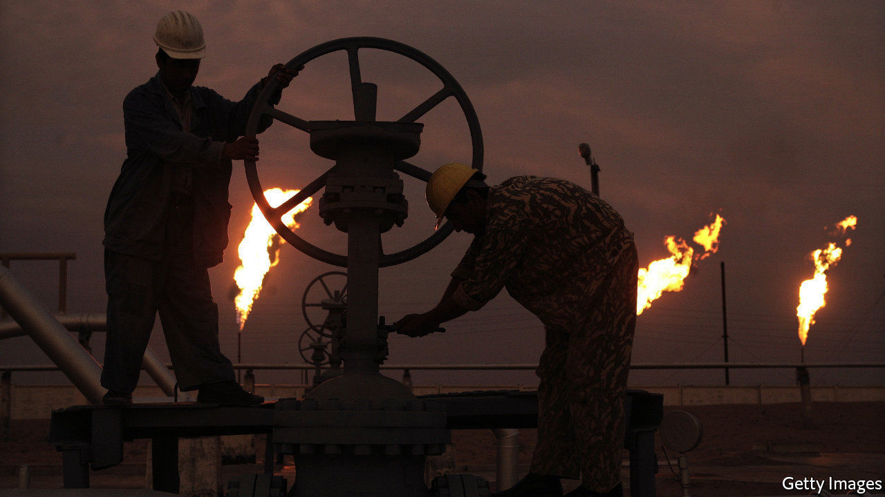

###### Colourless, odourless, buyerless

# Unable to export its natural gas, Uzbekistan tries using it itself 

##### The government plans to turn gas into petrol and plastics 

 

> Oct 3rd 2020 


UZBEKISTAN, AS ANY pub-quiz regular can attest, is doubly landlocked: landlocked itself, and surrounded by landlocked countries. That is unfortunate, given that one of its main exports, natural gas, is increasingly traded by sea. What is more, the trend to liquefy gas and ship it around the world in giant tankers has given importers much more choice about where to buy. The result has been more competition, lower prices and thus a much more difficult market for countries like Uzbekistan that export their gas the old-fashioned way, by pipeline. As if to underline the idea that exporting gas by pipeline was an unreliable way to earn a living, China cut its imports of Uzbek gas by two-thirds this year amid the coronavirus-induced economic slowdown, and Russia shut them off altogether. Those two countries sucked up 80% of Uzbekistan’s $2.3bn of gas exports last year, leaving Uzbekistan with lots of gas it has no way of selling.


The government’s solution is to consume the gas itself. Near the industrial city of Qarshi, it is pouring $3.6bn into a plant that will turn Uzbekistan’s gas into petrol and other liquid fuels, a process called gas-to-liquids. It is also encouraging the construction of factories that use gas as a feedstock to make plastics and other petrochemicals. A Chinese-owned PVC factory, for instance, opened late last year about 140km from Qarshi. The plan is to end all gas exports by 2025, even as production of gas grows.


The global market for gas is volatile, complains Ulugbek Sayidov, chairman of the state-owned company that runs the country’s pipelines: “It’s better for us to use this gas on the domestic market as opposed to exporting it.” The government reckons it can make more money by processing the gas, as well as creating jobs and attracting investment. It believes manufacturing polythene, for instance, should generate eight times the value of simply selling the gas used to make it. It wants plastic production to grow 20-fold by 2030. Gas is not the only resource the government wants to put to better use: it hopes to end the export of raw cotton this year, as well.


But gas-to-liquids, at least, is a capital-intensive technology that is usually viable only when oil prices are high, notes David Ramberg, a former academic. Only four other countries use it: Malaysia, Nigeria, Qatar and South Africa. The government, however, insists that even with the oil price at the current $40 or so a barrel, it will save $1bn a year on fuel imports. Oltin Yo’l (Golden Road), the gas-to-liquids plant, will be profitable when it opens next year, promises Bekhzot Normatov, a deputy energy minister. Even sceptics concede that its output is more valuable than unsold gas, stranded untouched below the steppe.

