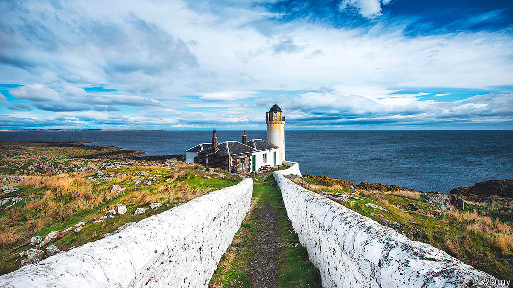

###### Water all around

# The magical allure of islands 

##### They have always been inseparable from stories, writes Gavin Francis 

 

> Oct 3rd 2020 


Island Dreams: Mapping an Obsession. By Gavin Francis.Canongate; 256 pages; $30 and £20.


AS A CHILD, Gavin Francis yearned for islands. On caravan holidays to the coast of Fife in Scotland, he was kept awake by the strobe of the lighthouse on the Isle of May (pictured). He pored over sketches of the island’s wildlife, picturing the far-flung journeys of its migrant birds. In its promise of isolation and self-fulfilment, the isle stood for the strange land of adulthood itself.


Islands are inseparable from stories. From Odysseus’s Ithaca to Prospero’s place of exile, they are way-stations for the imagination. They represent fantasies of wealth and are sites of political refuge or experiment. They have also been used to banish and maroon the ill, unwanted or unlucky. Many island communities are scarred by colonisation. Above all, Mr Francis notes, islands summon visions of separation and stillness, evoking “a sense of reverence, and an absence of distraction”. They offer a chance to breathe, and to think.


Mr Francis is a doctor as well as a writer, and for him the quiet simplicity of island living is a counterbalance to “the torrent of life through the clinic”. His meditative book tries to unpick this allure, combining as it does isolation, independence and flight.


Do not expect a straight cultural history. “Island Dreams” is stranger and richer than that. Composed of koan-like snatches of prose, it wanders between memoir and literature, steered by Mr Francis’s adventurous past and eclectic reading. It is illustrated with a gorgeous array of maps, pictures and diagrams. As with other experimental works of non-fiction such as Edmund de Waal’s “The White Road” or Maggie Nelson’s “The Argonauts”, the reader’s eye navigates the page as the text traverses the seas. At its best, Mr Francis’s writing is a catechism of desire for remote spots. Like his beloved island maps, it leaves “room for the imagination, and for dreams”.


Occasionally too much room: longer sojourns in places he has visited would sometimes have been welcome. They stretch from the South Sandwich Islands off the Antarctic coast to Moffen Island in the Svalbard archipelago, “a flat disc of shingle, the last spot before the North Pole”. His literary references range from the plight of Alexander Selkirk, the real-life inspiration for “Robinson Crusoe”, to the psychoanalyst Donald Winnicott’s theory of isolation versus insulation in childhood development. Winnicott’s notion that “the preservation of personal isolation is part of the search for identity” informs Mr Francis’s sense of the role of islands in his own life.


But his book is too subtle to baldly equate isolation and self-knowledge. Mr Francis eventually fulfilled his dream of living on the Isle of May, taking a job as a nature warden. “A condition of tolerating island life”, he realised there, “might well be the capacity to escape it.”

