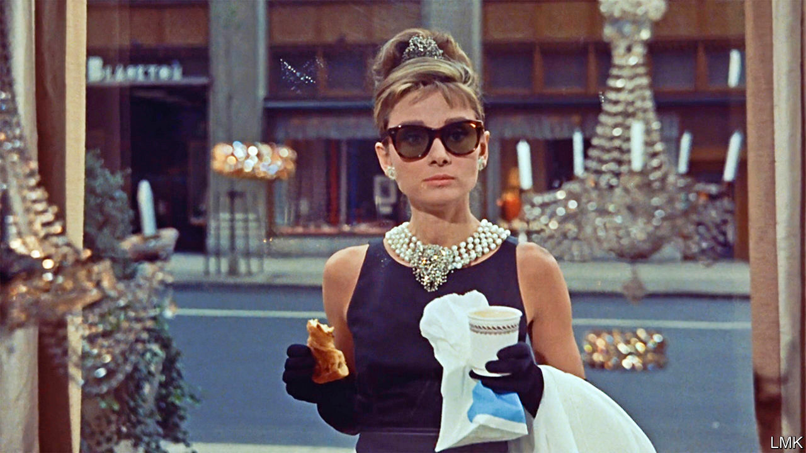

###### Letting go lightly

# Why the rocky engagement between Tiffany and LVMH might survive 

##### Investors are betting on the American jeweller’s corporate nuptials 

 

> Oct 3rd 2020 


THE MOST ardent romances result in the most acrimonious divorces. In the case of Tiffany and LVMH, rancour preceded the nuptials. In the amorous phase the French luxury giant behind Louis Vuitton had described the American purveyor of engagement rings as a corporate jewel, agreeing to a $17bn takeover ten months ago. It used an altogether less romantic tone in a Delaware court filing this week as it tried to break the match. Investors, meanwhile, are betting on a happy ending.


Rumours had swirled since the start of the covid-19 pandemic in March that Bernard Arnault, boss of LVMH, wanted to renegotiate the punchy price tag agreed on in November. On September 9th LVMH announced it could not go ahead with the deal, for an unexpected reason: a letter from the French minister of foreign affairs, Jean-Yves Le Drian, had asked it to defer the planned takeover of its American target to January 2021, beyond the agreed closing date. The delay would apparently give France more cards in a festering transatlantic trade spat.


Tiffany accused LVMH of engineering the supposed block from the foreign ministry—which soon insisted its letter was merely a polite recommendation, not an order. LVMH vehemently denied asking the authorities to intervene. Unhelpfully, on September 22nd Mr Le Drian told the French parliament he had indeed stepped in only after LVMH had come to him.


The American jeweller has thus sued LVMH to pony up. On September 28th LVMH countersued, saying that Tiffany was no longer worth buying. It called Tiffany’s performance since covid-19 broke out “catastrophic”. This, LVMH claimed, had left the jeweller with “dismal” prospects. The pandemic, it added, amounted to a “material adverse effect” that gave the putative buyer grounds for termination.


Tiffany is having none of it. It responded that LVMH was still legally committed to walk down the corporate aisle. Though covid-19 has indeed dented profits, things are already perking up, Tiffany says, whatever its erstwhile admirer may claim. LVMH was dragging its feet before the foreign ministry’s intervention, for example by delaying notifying antitrust authorities.


Delaware courts usually take a dim view of buyer’s remorse. Only once before have they agreed to a deal being broken off on grounds of material adverse effect. That might explain Tiffany’s buoyant share price. At around $116, it is well down on the $135 LVMH agreed to pay, but comfortably above the $90 at which it traded before Mr Arnault came along.


The premium suggests Tiffany remains a takeover target. Indeed, the most likely suitor is still thought to be LVMH. Most investors think the two sides will kiss and make up before a trial planned in January, perhaps arriving at a slightly lower price. There are few obvious rival buyers for the jeweller, whose brand could use some of Mr Arnault’s marketing nous. The luxury tycoon still craves legendary marques to add to the LVMH harem. Once the lawyers exhaust themselves, expect love—not least of profits—to find a way. ■

