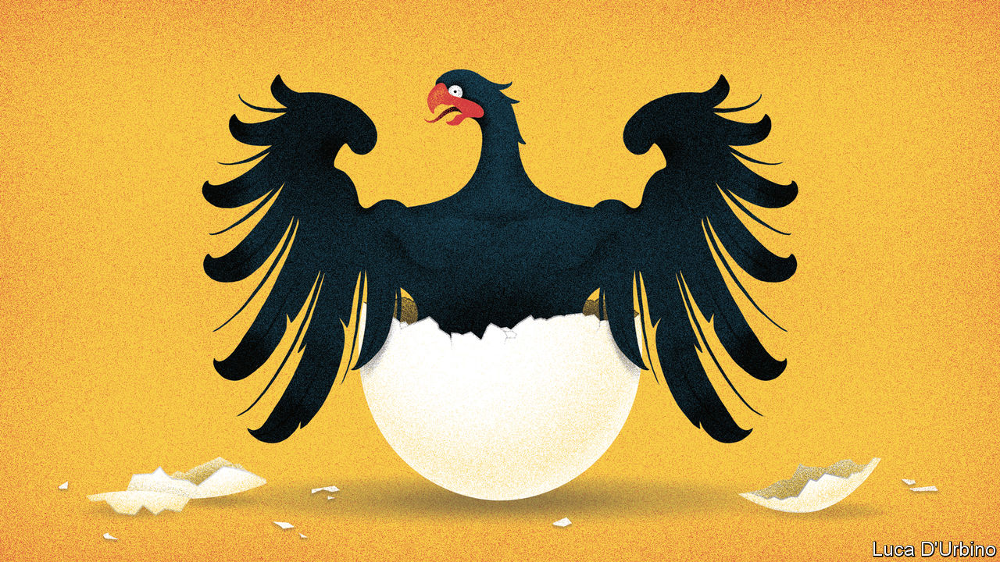

###### The sleeping giant wakes up

# Thirty years after reunification, Germany is shouldering more responsibility 

##### But it has a lot more to do 

 

> Oct 3rd 2020 


MARGARET THATCHER feared and openly opposed the reunification of East and West Germany. François Mitterrand was said to have shared her worries, though he accepted it was inevitable. Giulio Andreotti repeated a popular quip: that he loved Germany so much, he “preferred it when there were two of them”. Yet despite the reservations of the British, French and Italian leaders in 1990, a new country came into being 30 years ago on October 3rd. With 80m people, it was immediately the most populous country and mightiest economy in a Europe that until then had had four roughly equal principals. Ever since, statesmen and scholars have grappled with the problem of how to deal with the reluctant hegemon at the heart of Europe. How should Germany lead without dominating? Indeed, after the enormities of Nazism, can it be trusted to lead at all?


Thirty years on, German reunification has been a resounding success. East Germans were freed from the dull yoke of communism. With just three chancellors in three decades, the new, liberated Germany has been steady and pragmatic. It has championed the expansion of the European Union to the east and the creation of the euro. It has powered solid if unspectacular growth across a continent—at least until covid-19. Europe survived the economic crisis of 2007-08, the euro panic of 2010-12 and the migration surge of 2015-16. Germany has thrown its weight around less than sceptics feared, though indebted southern Europeans are still sore about crisis-era austerity.


Under its next chancellors, Germany needs more ambition. The need is most acute when it comes to security. Military spending is rising in Germany, but remains far below the 2% of GDP that NATO members are supposed to contribute. Even within Chancellor Angela Merkel’s Christian Democrats this is a touchy issue; it is even more so for her coalition partners, the Social Democrats, and for the Greens, who may help form the ruling coalition after next year’s election. More important, Germany has been too cautious in its policy towards Russia and China, tending to put commercial interests ahead of geopolitical ones. The construction of Nord Stream 2, a gas pipeline connecting Russia and Germany, is a case in point. It undermines the interests of Ukraine, Poland and the Baltic states, but until now Mrs Merkel has refused to cancel it, despite the outrageous behaviour of President Vladimir Putin. Nor has she listened much to those in her own party who warn that it is too risky to allow Huawei, a Chinese firm, to supply Germany with 5G telecoms equipment.


Still, there are signs of a shift. This week it emerged that Mrs Merkel had gone to visit the Russian opposition leader Alexei Navalny in hospital in Berlin, where he was recovering from being poisoned (by himself, Mr Putin claims). Huawei is to face steeper bureaucratic hurdles in Germany than previously envisaged, and Mrs Merkel is showing doubts, albeit faint, about Nord Stream 2. She increasingly accepts Emmanuel Macron’s argument that America is becoming an uncertain ally, and that Europe will have to do more to help itself no matter who wins November’s presidential election. This does not yet add up to a more assertive Germany leading a more assertive Europe, but it is a shift in the right direction.


Likewise, Germany needs to do more on the economic front. The pandemic has accomplished what the euro crisis did not, forcing the EU’s richer countries to show more solidarity with the poorer. The agreement over the summer to set up a €750bn ($880bn) recovery fund to be financed by common debt has been a crucial shift that Germany until recently would not have allowed. More than half of the fund will be given as grants rather than adding yet more debt to the highly indebted. The fund may yet be delayed; but it is a sign that Germany is at long last shouldering its responsibilities. More of this will be needed in the next 30 years if Europe’s currency union, and perhaps even the EU itself, are to survive. But the Bundesrepublik is growing up. ■

