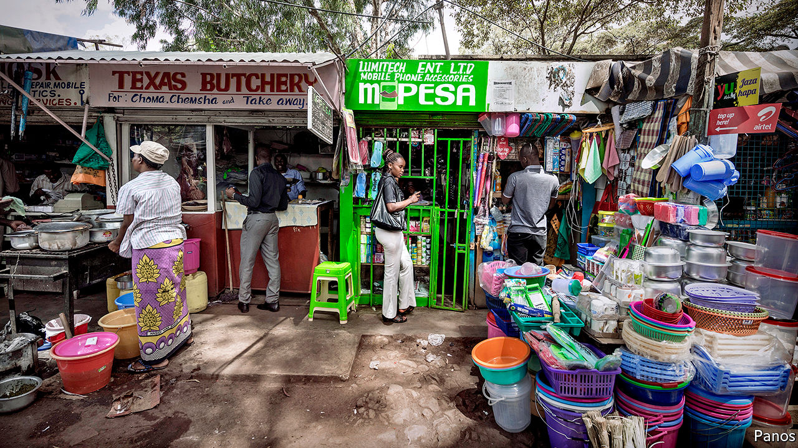

###### No contest

# How big firms rip off African consumers 

##### Competition law alone may not be enough to break their grip 

 

> Oct 3rd 2020 


KOKO MINGI VIII, king of the Nembe people, had a vigorous approach to trust-busting. In 1895 he led a pre-dawn raid on the headquarters of the Royal Niger Company, a British firm that had monopolised the palm-oil trade in the Niger delta. Koko captured 60 hostages and demanded to be allowed to trade freely. The British sent in the gunboats instead, and monopolists have had the upper hand in Nigeria ever since: the country did not enact an overarching competition law until last year.


King Koko’s trust-busting heirs have their work cut out, and not just in Nigeria. In much of Africa formal economies are dominated by large firms that rip off consumers. The IMF reckons that firm markups are about 11% larger in sub-Saharan Africa than in other developing regions, and that prices are 20% higher. The challenge for African governments is not only to make markets more efficient, but also to undo a history of economic exclusion.


Colonial economies were built around European trading firms, with licensing rules that hindered the emergence of black African capitalists. That logic was taken to extremes in South Africa, where just six conglomerates controlled 87% of the stockmarket at the end of apartheid. “The structure of our economy was designed to keep assets in a few hands,” noted Cyril Ramaphosa, the president, in his state-of-the-nation address last year. Change has been slow. An IMF working paper released in September argued that South Africa could boost annual GDP growth by 2.5 percentage points by encouraging competition.


Politics continues to stifle competition. Public contracts are not always won fairly: in 2012, for example, Zambian authorities accused two fertiliser companies of dividing up the market and rigging tenders to supply a state subsidy scheme, costing taxpayers $21m. In other cases, governments use protective regulations to cosset state firms, such as national airlines. Some 70% of all air routes to, from or within sub-Saharan Africa have only one carrier flying them, according to Cirium, a data firm. New entrants are often kept out of the skies by regulatory barriers or are unable to compete with subsidised incumbents.


Economic factors are also at work. Most African markets are too small to sustain more than a few competitors in heavy industries such as steelmaking or cement (which is much more expensive in sub-Saharan Africa than elsewhere). In emerging sectors such as telecommunications there are network effects, as consumers opt for the same service as their friends. In Kenya one mobile phone firm, Safaricom, holds 99% of the market for mobile money through its M-Pesa service.


Policymakers acknowledge the problem. Last year 31 countries in the region had competition laws, up from 12 in 2000. But many competition agencies “just exist by name” and lack the resources to do their job, says Mor Bakhoum of the Max Planck Institute for Innovation and Competition. Those in South Africa and Kenya, the regional leaders, investigate several hundred cases a year; the average agency in Africa investigates just two.

 


There is debate about what competition law should do. African countries have borrowed from European and American models, which prioritise market efficiency. But they also try to promote development and “make markets more inclusive”, says Grace Nsomba of the Centre for Competition, Regulation and Economic Development at the University of Johannesburg. South African authorities put unusual weight on public-interest criteria, such as how a merger will affect jobs or the growth of black-owned enterprises. A landmark case was the takeover in 2012 by Walmart of Massmart, a South African retailer. The deal was approved with conditions, including the reinstatement of retrenched workers and the creation of a fund to support small businesses.


Other countries also consider public-interest factors. Francis Kariuki, director-general of the Competition Authority of Kenya, says he is mindful of the country’s “economic topography” including the likely effect on small businesses, whenever he considers a merger. The authority is probing supermarkets that pay their suppliers late. And it showed flexibility during the covid-19 crisis, allowing airlines to club together for cargo flights to cope with a drop in volumes. “We didn’t need to change our laws,” says Mr Kariuki. “We just employed the public-interest criteria.”


But some lawyers worry that competition policy is being asked to do too much. In South Africa the law has become politicised, says John Oxenham of Nortons, a law firm, especially after it was amended in 2019 to increase the scope for ministerial intervention. He argues that introducing vague notions of fairness into the technical field of antitrust law makes court decisions opaque and unpredictable.


Even those who favour an activist approach recognise that competition law has its limits. “It can help prise open markets,” says Nimrod Zalk, who advises the South African government on industrial policy, but “it can’t on its own stimulate firm creation and firm development.” If small firms are to break the grip of incumbents they will need additional support and access to finance, Mr Zalk says.


There may even be a case for tolerating temporary monopolies where they reward firms that have invested in new skills and capacity. The problem arises when incumbents become entrenched. Aliko Dangote, a Nigerian tycoon, has used nous and political connections to build an industrial empire, manufacturing products locally that were once imported from abroad. But his cement business holds nearly two-thirds of the market and earns margins of 59%. Customers may grumble, but in the words of Burna Boy, a Nigerian singer, “Dangote still dey find money o.” ■

