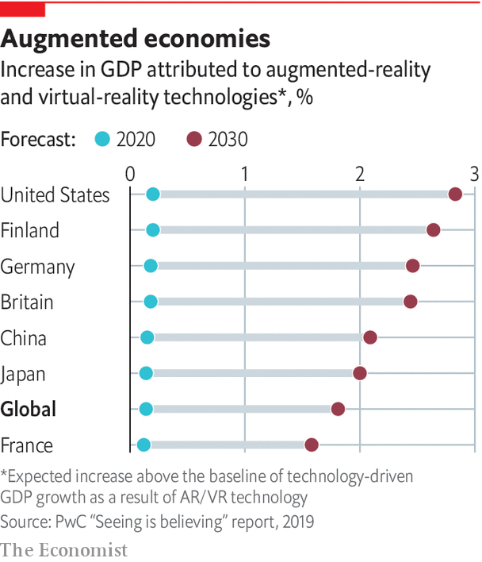
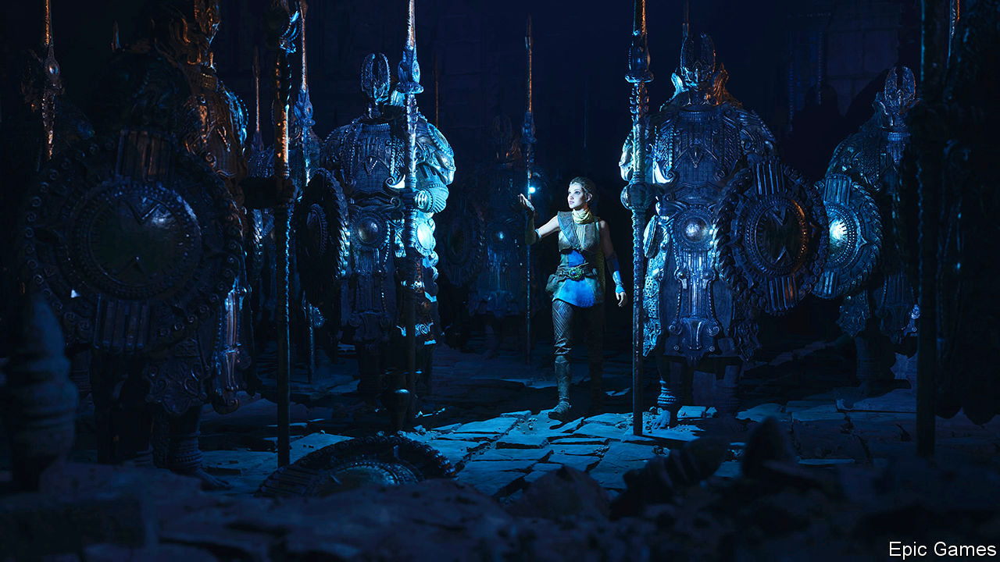

###### Virtual realities

# Computer-generated realities are becoming ubiquitous 

##### And no headset is required says Alok Jha 

 

> Oct 1st 2020 


AS OTHER MUSICIANS were settling down on their sofas during lockdown, Travis Scott was seizing the virtual moment. On April 23rd the American hip-hop star staged a concert that was attended live online by more than 12m people within the three-dimensional world of “Fortnite”, a video game better known for its cartoonish violence. As the show began, the stage exploded and Mr Scott appeared as a giant, stomping across a surreal game landscape (pictured). He subsequently turned into a neon cyborg, and then a deep-sea diver, as the world filled with water and spectators swam around his giant figure. It was, in every sense, a truly immersive experience. Mr Scott’s performance took place in a world, of sorts—not merely on a screen.


Meanwhile, as other betrothed couples lamented the cancellation of their nuptials, Sharmin Asha and Nazmul Ahmed moved their wedding from a hip Brooklyn venue into the colourful world of “Animal Crossing: New Horizons”, a video game set on a tropical island in which people normally spend their time gardening or fishing. The couple, and a handful of friends, took part in a torchlit beachside ceremony. Mr Ahmed wore an in-game recreation of the suit he had bought for the wedding. Since then many other weddings, birthday parties and baby showers have been celebrated within the game.


Alternative venues for graduation ceremonies, many of which were cancelled this year amid the pandemic, have been the virtual worlds of “Roblox” and “Minecraft”, two popular games that are, in effect, digital construction sets. Students at the University of California, Berkeley, recreated their campus within the game to stage the event, which included speeches from the chancellor and vice-chancellor of the university, and ended with graduates tossing their virtual hats into the air.


People unversed in hip-hop or video games have been spending more time congregating in more minimal online environments, through endless work meetings on Zoom or family chats on FaceTime—ways of linking up people virtually that were unthinkable 25 years ago. These many not seem anything like virtual realities—but they are online spaces for interaction and the foundations around which more ambitious structures can be built. “Together” mode, an addition to Teams, Microsoft’s video-calling and collaboration system, displays all the participants in a call together in a virtual space, rather than the usual grid of boxes, changing the social dynamic by showing participants as members of a cohesive group. With virtual backgrounds, break-out rooms, collaboration tools and software that transforms how people look, video-calling platforms are becoming places to get things done.


Though all these technologies existed well before the pandemic, their widespread adoption has been “accelerated in a way that only a crisis could achieve,” says Matthew Ball, a Silicon Valley media analyst (and occasional contributor to The Economist). “You don’t go back from that.”


This is a remarkable shift. For decades, proponents of virtual reality (VR) have been experimenting with strange-looking, expensive headsets that fill the wearer’s field of view with computer-generated imagery. Access to virtual worlds via a headset has long been depicted in books, such as “Ready Player One” by Ernest Cline and “Snow Crash” by Neal Stephenson, as well as in films. Mark Zuckerberg, Facebook’s boss, who spent more than $2bn to acquire Oculus, a VR startup, in 2014, has said that, as the technology gets cheaper and more capable, this will be “the next platform” for computing after the smartphone.


But the headset turns out to be optional. Computer-generated realities are already everywhere, not just in obvious places like video games or property websites that offer virtual tours to prospective buyers. They appear behind the scenes in television and film production, simulating detailed worlds for business and training purposes, and teaching autonomous cars how to drive. In sport the line between real and virtual worlds is blurring as graphics are super-imposed on television coverage of sporting events on the one hand, and professional athletes and drivers compete in virtual contests on the other. Virtual worlds have become part of people’s lives, whether they realise it or not.

Enter the Metaverse


This is not to say that headsets do not help. Put on one of the best and the immersive experience is extraordinary. Top-of-the-range headsets completely replace the wearer’s field of vision with a computer-generated world, using tiny screens in front of each eye. Sensors in the goggles detect head movements, and the imagery is adjusted accordingly, providing the illusion of being immersed in another world. More advanced systems can monitor the position of the headset, not just its orientation, within a small area. Such “room-scale VR” maintains the illusion even as the wearer moves or crouches down.


Tech firms large and small have also been working on “augmented reality” (AR) headsets that superimpose computer-generated imagery onto the real world—a more difficult trick than fully immersive VR, because it requires fancy optics in the headset to mix the real and the virtual. AR systems must also take into account the positions and shapes of objects in the real world, so that the resulting combination is convincing, and virtual objects sitting on surfaces, or floating in the air, stay put and do not jump around as the wearer moves. When virtual objects are able to interact with real environments, the result is sometimes known as mixed reality (XR).


Despite several false dawns, there are now signs that, for some industries, these technologies could at last be reaching the right price and capability to be useful. A report in 2019 by PWC, a consultancy, predicts that VR and AR have the potential to add $1.5trn to the world economy by 2030, by spurring productivity gains in areas including health care, engineering, product development, logistics, retail and entertainment.

 


Because the display of information is no longer confined by the size of a physical screen on a desktop or a mobile device, but can fill the entire field of vision, the use of VR and AR “creates a new and even more intuitive way to interact with a computer,” notes Goldman Sachs, a bank, which expects the market for such technology to be worth $95bn by 2025. And these predictions were made before the pandemicinduced surge of interest in doing things in virtual environments.


Progress in developing virtual realities is being driven by hardware from the smartphone industry and software from the video-games industry. Modern smartphones, with their vivid colour screens and motion sensors, contain everything needed for VR: indeed, a phone slotted into a cardboard viewer with a couple of lenses can serve as a rudimentary VR headset. Dedicated systems use more advanced motion sensors, but can otherwise use many of the same components. Smartphones can also deliver a hand-held form of AR, overlaying graphics and virtual items on images from the phone’s camera.


The most famous example of this is “Pokémon Go”, a game that involves catching virtual monsters hidden around the real world. Other smartphone AR apps can identify passing aircraft by attaching labels to them, or provide walking directions by superimposing floating arrows on a street view. And AR “filters” that change the way people look, from adding make-up to more radical transformations, are popular on social-media platforms such as Snapchat and Instagram.


On the software front, VR has benefited from a change in the way video games are built. Games no longer involve pixelated monsters moving on two-dimensional grids, but are sophisticated simulations of the real world, or at least some version of it. Millions of lines of code turn the player’s button-presses into cinematic imagery on screen. The software that does this—known as a “game engine”—manages the rules and logic of the virtual world. It keeps characters from walking through walls or falling through floors, makes water flow in a natural way and ensures that interactions between objects occur realistically and according to the laws of physics. The game engine also renders the graphics, taking into account lighting, shadows, and the textures and reflectivity of different objects in the scene. And for multiplayer games, it handles interactions with other players around the world.

 


In the early days of the video-games industry, programmers would generally create a new engine every time they built a new game. That link was decisively broken in 1996 when id Software, based in Texas, released a first-person-shooter game called “Quake”. Set in a gothic, 3D world, it challenged players to navigate a maze-like environment while fighting monsters. Crucially, players could use the underlying Quake Engine to build new levels, weapons and challenges within the game to play with friends. The engine was also licensed to other developers, who used it to build entirely new games.


Using an existing game engine to handle the job of simulating a virtual world allowed game developers, large and small, to focus instead on the creative elements of game design, such as narrative, characters, assets and overall look. This is, of course, a familiar division of labour in other creative industries. Studios do not design their own cameras, lights or editing software when making their movies. They buy equipment and focus their energies instead on the creative side of their work: telling entertaining stories.


Once games and their engines had been separated, others beyond the gaming world realised that they, too, could use engines to build interactive 3D experiences. It was a perfect fit for those who wanted to build experiences in virtual or augmented reality. Game engines were “absolutely indispensable” to the growth of virtual worlds in other fields, says Bob Stone of the University of Birmingham in England. “The gaming community really changed the tide of fortune for the virtual-reality community.”


Two game engines in particular emerged as the dominant platforms: Unity, made by Unity Technologies, based in San Francisco, and Unreal Engine, made by Epic Games, based in Cary, North Carolina. Unity says its engine powers 60% of the world’s VR and AR experiences. Unreal Engine underpins games including “Gears of War”, “Mass Effect” and “BioShock”. Epic also uses it to make games of its own, most famously “Fortnite”, now one of the most popular and profitable games in the world, as well as the venue for elaborate online events like that staged in conjunction with Mr Scott.


Epic’s boss, Tim Sweeney, forecast in 2015 that there would be convergence between different creative fields as they all adopted similar tools. The ability to create photorealistic 3D objects in virtual worlds is not just attractive to game designers, but also to industrial designers, architects and film-makers, not to mention hip-hop stars. Game engines, Mr Sweeney predicted, would be the common language powering the graphics and simulations across all those previously separate professional and consumer worlds.


That is now happening, as the tools of virtual-world-building spread into many areas. This Technology Quarterly will explore where computer-generated realities are already starting to make an impact—work, entertainment and health are all seeing changes—and where the technology is heading.


Building a complex, immersive, virtual social space, like the “Metaverse” depicted in “Snow Crash” is the goal for many serious minds in technology today. Mr Sweeney sees the Metaverse, or something like it, as the next iteration of the web, where people can go to work, play games, shop or just pass the time.


Similarly, Mr Ball reckons game engines will become a base layer for digital 3D worlds, a standard upon which new industries will be built. Rather than predict specific future results of this standardisation, he cites the introduction of railways as a way to think about the many opportunities that lie ahead. “What happens when you layer the country with railroad infrastructure?” he asks. “What happens when you massively drop the friction to experimentation and creation?” When it comes to virtual worlds, that is now a very real question. ■

