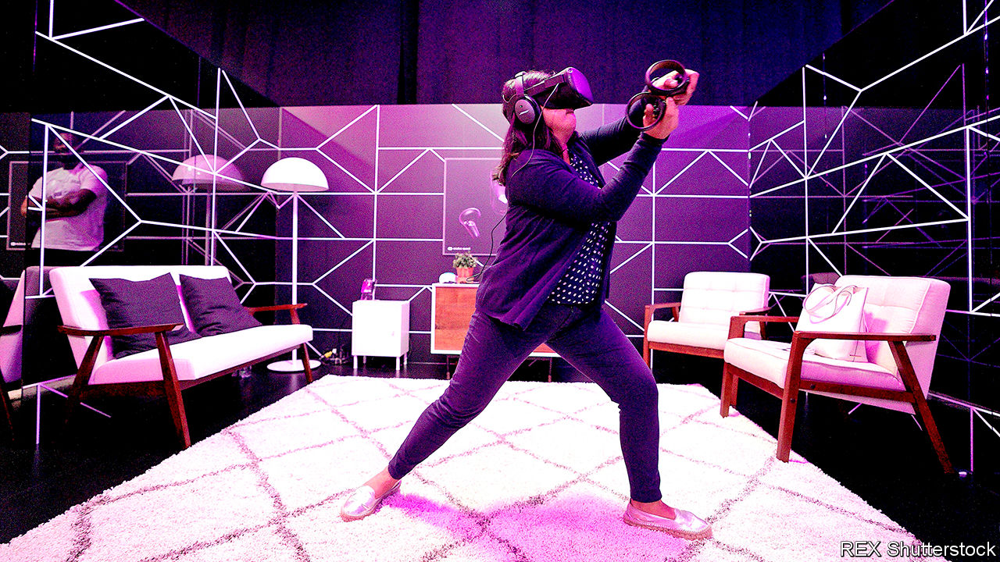
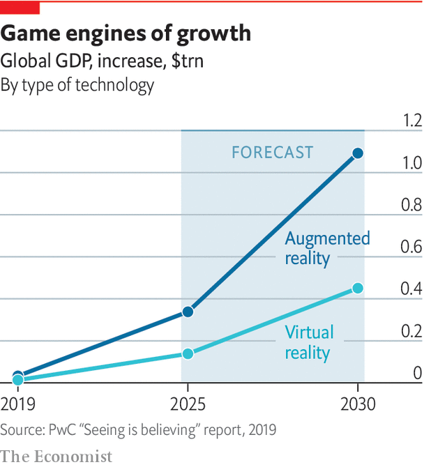

###### Hardware

# Headset technology is cheaper and better than ever 

##### But it has yet to go mainstream 

 

> Oct 1st 2020 


THE CUBES fly towards your correspondent slowly at first, then quickly gather pace as the music speeds up. On his head he wears a chunky set of goggles. In each hand, he holds an imaginary laser sword that can chop the cubes in half before they reach his body. Each cube is marked with an arrow (designating the direction in which it must be sliced) and a colour (for which hand has to do the slicing—blue for right, red for left). The more vigorously the cubes are sliced in time with the music, the more points are scored. Horizontal and vertical barriers, mixed in with the cubes, must be avoided at all costs. A few minutes of swinging the imaginary swords around is tiring but oddly diverting. The simulation breaks down only when your correspondent gets too energetic with his jabs and crashes into a nearby (non-virtual) bookshelf.


Welcome to “Beat Saber”, one of the most popular games available on the Oculus Quest, a virtual-reality headset. Though it is possible to experience and explore virtual worlds without having to put on a headset, doing so provides a new level of immersion, as screens in front of each eye, and sensors that map the movement of the wearer’s head, create the illusion of being inside a 3D environment. It is magical—but the awkwardness and cost of VR headsets is the main reason why there has always been a gulf between the promise of VR and the reality.


Every few years a new headset comes along that is hailed as the device that will finally bring VR into widespread use. The Oculus Quest headsets, the first of which was launched in 2019 at $399, are the latest. Compared with previous headsets it is cheap and light and can detect the position of the wearer’s head, not just its orientation. It is an impressive piece of kit, but has not broken through with consumers. Facebook, which paid more than $2bn for Oculus in 2014, has just announced a cheaper and more powerful version.


The VR headset, also known as a head-mounted display (HMD), traces its origins to a device called the Sword of Damocles. Developed in 1968 by Ivan Sutherland and Bob Sproull, two computer scientists who were working at the time at Harvard University, it consisted of a pair of cathode-ray tubes, one for each eye, that were updated with images at 30 times per second. Users could move within a six-foot square and had a 40-degree field of view while wearing the headset, which was so heavy that it had to be suspended from the ceiling, like the mythical sword. Mechanical and ultrasonic sensors detected the position and orientation of the user’s head in space. The cathode-ray tubes could display simple wireframe graphics, and could also superimpose them on real-time video of the wearer’s surroundings.

 


HMDs have been steadily decreasing in weight and improving in capability since the 1970s, and have been available commercially since the 1980s. “There are people that have worked in the VR industry now for almost 40 years,” says Anthony Steed of University College London. But the technology has still not moved far beyond academic labs and bespoke uses in training, engineering and design. When Dr Steed entered the field in the 1990s a breakthrough seemed imminent, at least as far as the media were concerned: “It was on front pages of national newspapers”. When the breakthrough did not come, Dr Steed says, the public concluded that the technology was terrible. “And to some extent it was,” he admits, but “it was just way ahead of its time.”

Goggles box


Industrial early-adopters kept plugging along. Jaguar Land Rover used VR in the early 2000s to test and iterate the designs of its upcoming vehicles. Rather than using HMDs, though, its system required users to enter an immersive virtual environment in a small room whose walls and ceilings had high-definition, stereo displays. The technology, based on an idea known as the Cave Automatic Virtual Environment (CAVE), allows several people to share the same virtual experience. The displays rapidly show a pair of images, one for the right eye and another for the left. By wearing glasses that are synchronised with the displays, so that each eye sees only the image meant for it, users in the CAVE see three-dimensional objects apparently floating in the centre of the room.


This form of VR was very expensive to set up, and needed a dozen or more computers to drive the images on the walls. But it helped designers and engineers share ideas for the interior spaces of their vehicles, observe ergonomics (how easy was it for the driver to reach for controls, for example, or interact with other passengers?), and judge the lines of sight out of the vehicle. In any engineering task where people need to share complicated 3D ideas with others, says Dr Steed, it can help to have a VR visualisation. But the cost was prohibitive except in rare situations.


Bob Stone, a 33-year veteran of academic and industry VR at the University of Birmingham in England, has also been through multiple cycles of hype around the technology. “I hope and pray after all these years, we’re on the cusp of something that’s really going to make a difference,” he says. In 1992 he built a virtual model of a Rolls-Royce jet engine that users could explore using a VR headset. “To do that jet engine, we had to have a piece of software that cost £75,000 ($132,000 at the time) and required at least £5,000 a year on maintenance, and we were running it on a million-pound Silicon Graphics supercomputer,” he recalls.


In the past decade, smartphones and video games have made the hardware and software needed for VR much more cheaply and widely available. A crucial moment a few years ago was when consumer devices became capable of generating real-time graphics quickly enough to create a realistic sense of immersion, says Dr Steed. In the 1990s a VR headset in Britain cost around £6,500 (roughly $10,700 at the time) the system to track the wearer’s position cost another £5,000, and VR gloves could cost up to £13,000. The latest generation of VR headsets have been able to take advantage of powerful processors, vivid colour screens, cameras and sensors borrowed from the smartphone industry, while game engines have made virtual environments and their contents much easier to construct.


Today consumer headsets range in price from $400 to $1,200, and the VR systems Dr Stone builds, for use in research and education, are driven by laptops that cost less than $1,200. In some cases his students have built VR systems in a few months, with no prior experience of the technology. “They’ve been producing all kinds of fantastic demonstrations, industrial demonstrations, health care, you name it,” he says. “And that really is testament to the way in which these toolkits have matured.”


A sense of immersion depends on more than just fancy graphics. Another crucial factor is latency—the time delay between a user’s head movement and the images shown on the headset’s screens being updated accordingly. In the 1990s the latency was often as high as 150 milliseconds. Today, even consumer headsets have latency of less than 20 milliseconds, thanks to faster chips and improved sensors. That makes movements more natural and less likely to cause motion sickness (thought to be caused by a discrepancy between what the user sees and expects to see).


Even as consumer-grade VR headsets such as the Oculus Quest, HTC Vive and Sony PlayStation VR are improving in quality and falling in cost, a problem remains: a lack of content for them. The big video-games studios have been reluctant to invest in VR titles because, they argue, there are not enough headset owners to justify it. Consumers, in turn, are reticent to buy technology that has no associated games. Things may be starting to shift. A spokesperson for Oculus says that more than 20 of the titles in its store have now generated more than $1m. “Beat Saber” has surpassed 2m sales across various VR devices and now has a new version, “Fitbeat”, to take advantage of the growing interest in fitness. Another big hope in the gaming world is the recent release of “Half-Life: Alyx” by Valve, a new entry in a popular franchise, that has been made specifically for VR headsets.


“We are in a really nice place now, a place where VR is developing nicely, with ecosystems forming, with successful VR headsets emerging,” says George Jijiashvili, an analyst at Omdia, a research outfit. But, he adds, “it will take time for this to become a mass market opportunity”. He predicts there could be around 55m users with the latest VR headsets by the end of 2024, up from around 13m at the end of 2019. That is a big jump, but is still just a niche market.

The eyes have it


As consumer headsets have improved, the fancier models used in industry show where the technology is going next. Varjo, a Finnish company, makes high-end headsets that claim to have “human-eye resolution”. Most VR headsets use the same kinds of screens found in smartphones, with a typical resolution of 500 pixels per inch (pixels are the coloured picture elements that make up the image). When such screens are placed close to the eye, individual pixels can be easily discerned. Varjo’s headsets have an extra set of high-resolution screens, with a resolution of 3,000 pixels per inch, to cover the centre of each eye’s field of view, where most detail is perceived. Specialist optics combine the images from both sets of screens. The result is that images look much sharper.


Varjo’s founder, Niko Eiden, says this makes it possible to examine fine details in the virtual environment, such as text labels, dials and buttons in a car interior or a flight simulator (Boeing uses the VR-2 when training astronauts to operate its Starliner spacecraft). The headset also has a gaze tracker, so instructors can monitor whether or not the wearer has been looking in the right places during training. But it does not come cheap: it costs €5,995 and is intended for business and academic use, not gaming.


And then there are the augmented-reality or mixed-reality headsets, which overlay virtual imagery onto the real world, a trick pioneered by the Sword of Damocles. One way to do this is to place cameras on the front of a VR headset, and then augment their real-time video with extra graphics. But nobody wants to wear a VR headset in public, and true believers in AR imagine a lightweight headset, like a pair of glasses, that overlays information and graphics on the wearer’s field of vision, so that virtual objects are realistically blended into the real world.


One company pursuing this vision is Magic Leap, a secretive startup based in Florida whose backers include Google, AT&amp;T and NTT DoCoMo. In 2018, after years of speculation and rumour, it finally released a headset, resembling a pumped-up set of sunglasses, which cost $2,295. But its capabilities fell short of the grand claims that had been made about it, and only a few thousand units were sold, according to The Information, a tech-industry news site. A less ambitious but more successful approach to AR is that taken by Microsoft’s HoloLens 2, a $3,500 device that resembles a chunky set of skiing goggles, and is considered the most capable AR headset on the market. Researchers use it in fields from military simulation and medical training to education and gaming. But its high cost and limited field of view suggest that AR headsets with broad appeal to consumers are still a distant prospect. ■

