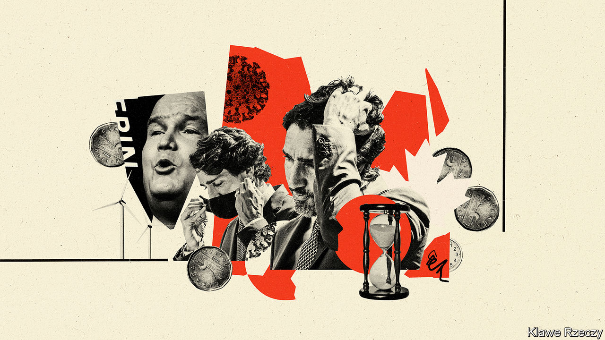

###### Justin’s timing

# Life is about to get harder for Canada’s minority government 

##### The prime minister, Justin Trudeau, may be contemplating an early election 

 

> Oct 3rd 2020 


JUSTIN TRUDEAU, Canada’s prime minister, can be sure of passing the next test he faces. This month Parliament will hold a vote of confidence in his government. Although his Liberal Party is in a minority and Mr Trudeau has been weakened by scandal, the left-leaning New Democratic Party (NDP) will back the government. The prime minister has promised enough to families and businesses hurt by recession to keep the legislature’s fourth-largest party from voting against him.


After that, things will get harder. The Conservative Party picked a new leader on August 23rd: Erin O’Toole, a former air-force helicopter navigator and minister of veterans’ affairs. He will give new energy to the parliamentary opposition. Seven of the ten provincial premiers belong to his party or lean towards it. They are at odds with Mr Trudeau over spending priorities, the environment and the role the federal government plays in provincial affairs. The NDP will push for more concessions from the prime minister, for example higher taxes on the rich. He may be preparing for a national election as early as spring 2021 in which he will hope to win a majority.


The speech from the throne outlining the government’s plans, delivered on September 23rd by the governor-general, Julie Payette, was a programme for muddling through the pandemic and winning an election. It ignored or barely mentioned Mr Trudeau’s boldest ideas, such as a universal basic income and extending unemployment insurance to the gig economy.


Even so, his plans are expensive. With reported cases of covid-19 spiking since August, Ms Payette said that the government would spend “whatever it takes” to support workers and businesses. It wants to create a million new jobs, train more workers, set standards for care homes (where 80% of deaths from covid-19 have taken place), develop an early-learning and child-care programme and launch a scheme to help people pay for drug prescriptions.


The government has said nothing about how much this will cost. It has yet to present a budget for the current fiscal year, which ends in March. Chrystia Freeland, the finance minister, has promised a bare-bones “fiscal update” before January. The parliamentary budget office (PBO) expects this year’s deficit to reach C$330bn ($250bn), or 15% of GDP. Public debt will rise by 17 percentage points to 48% of GDP.


While the pandemic rages, the government will not encounter much resistance. On September 30th Parliament unanimously passed legislation to give more aid to workers. Mr O’Toole warns that “there is not an unlimited pot of ever-increasing deficit spending” but is not calling for immediate cuts. It helps that much of the current rise in spending is temporary. The PBO expects the deficit to drop to C$40bn by 2024-25. Mr O’Toole proposes to eliminate it within a decade of taking office.


The battles will be about issues beyond economic life support. Mr Trudeau will face opposition “in a host of ways from virtually all the provincial premiers”, says Graham Fox, president of the Institute for Research on Public Policy, a think-tank in Montreal. Most of what the prime minister proposes in such areas as child care and job training are mainly provincial responsibilities. Provinces are eager for more federal money—they want the government to raise its contribution to health-care spending to 35% of the total from 22%, for example—but not for more federal influence over how it is spent. The throne speech ignored such demands.


The government promised to end net emissions of greenhouse gases by 2050. Jason Kenney, Alberta’s Conservative premier, complains that it is doing too little to support the oil and gas industry, on which the province depends. These tensions will worsen, warns Mr Fox, unless the federal government co-operates more closely with the premiers than it has done until now.


Shaping the protagonists’ plans is the knowledge that the average lifespan of minority governments is two years. Mr Trudeau’s is about to celebrate its first birthday. Its ageing process was delayed by the pandemic. Senescence resumed over the summer, with revelations that the families of Mr Trudeau and the then-finance minister, Bill Morneau, had taken benefits from a charity that got government contracts (Mr Morneau resigned in August). It may speed up if the economy worsens. Although growth bounced back during the summer, a second wave of covid-19 and a tapering off of fiscal stimulus in the United States could end the recovery, warns Douglas Porter, the chief economist of BMO, a bank.


As he contemplates when to call a new election, Mr Trudeau will watch closely the fate of the NDP-led minority government in the western province of British Columbia. Its premier, John Horgan, triggered an election a year early, on October 24th, after saying he would not. Like Mr Trudeau, he prepared the way by boosting spending. If Mr Horgan wins a majority, that may embolden Mr Trudeau to gamble on an election sooner rather than later. Until then, he will have to check his ambitions.■

