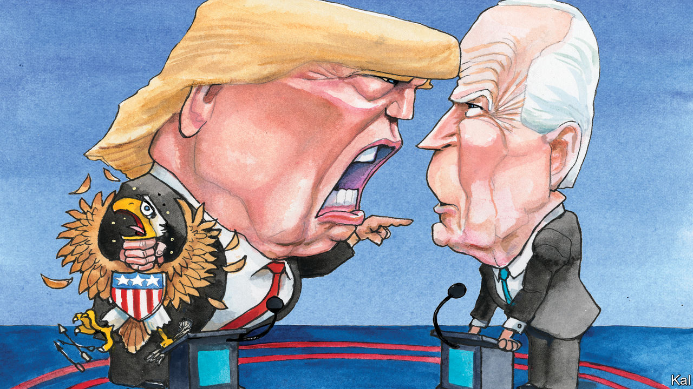

###### Lexington

# The end of the debate 

##### The president turns a globally respected American institution into a national embarrassment 

 

> Sep 30th 2020 


AMONG THE institutions Donald Trump has attacked in the past three and a half years, the televised presidential debate might not seem much. It does not guarantee the rule of law, protect the environment or defend the homeland. It has hardly ever been electorally significant. Maybe only the first televised duel, which pitted a sweaty, shady looking Richard Nixon against a youthful, make-up wearing John Kennedy in 1960, materially affected a race. Yet at a time when some of the most basic assumptions about American democracy are being challenged by Mr Trump’s scorched-earth presidency, as he illustrated with a debate performance of stunning brutishness in Cleveland on September 29th, the merits of the format are worth recalling.


Before this week they were threefold. The president, setting aside the exalted status and electoral advantages of incumbency, must submit to the same pre-agreed rules as his challenger. (No president since Nixon, following his humiliation in 1960, has ducked the format.) Second—and notwithstanding a mountain of evidence that most people do not vote on the basis of such things—debates affirm the importance of plans and ideas. This projects a degree of seriousness that is otherwise largely absent from most political coverage.


The candidates’ competing proposals also underline the degree to which elections are a choice. And because they are essentially making their pitches to a vast television audience, the debates also underline how that the choice falls to ordinary Americans. Boosted by a paucity of campaigning because of covid-19, the 90-minute, ad-free event in Cleveland was watched by an estimated 80m, over half the electorate. Millions more watched around the world—which speaks to a third quality of the presidential debate.


Combining democracy and mass culture, the format is archetypally American, yet has proved to be highly exportable. Even more people likely watch their own pre-election debates abroad—including, with encouragement from America’s non-partisan Commission on Presidential Debates, in fledgling African and Eastern European democracies—than tune in to America’s. These are not trivial accomplishments. Setting aside many moments of dullness and inanity, the four-yearly televised event is an enactment of American democracy and an advertisement for it of which Americans should be proud. But they can forget that for now.


Debating Hillary Clinton in 2016, Mr Trump strained the rules to the limit; he interrupted and physically intimidated his opponent (and promised to jail her). In Cleveland he largely ignored them. He interrupted, contradicted and traduced Joe Biden, and sometimes also the moderator, Chris Wallace of Fox News. He cavilled and scowled; he huffed and he ranted. The ferocity of his claimed grievances was formidable. It was also ludicrous. It might once even have seemed comical, were he not America’s president.


His criticisms of his Democratic rival were familiar, mostly or wholly inaccurate, and often contradictory. He accused Mr Biden of being so tough on crime that he had alienated African-Americans and so weak on it that he refused even to utter the phrase “law and order”. He accused him of being so enslaved to the left that he was pushing the left-wing policies, such as Medicare for All and the Green New Deal, that belonged to the Democratic rivals he trounced in his party’s primaries. When Mr Biden pushed back, Mr Trump crowed that he had “just lost the left”.


But many of his attacks were more personal. He suggested Mr Biden was unintelligent and levelled unsubstantiated corruption allegations at his surviving son. At times Mr Biden responded in intemperate kind—he called the president a racist, a liar, a clown and enjoined him: “Will you shut up, man?” But this was not a two-way fight. Mr Biden’s rehearsed chuckling forbearance was more striking in the moment than his insults. And Mr Wallace’s increasingly desperate remonstrations were almost exclusively aimed at the president.


Mr Biden also tried to lay out the traditional policy case, including, by his flubby standards, with some half-decent answers on policing and climate-change policy. For his part, Mr Trump made a handful of disjointed, mostly defensive, claims for his administration’s achievements: on the subject of insulin pricing, for example, he said “I’m getting it for so cheap it’s like water.” But he did not describe any policy or future plan wholly or in detail.


Was there a strategy to this beyond his usual refusal to be constrained by rules and need to dominate? Maybe not; those urges explain most of what Mr Trump does. But the strategic implications of his thuggery look no less dire for being, in all likelihood, unplanned. Ahead of an election he appears on course to lose, he is telling his supporters that Democrats are not merely hostile opponents but somehow illegitimate. He also repeated in Cleveland his unfounded claim that the election will “be a fraud like you’ve never seen”. Asked to condemn the violent white supremacists who have already taken to the streets on his behalf, in Oregon and elsewhere, he failed to do so. None of this seemed likely to help his electoral prospects. It is the kind of behaviour that has turned a small majority of Americans against him. And yet over 40% are still with him to the hilt.

Flashing red


In “How Democracies Die”, published early in Mr Trump’s tenure, two Harvard scholars, Steven Levitsky and Daniel Ziblatt, described a slippery slope that starts with a trampling of democratic norms—thereby ending the degree of mutual trust between rivals that democracy requires—and proceeds through damage to institutions, especially those related to elections, to lawlessness and extremism. It is always possible to underestimate the shock absorbers in America’s vigorous, multi-tiered system. Yet at the federal level, it must be admitted, many of the warning lights they described are already flashing.■


Dig deeper:

Read the  and explore our , then sign up for Checks and Balance, our  and  on American politics.

