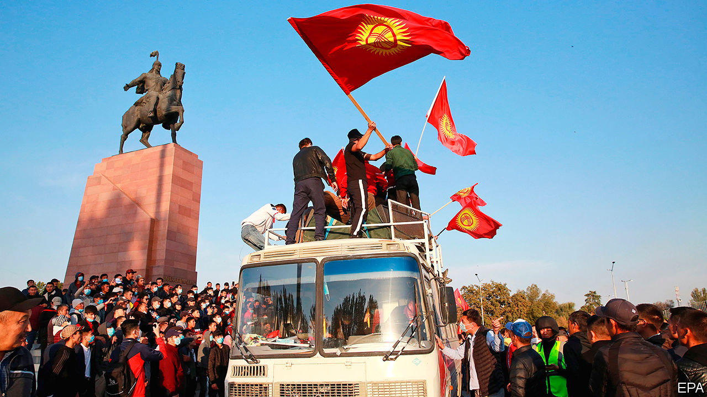

###### Take three

# Angry Kyrgyz rebel against a tainted election—for the third time 

##### The president has offered to annul the results, but protesters want him to step down 

 

> Oct 7th 2020 


ONE THING is clear: the people of Kyrgyzstan are not keen on tainted elections. This week, for the third time in 15 years, they rose up in rebellion following a vote widely seen as crooked. Adakhan Madumarov, an opposition leader, describes the parliamentary poll on October 4th as the dirtiest in Kyrgyzstan’s turbulent three decades of independence. On October 5th thousands poured onto the main square of Bishkek, the capital, in protest. That night demonstrators battled riot police before storming the building housing the president’s office and parliament. They were shouting a revolutionary slogan popularised in previous uprisings but now directed at the current president, Sooronbay Jeyenbekov: “Ketsin!” (“Go!”)


Mr Jeyenbekov insists he remains in control, but his whereabouts are unknown. He has dismissed complaints about the elections as a “pretext” to attempt his overthrow. Yet he has also acquiesced to at least one of the protesters’ demands: electoral officials have annulled the results of the election and promised a re-run. It is not clear that this will satisfy the angry mob in Bishkek, however, which has freed several politicians who had landed in jail in recent years, including Almazbek Atambayev, Mr Jeyenbekov’s predecessor. Some outgoing MPs are trying to impeach Mr Jeyenbekov and the prime minister, Kubatbek Boronov, has resigned.


Kyrgyzstan has held several competitive elections—an oddity in Central Asia, where crushing landslides for autocratic rulers are the norm (see ). As he cast his ballot this week, Mr Jeyenbekov doggedly insisted the election was “open and fair”. Videos circulating on social media, however, showed voters being brought by minibus to polling places, where they handed photos of the ballots they had cast to men with clipboards. At the very least, there was rampant vote-buying ($25 was the going rate). The preliminary results announced on October 5th would have left only five of the 16 parties participating with any seats in parliament. Two parties loyal to the president won a big majority: Birimdik (Unity), which Mr Jeyenbekov tacitly backed, and Mekenim Kyrgyzstan (My Homeland Kyrgyzstan), which has ties to Raimbek Matraimov, a wealthy former customs official. Last year corruption-busting journalists accused Mr Matraimov of complicity in a multibillion-dollar smuggling ring. The main source behind the exposé was murdered in a gangland-style killing. Mr Matraimov has denied the allegations and was not charged with any crimes.


The opposition parties are already failing to find common cause, with bickering between rival factions sometimes descending into fisticuffs. The threat of violence hangs in the air, as politicians sprung from jail and other influential figures (including some with rumoured connections to organised crime) jostle to fill the vacuum. A comeback by Mr Atambayev, who presided over flourishing corruption and a degradation of democracy that has continued under Mr Jeyenbekov, would prove unpopular in many quarters.


Two rivals are already laying claim to the job of prime minister: Tilek Toktogaziyev, a youthful entrepreneur, and Sadyr Japarov, a rabble-rousing nationalist ex-MP released by the protesters from jail, where he had been sent for kidnapping an official during a previous bout of political turmoil. China, which is alarmed at reports that the protesters are targeting Chinese-owned gold mines, has expressed concern. So has Russia, which has a military base in Kyrgyzstan and is hostile to popular uprisings in what it still sees as its backyard, particularly given the sustained protests against authoritarian rule in Belarus.


The confusion may help Mr Jeyenbekov hang on, though his hopes of securing a pliant parliament in his remaining three years in office have been scotched. Whatever happens, however, Kyrgyzstan’s democracy is a victim. The succession from Mr Jeyenbekov to Mr Atambayev was hailed as Central Asia’s first peaceful and democratic transfer of power. A one-term limit had been imposed on the presidency, to impede future power grabs. In retrospect, the cheerleaders were too optimistic. ■

