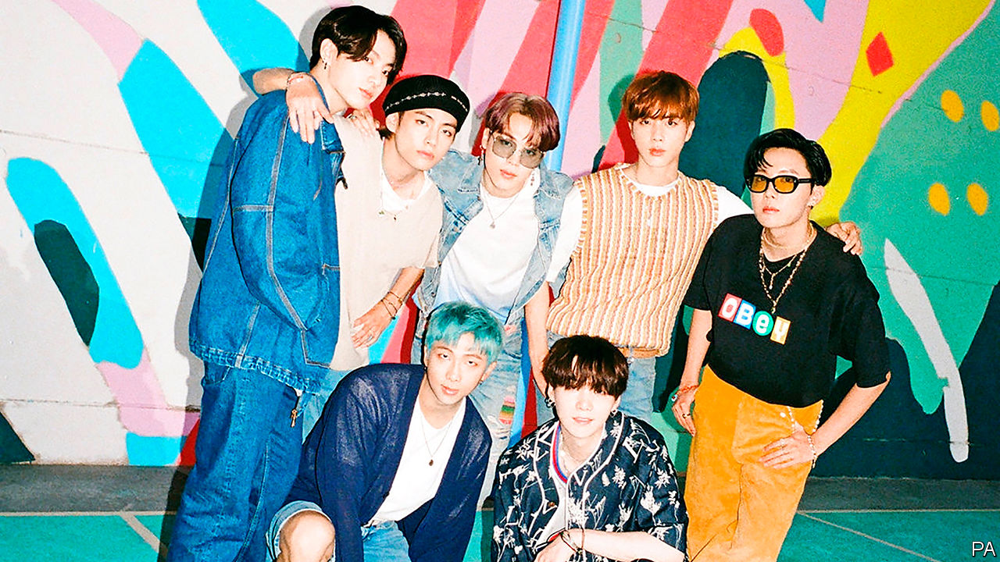

###### Woke blokes

# The company behind BTS, K-pop’s biggest act, is going public 

##### The boy band has found success by defying oafish stereotypes 

 

> Oct 10th 2020 


FOR THE past couple of years, the biggest news in the world of K-pop has been decidedly unpleasant. A scandal centred on “Burning Sun”, a glitzy nightclub in Seoul, South Korea’s capital, saw several male K-pop stars and industry executives accused last year of sexual abuse, procuring sex for business partners, drug-peddling and bribery. Later in the year two female idols committed suicide in the space of a few weeks. Both had been subject to misogynistic abuse for years.


But the industry’s biggest stars seem untouched by its seedy side. BTS, the world’s most successful K-pop group and the biggest boy band on the planet, has found global success by selling something close to the opposite of the machismo and aloofness that are usually required from K-pop idols. The seven 20-something men present themselves as down-to-earth, frank about the pressures and downsides of fame, socially engaged and aware of their own shortcomings. When fans got upset about a set of sexist lyrics a few years ago, the member who wrote them apologised for his ignorance and vowed to “study more” to avoid such lapses in future (he has since been spotted reading a feminist novel). And when American fans asked the group to support the Black Lives Matter protests this year, they promptly did.


Such behaviour resonates with fans in South Korea and beyond. “The message they send is so different from other boy bands,” says Lim Hyun-jee, a 26-year-old from Seoul. “They talk about growth, mental health, bullying and anything that we can all relate to,” she gushes. “And they get along so well, it’s very appealing.”


Hong Seok-kyeong of Seoul National University believes that BTS’s success stems partly from the hope they offer a generation of fans worn down by the pressure to compete and conform in their education and careers. “Both in their songs and in their interactions with fans they show that they can relate to these pressures,” she says. “Their whole story suggests that it’s OK to be different and that you can still be successful even if you don’t really fit in.” She thinks that young women, in particular, like their softer, emotionally vulnerable brand of masculinity as an alternative to South Korean machismo. Being pretty helps, of course. “The way they make themselves beautiful is very much about providing visual pleasure to a female audience.”


Some Korean feminists speculate that the band’s woman-friendly image is too good to be true, given the sexist norms of the industry in which they work. Others take it at face value. At the very least, BTS’s success has shown that niceness is a marketable quality, which may encourage others to give it a try. The numbers speak for themselves. After teetering on the brink of bankruptcy a decade ago, Bang Si-hyuk, who founded BTS’s production company, Big Hit Entertainment, is now a squillionaire. The company’s planned listing on the Korean stock exchange on October 15th looks set to make him and BTS even richer. Massively oversubscribed by both institutional investors and hardened fans, it is expected to value Big Hit at $4bn or so. ■

