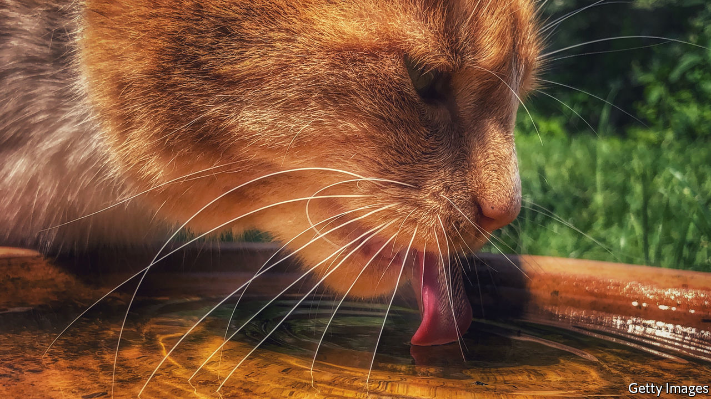

###### Dead cat bounce

# For he will consider Jeoffry, the poet’s cat 

##### His 18th-century life “is imaginary”, says Oliver Soden. But that is “no reason for it not to be true” 

 

> Oct 10th 2020 


Jeoffry: The Poet’s Cat. By Oliver Soden. History Press; 208 pages; £16.99.


THE HERO of our story was born in a whorehouse during an earthquake in March 1750. He entered the world mewling and mewing and was carried upstairs in a silk stocking by a harlot straight out of Hogarth. His father was a ginger tom, his mother an importuned tabby. He was christened Squit by his first mistress, but would go down in history as Jeoffry.


Most biographers have just the one life to marshal; Oliver Soden has nine. His subject was a purring muse to the 18th-century poet Christopher Smart. Mr Soden’s delightful, insinuating book curls around your thoughts and tickles you with its whiskers.


It is not the first life of a pet. “The history of Pompey the Little” offered a lap-dog’s perspective on the world in 1751, when Jeoffry was still a kitten. Mr Soden acknowledges a debt to Virginia Woolf’s “Flush”, a biography of Elizabeth Barrett Browning’s spaniel—a tough act to follow, and in one respect “Jeoffry” falls short. The author imagines the escapades a cat might have had; Woolf played on every sense to conjure up a dog set on an adventure.


This much is known: that between 1759 and 1763 Jeoffry shared Smart’s cell in a lunatic asylum, and that Smart devoted 74 of the surviving 1,700 lines of his religious poem “Jubilate Agno”—“whimsical in its ecstasy, and ecstatic in its whimsy”—to his cat. The sequence beginning “For I will consider my Cat Jeoffry…” is among the most anthologised poems in English; Benjamin Britten set it to music. Jeoffry’s life, writes Mr Soden, “is imaginary. But that seems to me no reason for it not to be true.”


The result is as much a history of literary and theatrical London as a feline biography. Jeoffry catches mice in Drury Lane, scratches holes in pig-skin prophylactics in a Bow Street bordello, leaps into the lap of the 16-year-old Fanny Burney and bats at her loose lace fichu. He pauses on the Strand to lick Samuel Johnson’s proud, panther-like Hodge on the forehead. He offers a cat’s-eye-view of David Garrick’s stroking gloves, George Frideric Handel’s swollen legs, George II’s glittering buckles and straining gold garters. A cat dares to look at a king—and what he sees is mostly stomach. Prowling Smart’s desk, Jeoffry spills the poet’s pounce pot of powdered cuttlefish bone.


Mr Soden jokes that if “Jubilate Agno” is a magnificat (a song of praise to God), the Jeoffry verses are a magnifi-cat. His own magnifi-cat recreation, bound in cloth-covers and sporting a Gainsborough kitty, would make a fine stocking filler—silk, buckled or gartered.

