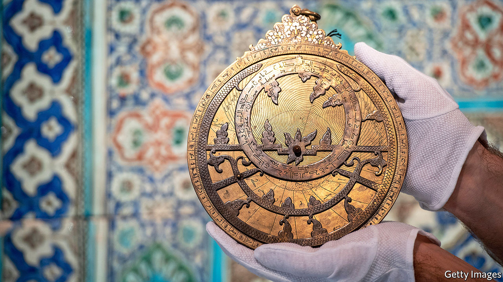

###### Sleeping giants

# The intellectual flare of the so-called dark ages 

##### In “The Light Ages”, Seb Falk lays out the wonders of medieval science 

 

> Oct 8th 2020 


The Light Ages. By Seb Falk. W.W. Norton; 320 pages; $30. Allen Lane; £20.


IN THE 11TH century, nearly 500 years before Leonardo da Vinci drew a similar flying machine, a young monk called Eilmer strapped wings to his hands and feet and jumped off a tower at Malmesbury Abbey in England. After he had glided more than 200 metres a gust of wind caught him, and he crashed, breaking both legs.


Eilmer’s exploit seems to capture much about the Middle Ages, as Seb Falk, a historian, presents them in “The Light Ages”. They fizzed with scientific curiosity and experimentation, much of it in religious institutions. There were a lot of dead ends, but there was progress too. And they don’t deserve to be tainted as “the Dark Ages”.


A deeply rooted intellectual prejudice holds that nothing much happened in the 1,000-odd years between the fall of the western Roman Empire and the rediscovery, in the 15th century, of the texts of the ancient world. Mr Falk sets out to discredit it. Those texts were well-known in the Middle Ages, when they were brought together in European libraries with the musings of the finest contemporary minds (many from far beyond Europe’s borders), translated into Latin, copied, debated and sometimes improved upon. A shift did begin in the 15th century, but it was more quantitative than qualitative—an acceleration, largely due to the invention of the printing press, rather than a watershed.


Mr Falk acknowledges that medieval science was not the same as the modern kind. Astronomy was the most important discipline, but astrology was respectable too, and it shaded into magic. Monks and nuns toiled in scriptoria to understand “a living cosmos endowed by God”, not “a coldly mechanistic natural world”. But were the methods really so different? Confronted with the unknown, human beings generate a chaotic mass of hypotheses that gradually gets whittled down through observation and experiment. That describes medieval science as much as today’s.


And medieval scientists had a virtue that their modern counterparts can seem to have lost: humility. That is the reason Mr Falk chooses an obscure 14th-century monk-scientist, John Westwyk, as his guide. He cites Westwyk’s description of the astrolabe, an instrument that assisted in many useful tasks, such as telling the time and finding north, based on calculations of the positions of celestial bodies. The astrolabe sometimes seems to have more personality than the monk, probably because of the paucity of biographical information available. Still, Westwyk plays a valuable role in Mr Falk’s story.


To become an astronomer, he had to learn mind-boggling quantities of information, often in the form of numerical tables for which the astrolabe provided a handy, but less accurate, shorthand. Reading about what Westwyk knew can be hard-going, because people are not used to thinking that way any more; computers do it for them. The reward is an understanding of the daily feats of memory that he and his contemporaries performed. It was because their knowledge was derived from first principles, Mr Falk shows, that they regarded the night sky with such wonder.


The mechanical clock, spectacles, advances in navigation, a grasp of tides and currents—these were among the achievements of the Middle Ages. They produced a theory of impetus that influenced Galileo Galilei in the 17th century. By then Nicolaus Copernicus had overturned everything medieval astronomers held dear, by placing the sun at the centre of the universe; but he couldn’t have done so without their patiently elaborated geometry. Fittingly, a metaphor Isaac Newton used in 1675—“If I have seen further it is by standing on the shoulders of giants”—was coined in a 12th-century cathedral school. ■

