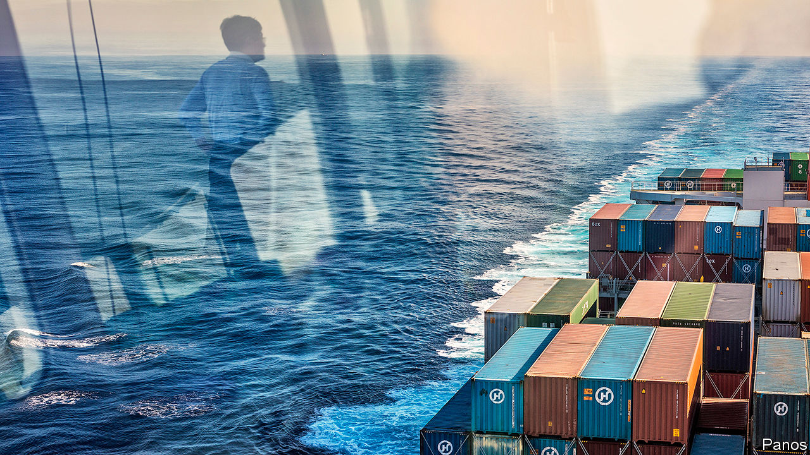
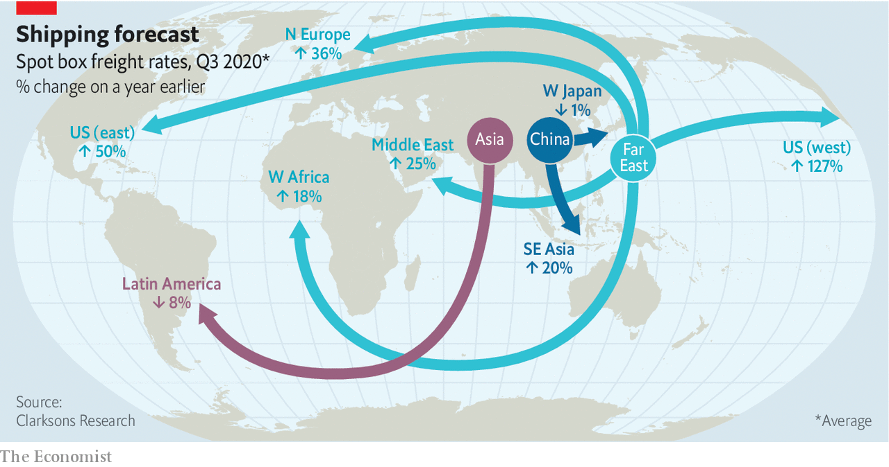
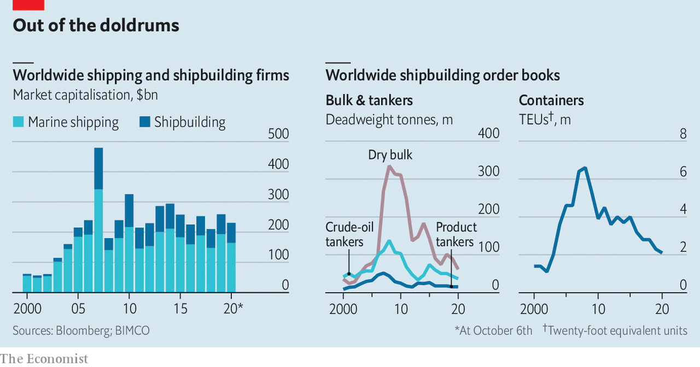

###### Not so choppy

# How covid-19 put wind in shipping companies’ sails 

##### Despite a slowdown in global trade, the maritime industry is having a banner year 

 

> Oct 10th 2020 


SICKNESS AND shipping have a long shared history. The word quarantine is derived from the 14th-century Venetian practice of isolating ships at anchor for 40 days if plague was suspected on board. The latest ailment is a global pandemic that has killed at least 1m people and put the world economy, and global commerce, full steam reverse. This might have been expected to becalm an industry which carries 90% of traded goods—11.9bn tonnes last year, or 1.6 tonnes for every human—and where profits have often been elusive. The last time trade volume declined, in the aftermath of the financial crisis of 2007-09, maritime shipping suffered. Clarksons, a shipbroker, expects volumes to fall by 4.4% in 2020.


Still, Neptune seems to have smiled on shipping companies. Oil tankers and dry-bulk vessels that transport iron ore, coal and grain will turn a profit in 2020. Operators of ships ferrying containers, packed with consumer goods or components, are set fair for a banner year. Shipping is a business where, in the words of Martin Stopford of Clarksons, firms “make a living and occasionally make a killing”. This year, it appears, belongs to the second category. What is going on?


One answer is that the carnage wrought by the coronavirus has not been as bad as anticipated. The World Trade Organisation initially expected trade volume to shrink by as much as 30% in 2020. Drewry, a consultancy, had reckoned worldwide port visits by ships in the second quarter might decline by 16%. In fact they fell by 8%.


The industry has been able to take advantage of the swifter-than-expected recovery thanks to big underlying changes in its structure over the past decade, towards greater concentration. Container shipping, like tankers and dry bulk, seems finally to have learned a lesson from the debilitating overcapacity created as companies battled for market share.


In the decade before the financial crisis demand grew by around 10% a year. The order book swelled to the equivalent of 60% of the entire fleet when Lehman Brothers collapsed in 2008. An armada of new ships, which take at least two years from order to launch, arrived just as growth slowed. In the 2010s the fleet expanded by 100% while demand grew by just 50%, points out Peter Sand of BIMCO, a shipowners’ association.


The excess capacity ruined returns for years afterwards. McKinsey, a consultancy, reckons that between 2012 and 2016 container-shipping destroyed $84bn of shareholder value. Over the past five years, notes David Kerstens of Jefferies, an investment bank, the industry in aggregate has done a bit better, just about breaking even.


Now, though, efforts to cut costs and win market power are finally paying off. After years of consolidation the top seven firms now claim three-quarters of the global fleet, up from 55% in 2016, according to Jefferies. On top of that, 2017 saw the birth of three global alliances that now control 85% of capacity across the Pacific and almost all capacity between Asia and Europe.


Increased co-ordination has allowed the companies to respond to slowing trade. “Blank sailings”, industry jargon for cancelled voyages, came thick and fast. In May a record-breaking 12% of the global container fleet was idled, according to one estimate. Even as capacity has been reinstated—the share of the fleet that is idle has fallen to around 3%—freight rates have rocketed to cope with an unexpectedly vigorous recovery. Now, says Lars Jensen of SeaIntelligence, a consultancy, the container industry is on course for record profits of $12bn-15bn this year. Maersk, the world’s biggest container-shipping firm with 17% of the market, expects profits of $6bn-7bn, up from a pre-pandemic estimate of $5.5bn.


Rates have shot up most dramatically on trans-Pacific routes (see map). Spot prices for sending a container from China to America’s West Coast have risen by 127% since last year, to record highs. The port of Long Beach in California reported its busiest August ever; Los Angeles saw business that month up by 12% year on year.

 


Can firms continue to manage capacity and resist the urge to order ships? Possibly, thinks Mr Kerstens. Maersk and Hapag-Lloyd, another big firm, have eschewed chasing volume and market share in favour of profitability. Maersk is investing heavily in integration with more lucrative links in the chain, such as lorries and warehouses.


The thin order book (see chart)—now equal to just 7% of the fleet—is not entirely down to newfound sobriety. Stricter environmental rules play a part, says Mark Jackson of the Baltic Exchange, a data provider. The International Maritime Organisation, the UN’s shipping agency, wants to halve the industry’s carbon emissions by 2050, relative to 2008. As long as the pathway to meet the target remains sketchy, and the requisite technology nascent, companies are reluctant to order vessels with a lifespan of 25 years or more.

 


Shifting trade patterns are another factor. Supply chains are being reconfigured by the pandemic and the Sino-American economic war. As manufacturing shifts from China to other parts of Asia—Cambodia has rapidly replaced it as the predominant source of America’s Christmas-tree lights, for example—smaller ships will be required. These can ferry goods directly from minor Asian ports to Europe or, because vast existing vessels plying the route between China and Europe have plenty of life left, to trans-ship smaller loads to Asian mega-hubs for onward dispatch. All that means building ever-mightier ships offer diminishing returns to scale. Today’s leviathans—such as the Hong Kong, owned by OOCL, a firm based in the Chinese territory—can carry well over twice as many containers as the largest ships in 2005.


Tankers and dry-bulk carriers face rougher conditions. Both segments are far more fragmented than container shipping, and so unable to cut capacity as easily. The biggest specialist tanker operator, Teekay of Canada, wholly owns around 60 vessels totalling nearly 7m deadweight tonnes out of a global fleet of 623m in 2019. The average number of ships per firm is around 5.5.


Even so, tanker-owners were “having a party in the first half of the year”, says Mr Sand of BIMCO, thanks to sinking oil prices. Average annual earnings over the past decade were above break-even only half the time for the largest crude-oil tankers. But the collapse of an agreement between the Organisation of the Petroleum Exporting Countries and Russia sent oil prices tumbling just as covid-19 sapped demand for crude. Traders with nowhere to stash unwanted oil turned to tankers. At one point this spring more than a tenth of the world’s fleet was chartered as storage. Rates for the largest craft soared from $6,500 a day to $240,000, ten times the break-even level. Rates have now slipped below break-even but that bonanza will tide tanker-owners over to an annual profit.

Bulking up


Dry-bulk vessels, by contrast, had a terrible start to the year. But they have since been helped by China’s swift recovery. The country accounts for 40% of the global dry-bulk trade, mostly because it imports 70% of the world’s iron ore (see ). Stimulus measures have led to record production and iron-ore imports hit all-time highs in the first seven months of the year. That has offset lower activity in the rest of the world, says Bimco. All sizes of ships are now making money.


One risk for commercially minded companies is that big rivals with different motivations might undermine capacity cuts. Governments in China, South Korea and Taiwan regard their state-controlled shipping giants, four of which are in the world’s top ten, not so much as profit motors but as a way to preserve their place in the global trading system. Hyundai Merchant Marine, the ninth-largest firm, is the only big shipper not to trim capacity. There are hints that China’s government does not approve of the high prices to shift Chinese-made goods. It has reportedly asked its carriers to reinstate capacity to America. COSCO and OOCL, which are state-controlled, will refrain from raising rates.


It is a similar story with ports. Maersk’s port division, APM, has clear financial imperatives. But Hyundai and Evergreen Marine, a Taiwanese company, probably regard their ports as a cost to bear for the sake of their shipping businesses. China Merchants and COSCO, which also runs big ports, are owned by a state keen to use trade to spread Chinese influence around the globe. Dubai’s DP World, which delisted in February, and PSA, a Singaporean operator, are both commercially driven but ultimately in state hands, too. Hong Kong’s Hutchison, one of the world’s biggest port operators, saw profits dip by 15% in the first half of the year. Often the interests of shareholders do not completely align with the role of enabling trade, says Eleanor Hadland of Drewry.


Another doubt is whether governments will allow their shipbuilders to fall into desuetude. China, Japan and South Korea now control 90% of global shipbuilding. They have incentives to keep shipyards in business, even if some could soon be out of work; reopening mothballed yards is a long and expensive process.


Keeping the world’s goods flowing is, then, a complex business—just ask the seamen trapped on board for months as lockdowns and travel restrictions have prevented regular changeovers. But their employers are moving into the nascent global economic recovery with wind in their sails. That is good news for world trade. ■


Editor’s note: Some of our covid-19 coverage is free for readers of The Economist Today, our daily . For more stories and our pandemic tracker, see our 

