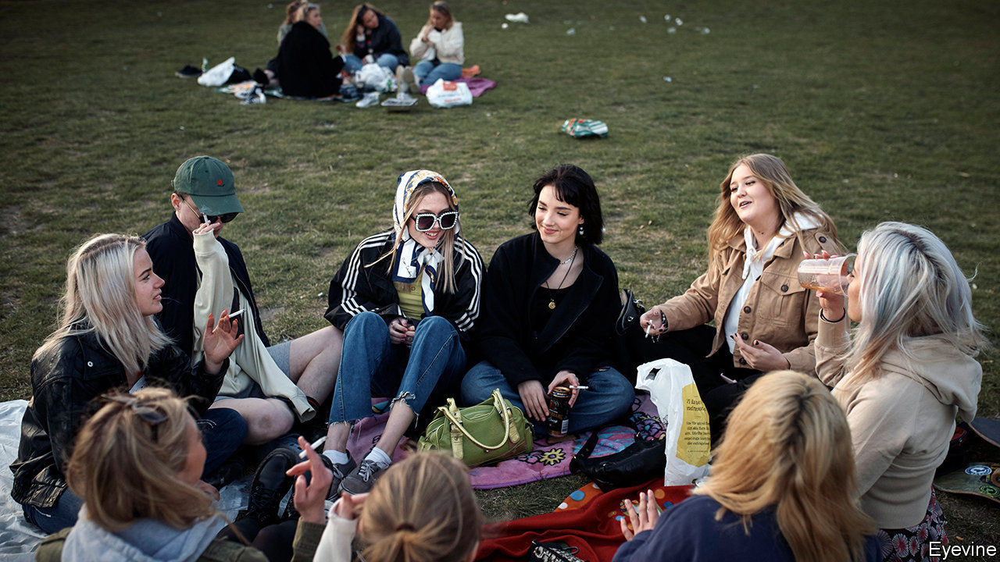
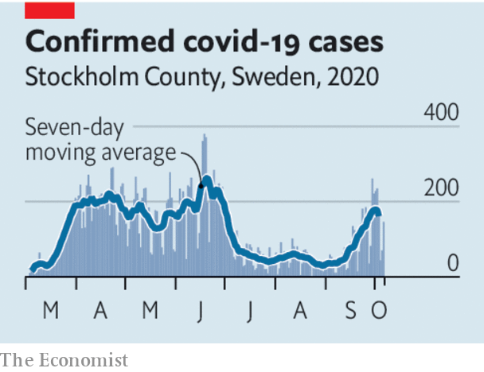

###### Land of the mask-free

# The real lessons from Sweden’s approach to covid-19 

##### Sweden is held up as a champion of liberty. In fact it is the home of pragmatism 

 

> Oct 10th 2020 


Editor’s note: Some of our covid-19 coverage is free for readers of The Economist Today, our daily . For more stories and our pandemic tracker, see our 


THE GREAT thing about using a small country to support your argument is that your opponents are unlikely to know what is really going on there. Perhaps that is why Sweden, with 10.3m people, has become a much-cited example in the debate about how to deal with covid-19. Liberty-loving Swedes are supposedly pursuing a mask-free, lockdown-light strategy that will create herd immunity without bankrupting the economy. Sweden’s success, it is said, is a standing rebuke to the left-wing killjoys who love bossing folk around and shutting everything down.


Sweden does indeed hold lessons—but they are less about freedom than about using trade-offs to generate lasting social cohesion. The country makes an odd paragon for fans of small government. The last time it pursued individualism red in tooth and claw, social policy was in the hairy hands of men who went to work in longboats. Today Sweden is a progressive beacon, lying seventh in the OECD’s ranking of social spending—ahead even of Germany.


Fans of Sweden are right to point out that, in the first phase of the disease, the government had a light touch. Although it banned large groups and issued plenty of health advice, it rejected blanket lockdowns. But that was not a particularly successful approach. Sweden has a fatality rate of around 60 per 100,000, ten times that of Finland and Norway, which did lock themselves down. Swedes’ freedom did not spare the economy, even though many deaths were among elderly people no longer working. Output in the second quarter alone shrank by 8.3%—also worse than the other Nordic countries. A high caseload is bad for the economy.

 


One rejoinder is that, unlike Britain, France and Spain, Sweden has not seen a second wave. However, even if you leave aside the fact that cases in Stockholm County roughly quadrupled in September (in absolute terms, they are still low), Sweden’s new strategy for the second phase converges with Germany’s. Contrary to some claims, this is not dependent on herd immunity—Sweden still has a large population of susceptible people. Rather, it entails rapid large-scale testing and contact-tracing so as to identify and suppress outbreaks early. This is accompanied by a clear, consistent message that is sustainable because it gives people autonomy (see ). Those are the building blocks of successful anti-covid-19 strategies everywhere.


The lesson from the new Swedish policy is not that it is libertarian, but that the government weighs up the trade-offs of each restriction. For instance, when someone tests positive, their entire household must go into quarantine, but schoolchildren are exempt—because, the government reckons, the gains from shutting them away are overwhelmed by the lasting harm to their education. Likewise, the quarantine lasts five to seven days, compared with two weeks elsewhere. The risk of spreading covid-19 in that second week is small and shrinking, but the harm to mental health of extended isolation is growing.


Sweden is a high-trust society, where people follow the rules. And yet its approach is based on the idea that, as covid-19 is here for a long time, asking too much of people will lower compliance and thus spread the disease. Low-trust societies may need a different balance between coercion and self-policing but they, too, need sustainable rules.


And what of masks? Sweden’s fans seize on mask-free crowds in Stockholm as proof of its liberty. But that is not the basis for its policy. Government experts argue that the evidence that masks help is weak, and that their other measures work fine. In this, Sweden is out of step with other countries. If the disease charges back there, that is likely to change. After all, its policy is based on evidence and pragmatism, not blind principle. ■

