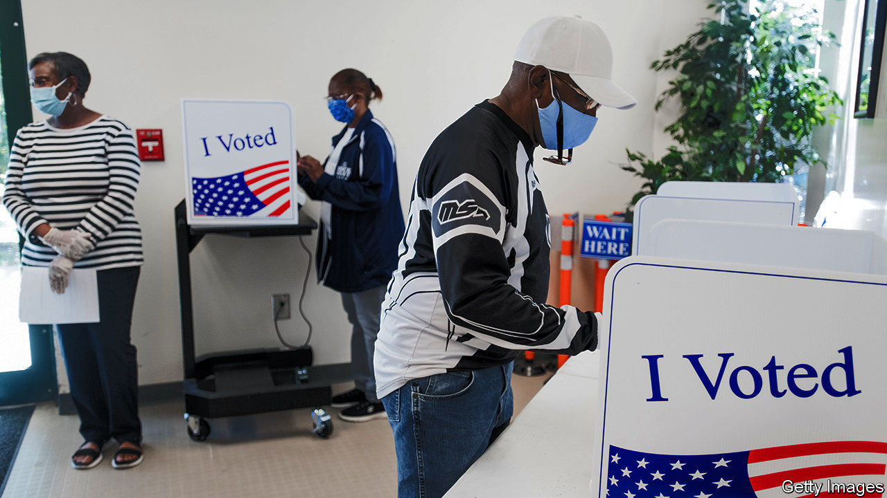

###### American democracy

# The spreading scourge of voter suppression 

##### Don’t rob people of votes, count them 

 

> Oct 10th 2020 


A PRESIDENT IN hospital, virus in the White House, a fight over the Supreme Court, leaked presidential tax returns: it is enough to make you reel. Amid the tumult of the campaign, it is easy to miss a less frenzied turn of events that has no less profound implications for America’s democracy. It concerns suppressing the vote. “Elections belong to the people,” said the Republican Party’s greatest president. What, then, would Abraham Lincoln make of his partymen’s efforts—in Florida, North and South Carolina, Texas, Wisconsin and other contested states—to limit the number of people the coming election belongs to?


Allegations of minority-voter suppression are hardly new. They are also often overheated and hard to prove. Yet Greg Abbott’s action in Texas stands out (see ). On October 1st the Republican governor restricted the number of drop boxes for completed ballots to just one per county. For the 4.7m residents of Harris County, 70% of whom are non-white and liable to vote Democratic, that is a travesty.


Echoing President Donald Trump, Mr Abbott said this was necessary to prevent voter fraud. Wisconsin’s Republican legislature said the same to justify restricting early voting in the state, as did their counterparts in the Carolinas when insisting on the need for a witness counter-signature on mail-in ballots. Preventing fraud is a sound principle. Some Republican measures, including in Texas, involve tightening up covid-19 provisions for early voting that those same lawmakers had introduced. In practice, however, concerns about electoral fraud, which Republican lawmakers have cited in 25 states over the past decade, are almost always unfounded. This makes their arguments against the special covid-19 provisions hard to sustain.


The only major instance of voter fraud in recent times was perpetrated by a rogue Republican activist in North Carolina. There is no evidence of the mass Democratic electoral fraud many Republicans claim to detect. Mr Trump, who alleged that 5m votes were cast illegally for Hillary Clinton in 2016, launched a commission to find some. It returned empty-handed. Meanwhile, examples of new Republican restrictions have piled up.


In Georgia, Ohio and Texas at least 160,000 people, disproportionately non-white, were wrongly removed or marked for removal from the electoral roll in 2018-19. And though the effect of recent measures is unclear, Florida hints at what may be to come. The state voted in 2018 to enfranchise felons who had met all their obligations, an estimated 1.4m people—including a fifth of black Floridians. The Republican legislature passed a law enacting this plebiscite that interpreted those obligations in the most onerous way possible by demanding they first settle all outstanding fines. Former felons were always likely to be low-propensity voters, but this erected a formidable bureaucratic hurdle even to those able to pay. As Florida’s registration deadline passed this week, perhaps one in six had registered to vote.


Mr Trump’s threat that he will refuse to accept the election results has raised fears of a constitutional crisis. They need to be taken seriously. More likely, however, these practised instances of vote suppression will turn out to be the election’s real lasting democratic damage. It is perverse for one party in a democracy to shape its politics around suppressing the vote. Adopting this as a political tool is especially foul in a country where African-Americans were denied the vote in living memory.


The tactic is the apogee of Republican short-termism. True, Georgia’s governor may owe his job to suppressing black votes. But the party will sooner or later be unable to win national elections if it cannot woo non-whites. With every cycle of electoral abuse, the party of Lincoln is handing them fresh grievances.■


Dig deeper:

Read the  and explore our , then sign up for Checks and Balance, our  and  on American politics.

