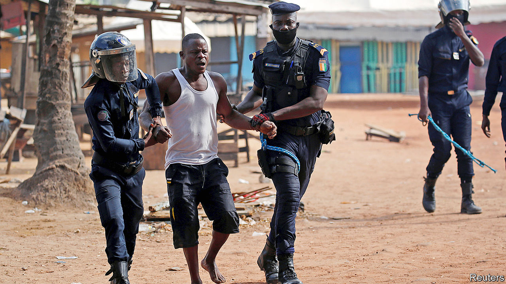

###### The vengeance of old men

# A dangerous election looms in Ivory Coast 

##### Geriatric rivals argue over the rules, as fears of another bloody election grow 

 

> Oct 10th 2020 


THE LAST time Ivory Coast had a close election, 3,000 people were killed. So when a policeman in Abidjan, its commercial capital, recently saw men with machetes pouring out of vans, chatting amicably with his police chief and then attacking nearby unarmed protesters while the police looked on, he complained to Amnesty International, a human-rights watchdog. “Their presence was not coincidental,” he said. “This reminds me of the two past crises when militias were sowing terror among the people.”


Ivory Coast, Francophone west Africa’s biggest economy and a regional business hub, is on edge before the first round of a presidential election, due on October 31st. President Alassane Ouattara, aged 78, made matters worse by deciding to run for a third term, seemingly in breach of the constitution, after his chosen successor died in July. Rivalries within the same cast of ancient politicians who have fought over the country for 30 years once again threaten chaos. At least 14 people have been killed in political punch-ups since mid-August. Ivorians fear that worse is to come.


In 2010 the then president, Laurent Gbagbo, refused to accept that he had lost the election and had to be prised from his bunker by forces loyal to the winner, Mr Ouattara, who was backed by French troops and helicopters. Mr Gbagbo was carted off to face trial at the International Criminal Court (ICC) in The Hague. The economy bounced back under Mr Ouattara, averaging 8% growth a year since 2011, though many Ivorians are still poor.


Since then, efforts at reconciliation have failed. The election’s rules and the choice of who should oversee the vote are disputed. On September 14th the constitutional council waved through Mr Ouattara’s controversial candidacy, after he claimed that a constitutional change during his time in office meant that his two-term limit could be reset. Idayat Hassan of the Centre for Democracy and Development, a think-tank in Abuja, Nigeria’s capital, calls it a “constitutional coup”.


The council was less lenient towards most would-be candidates, blocking 40 of the 44 who applied to run. This included Guillaume Soro, a former rebel leader and prime minister under Mr Ouattara, and Mr Gbagbo himself, who was acquitted by the ICC last year of charges of crimes against humanity. Mr Gbagbo is, however, more or less stuck in Belgium pending an appeal against the verdict by the prosecutor. The Ivorian constitutional council, banning both men, cited criminal convictions secured against them in absentia: Mr Gbagbo for allegedly looting the central bank, Mr Soro for alleged embezzlement. Despite Mr Gbagbo’s grim record, he still has a big following. Mr Soro calls Mr Ouattara’s bid for a third term a “mad venture”.


The candidates who have been allowed to run are hardly any happier. They say the election should not go ahead unless Mr Ouattara withdraws and the constitutional council and electoral commission are dissolved. Pascal Affi N’Guessan, another candidate, says the government is a “dictatorship”. The leading opposition figure, Henri Konan Bédié, another former president, has called for civil disobedience. The opposition hopes to fill a stadium with 50,000 supporters on October 10th. Its overall aim, suggests Séverin Kouamé of the University of Bouaké, is to alarm foreign governments so much that they feel obliged to intervene, as they have before.


Mr Ouattara is ignoring the opposition’s demands and has banned street protests. “I warn anyone who wants to make trouble, if that is what they want, they will have to face me,” he says. Meanwhile, he has sought to please the quarter of the population who depend on growing cocoa by announcing a 21% increase in its price.


France’s president, Emmanuel Macron, the most influential of the Western leaders involved, is said to have urged Mr Ouattara to delay the poll. The International Crisis Group, a Brussels-based conflict-prevention outfit, says the same. But after 30 years of rancorous rivalry the main protagonists are in no mood for dialogue. Whereas the median age in Ivory Coast is 19, Mr Bédié is 86. Mr Gbagbo is 75, only three years younger than Mr Ouattara. The two opposition candidates have a history of stirring up ethnic strife for their own ends.


A delay seems unlikely. Were Mr Ouattara to win, the opposition would surely reject the result. Violence, which many fear would take on an ethnic hue, could well erupt. Mr Soro has a following in the army, increasing the risks of bloodshed. “The people are scared,” says Mr Kouamé.


With luck, Ivorians—fed up with the bad blood among politicians—may prove reluctant to take to the streets. There are fewer armed groups now than in 2010. And although Mr Gbagbo has a history of rallying supporters to the streets, he is in Belgium. From such a distance, he may be less able to stir up trouble.


If by hook or by crook Mr Ouattara wins, as seems probable, swathes of the electorate will view him as illegitimate. Even if violence is avoided, Ivory Coast will face a post-election crisis, says William Assanvo of the Institute for Security Studies. ■

