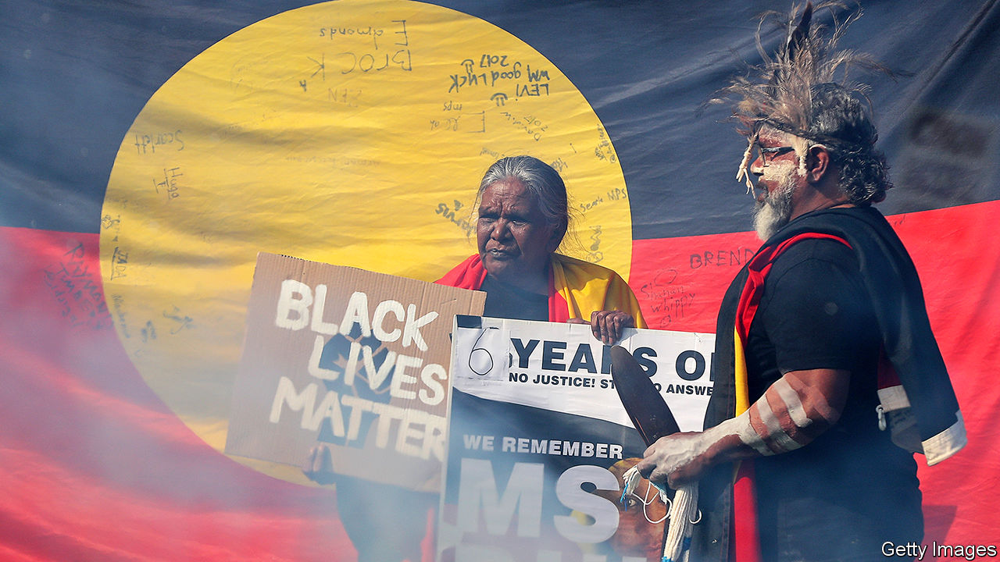

###### Take down or cough up

# A copyright dispute ensnares the Aboriginal flag 

##### Firms and charities using the emblem are being asked to pay royalties 

 

> Oct 17th 2020 


THE ABORIGINAL flag has been an emblem of pride and protest for half a century. Its colours—black, red and yellow—represent Australia’s first people, their connection to the land and the life-giving sun. It is hoisted over schools and waved at sporting fixtures. It flies periodically over Sydney’s famous Harbour Bridge. Yet Aboriginals fear its very existence is under threat.


The issue is copyright. Australia’s government has officially adopted the flag, but its design is still owned by the man who created it, Harold Thomas, an Aboriginal artist. He conceived it in the 1970s as a banner for the campaign to allow Aboriginals to reclaim their traditional lands. The image was reproduced fairly freely until 2018, when he sold exclusive rights to its use on apparel and “digital and physical media products” to WAM Clothing, a private firm.


WAM has since chased down many firms and charities for royalties. The Victorian Aboriginal Health Service was told it would have to pay to use the flag on T-shirts, a recent Senate inquiry heard. These were sold at cost to patients to encourage them to attend check-ups. Diabetes Victoria, another non-profit, had to stop using the flag on its website because WAM demanded payment.


“How could one company have a monopoly on an iconic symbol?” wonders Laura Thompson, an indigenous health expert. She started a campaign to “free the flag” after her charitable enterprise was given three days to “cease and desist” from printing it on clothing. To some, it seems doubly insulting that the firm commercialising the banner is owned by white Australians. Worse, critics argue, its co-founder, Ben Wooster, has a record of exploiting indigenous culture. Another of his companies, Birubi Art, was fined A$2.3m ($1.65m) last year for selling fake Aboriginal art.


The danger, says Linda Burney, the country’s first indigenous MP, is that the emblem could be forced out of use. It is already disappearing from sport. The Australian Football League (AFL), of top Aussie-rules teams, normally prints the flag on pitches and players’ jerseys for an annual “indigenous round”, which celebrates its Aboriginal athletes. It stopped doing so this year after WAM threatened legal action. Australia’s national cricket and rugby union teams and the National Rugby League have all followed, saying they will not pay.


The national government is trying to defuse the row by buying the rights from Mr Thomas, WAM Clothing and two other licensees. This should allow the flag to be used freely. But not everyone likes the idea of handing custodianship of the image to bureaucrats. The Senate inquiry recommended that an independent Aboriginal committee should be in charge of it. Labor, the main opposition party, fears that things are moving rather too slowly. “The importance and history of the flag is being lost,” two of its senators have warned. If negotiations are not resolved by January, they suggested, the government should forcibly commandeer the design. ■

