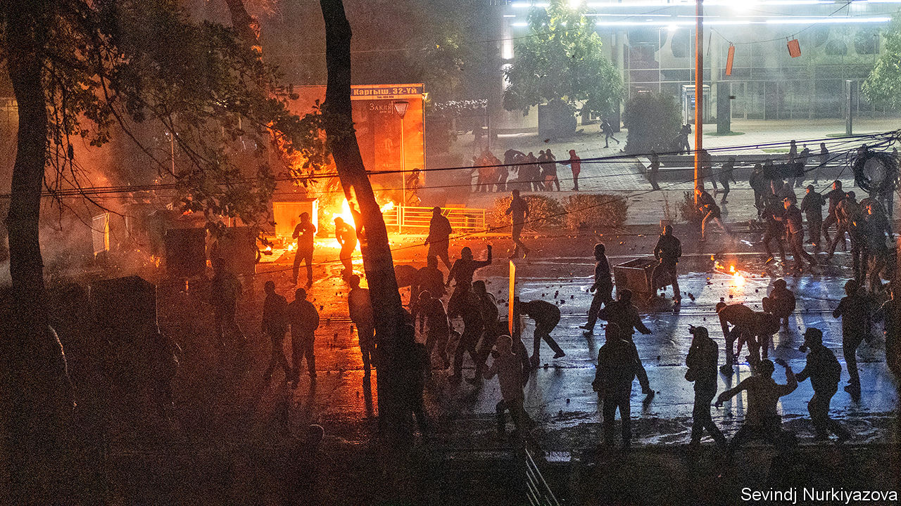

###### From prison to power in a week

# Kyrgyzstan’s president resigns as a recent convict takes charge 

##### Protests against suspect elections have not had the intended result 

 

> Oct 17th 2020 


ON THE FENCE of the building housing Kyrgyzstan’s parliament and the office of the president, which protesters stormed last week, hangs a disconsolate handwritten sign: “In autumn, leaves should fall, not the country.” Many locals fear that Kyrgyzstan is on the brink of chaos, after Sooronbay Jeyenbekov, the president, tendered his resignation on October 15th. He was on the defensive after protests had erupted over a parliamentary election marred by systematic vote-buying. He had the election annulled and accepted the resignation of the prime minister, but had intended to stay on himself until the country was “back on the path of lawfulness”. His change of heart suggests he sees little hope of that now. Instead, he simply said he was hoping to avoid bloodshed by going.


The government has been left in the hands of Sadyr Japarov, the new prime minister, who was sprung from prison by his supporters during the post-election unrest, cutting short an 11-year sentence for kidnapping. Attacks on rivals by his thuggish followers have raised fears of mob rule. By law, the parliamentary speaker acts as president until new elections can be held. But if Kanat Isayev, who is loyal to Mr Jeyenbekov, were also to step aside, as Mr Japarov’s supporters have been demanding, the prime minister would become the acting president.


Mr Japarov, an ex-MP, brushes off accusations that he has criminal connections as a bid to “blacken” his name. But Omurbek Suvanaliyev, a security official ousted during the drama, warns that “the underworld has the upper hand over politicians”. The American government has issued a statement saying it is important to “fight against the influence of organised crime and corruption in politics”.


On October 9th Mr Japarov’s supporters attacked a rally in support of liberal politicians. Tilek Toktogaziyev, an entrepreneur who was also vying for the job of prime minister, was knocked unconscious. An unknown gunman took a pot-shot at Almazbek Atambayev, an ex-president also sprung from jail by supporters during the unrest. Mr Japarov asserts that Mr Atambayev—who is back in prison, where he is serving a sentence on corruption charges that he claims were politically motivated—staged the attack himself. Getting the hint, MPs from the outgoing parliament chose Mr Japarov as prime minister, although some complained of intimidation. As for his conviction, the Supreme Court has, with lightning speed, ordered a review.


The prime minister’s supporters continue to flex their muscles with noisy rallies in Bishkek, the capital. The unenviable fates of Kyrgyzstan’s ex-presidents—one in jail; two, toppled by popular protests, in exile—must be on Mr Jeyenbekov’s mind. Those who protested in favour of cleaner elections, meanwhile, must be wondering how their complaints led to this. ■

