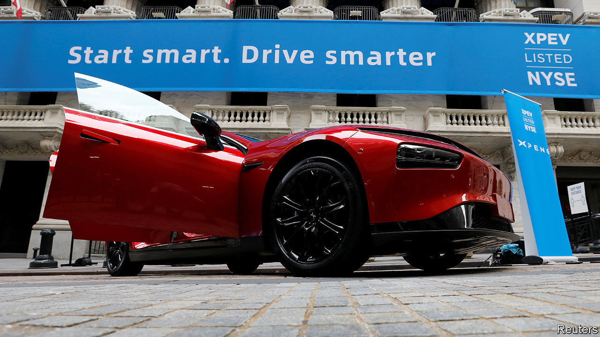
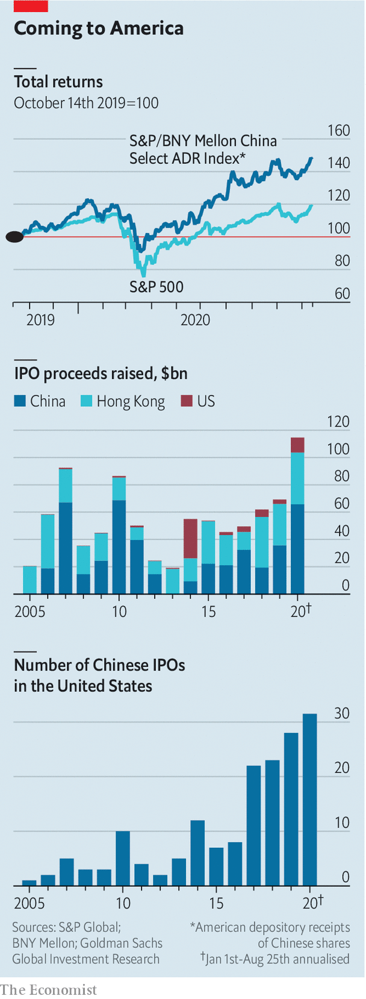

###### Red capitalism

# Why Chinese firms still flock to American stock exchanges 

##### Washington is increasingly hostile to Chinese firms. Not Wall Street 

 

> Oct 17th 2020 


CHINESE FIRMS get a frosty reception in America these days. President Donald Trump is a relentless China-basher. His administration has tried to crush Huawei, a telecoms giant, ban TikTok and WeChat, two popular Chinese-owned apps, and expel Chinese companies listed on American stock exchanges. No wonder that some have steered clear of late. Ant Group, a fintech star that may once have followed Alibaba, the tech titan with which it is affiliated, onto the New York Stock Exchange (NYSE), is about to float in Hong Kong and Shanghai instead. Last month Sina, the Nasdaq-listed owner of Weibo, China’s answer to Twitter, said it would go private in a $2.6bn deal. A day later Tencent, another Chinese online colossus, said it would buy out Sogou, a NYSE-traded search company, for $3.5bn.


Many Chinese firms that might once have flocked to New York are eyeing their home stockmarkets. According to consultants at Deloitte, from January to September new listings in Hong Kong raised some $28bn, two-thirds more than in the same period last year. The money raised by newcomers to the biggest mainland exchanges, in Shanghai and Shenzhen, has reached 355bn yuan ($53bn), 2.5 times the comparable figure in 2019.


Look closer, though, and plenty of Chinese startups continue to covet American listings. In August KE Holdings, an online property firm backed by Japan’s SoftBank Group, raised $2.1bn; XPeng, an electric-car maker, picked up $1.5bn. Lufax, a fintech firm which this month filed to go public on the NYSE, may raise $3bn. All told, Chinese firms have raised nearly $9bn in American initial public offerings (IPOs) since January, and another $8bn in secondary share sales. Goldman Sachs, an investment bank, reckons that the money raised from Chinese IPOs on the NYSE and Nasdaq has held up during Mr Trump’s presidency (see chart). The market value of Chinese listings in America now exceeds $1.6trn, of which American investors hold nearly a third. Goldman Sachs forecasts a record number of Chinese listings in New York this year.

 


Why would Chinese companies flock to America given the apparently toxic environment? For one thing, as Adam Lysenko of Rhodium Group, a research firm, points out, it is often easier to list on American exchanges than in China, with its more restrictive regulatory regime. Ant’s blockbuster stockmarket debut hit a last-minute snag this week when China’s top securities regulator unexpectedly delayed approval for the Hong Kong leg of its dual listing.


An overseas listing also allows mainland companies to get round China’s strict currency controls. Gary Rieschel of Qiming Ventures, a venture-capital firm, says that going public in New York, the world’s pre-eminent financial centre, makes sense for Chinese firms like Lufax keen on global expansion. For rising technology startups in particular Wall Street also represents an imprimatur from the world’s most sophisticated investors, and access to its deepest and most liquid capital markets.


Shareholders, for their part, get a slice of its perkiest stocks. Total returns for an index of Chinese firms listed in America tracked by BNY Mellon, a bank, have risen by nearly half in the past 12 months, twice the rate for the S&amp;P 500 index of big American firms. Mr Lysenko calculates that from 2017 to 2019 Chinese firms listed on American exchanges traded at higher valuations relative to earnings than companies in the S&amp;P 500, on the Nasdaq, or indeed those whose shares changed hands on the Shenzhen and Hong Kong stockmarkets. These “red” stocks are simply too tasty for American investors, red as they already are in tooth and claw, to forgo. ■

