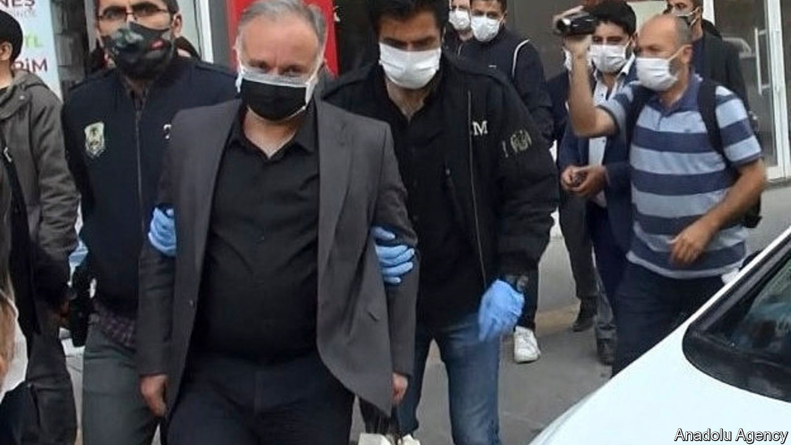
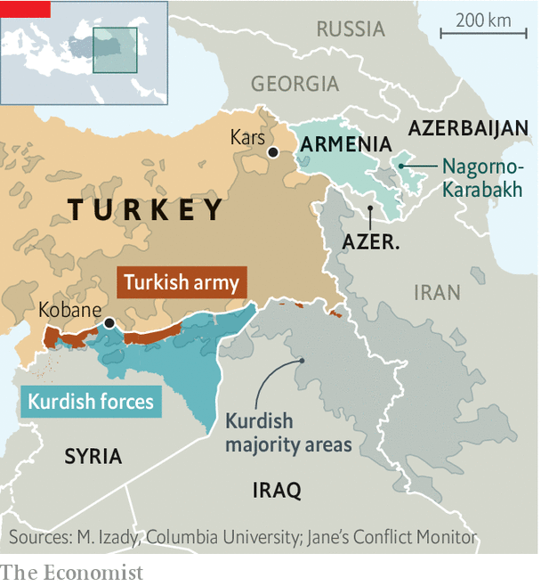

###### Wear a different chain

# Turkey locks up Kurdish mayors 

##### Of the 65 mayors elected last year on a Kurdish party’s ticket, 59 have been forced out or detained 

 

> Oct 17th 2020 


IN CITIES ACROSS Turkey’s east, it is no longer an unusual scene. The local mayor, clutching a bag stuffed with some clothes and a toothbrush, the bare necessities for a long spell in prison, emerges from his house before dawn, accompanied by a group of policemen, and disappears into a van. The scene played out most recently on September 25th in Kars, a city near the Armenian border, where police arrested Ayhan Bilgen, who was elected to office last year. A small crowd gathered to say goodbye. “Kars is proud of you,” the chanting began. Dozens of other members of Turkey’s biggest Kurdish party, the Peoples’ Democratic Party (HDP), including three former parliamentarians, were rounded up the same day.


Turkey’s president, Recep Tayyip Erdogan, believes he is close to burying the dream of Kurdish autonomy both inside and outside the country’s borders. The army has dealt Kurdish insurgents, known as the Kurdistan Workers’ Party (PKK), a series of heavy blows. State prosecutors have crippled Kurdish politics through the courts. Sixty-five mayors were elected on the HDP’s ticket in local elections last year. At least 59 of them have been forced out of office or locked up, or both. Several former members of parliament are also behind bars. “The government…is using the judiciary to try to neutralise the HDP and to intimidate the whole opposition,” writes Selahattin Demirtas, the party’s former leader, from a prison in western Turkey, where he has languished since 2016. (Mr Demirtas communicates with the outside world through his lawyers.) “The situation we and our recently arrested friends face has nothing to do with the law.”


Officially, the charges against the HDP politicians rounded up over the past weeks date back to 2014, when the party called for protests after Islamic State forces besieged the Syrian border town of Kobane, populated mostly by Kurds, while Turkish tanks looked on from hundreds of metres away and Mr Erdogan sat on his hands. At least 37 people across Turkey were killed after Kurdish and Turkish nationalists took to the streets. The government has now decided to hold the entire HDP leadership responsible for the violence.

 


Its motives look largely political. “They want to prevent the HDP from functioning and to upset the structure of the opposition coalition,” says Galip Dalay, a fellow at the Robert Bosch Academy in Berlin. As a de facto partner in an alliance led by Turkey’s main secular party and nationalists who split from a party allied to Mr Erdogan, the Kurds helped propel the opposition to a string of victories in last year’s local elections, most notably in the Istanbul mayoral race. Mr Erdogan now hopes to provoke a split within the alliance by exploiting his main opponents’ reluctance to align openly with the HDP, which many Turks view as the PKK’s political arm. (Turkey, America and the EU consider the PKK to be a terrorist group.) “If the rest of the opposition criticises the arrests, the government will say they’re on the side of terrorists,” says Vahap Coskun, an academic. “And if they don’t, they risk being estranged from the HDP.”


The crackdown at home has gone hand in hand with military interventions abroad. In the mountains of northern Iraq, Turkey has stepped up air and drone strikes against PKK strongholds. In northern Syria, it has launched three separate offensives against the group’s offshoot, destroying its dream of a Kurdish statelet running the length of the Turkish border. Mr Erdogan is also enmeshed on other fronts. He has troops operating in Libya, and he is also deeply involved in the renewed conflict between Armenia and Azerbaijan over the disputed enclave of Nagorno-Karabakh. After almost two weeks of fighting in and around the enclave, a ceasefire is now in effect, though violations are reported.


Mr Erdogan thinks he has the PKK and the HDP on the ropes. “We’ve completely destroyed the morale of the terrorist group,” his interior minister boasted last month. But the government has an intractable problem—the Kurds themselves. In every parliamentary election since 2015, the HDP has been able to count on the votes of 5m-6m people, the vast majority of them Kurds. Even today, with its leaders in prison, the party polls above 10%, enough to make it the third or fourth group in parliament. Mr Erdogan rules on the battlefield and in the courts. But he has no answer to the Kurds at the ballot box. ■

