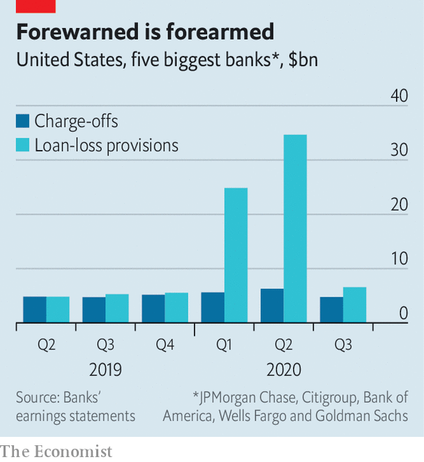

###### The calm after the storm

# Wall Street says it is braced for losses. Now what? 

##### One question is what they do with their earnings 

 

> Oct 15th 2020 


MOST BANKERS have been working frantically for the past six months. Traders handled record-high volumes in choppy markets. Their colleagues issued mountains of equity and debt as companies sought to withstand the economic downturn by amassing capital. Commercial bankers offered forbearance to struggling borrowers, and were forced to write down the value of loans as the likelihood of being repaid fell. As a result, investment-banking revenues soared in the first half of the year, and most commercial banks suffered losses as they set aside provisions for bad loans. That made for slender profits at Bank of America, Citigroup and JPMorgan Chase, the big hybrid banks. Goldman Sachs and Morgan Stanley, which are more skewed towards investment banking, posted stellar profits. Wells Fargo, a mostly commercial lender, lost money.


The third-quarter earnings reported by five of these banks on October 13th and 14th tell a different story (the sixth, Morgan Stanley, was due to report on the 15th, as The Economist went to press). Investment bankers were still busy—trading revenues were up by around 20% compared with the third quarter of 2019, and Goldman’s profits doubled on the year. But the pace of activity was leisurely compared with the second quarter, when trading revenues were up by 60% over the same period in 2019.


Banks also think they are now largely prepared for losses. In the first half of the year the big five booked $60bn-worth of provisions for bad loans. But those in the third quarter were skinnier, at just $6.5bn, not far off those in the third quarter of 2019 (see chart). The stock of allowances for bad loans adds up to $106bn, about 2.8% of banks’ loan books. Non-performing assets are creeping up, but are still far from the levels that would wipe out provisions. Jennifer Piepszak, the chief financial officer of JPMorgan, said that customers were “holding up well”.

 


As the perils of higher provisions and the spoils from market volatility became less dramatic, investors’ attention turned towards a more prosaic influence on earnings: banks’ net interest incomes, or the difference between the interest collected on loans and other assets and the interest paid on deposits and other funding. These have been squeezed by interest-rate cuts by the Federal Reserve and low long-term bond yields. America’s five large banks earned $44bn in net interest income in the third quarter, 13% less than in the same period last year. All together, reduced interest income, calmer trading revenues and subsiding credit costs meant that profits were lower than they were a year ago, but less starkly so than in the second quarter. Profits fell by 11% across Bank of America, Citigroup and JPMorgan in the third quarter, compared with a drop of 56% in the second.


The question now is what banks will do with their earnings. Regulators, still scarred by the global financial crisis of 2007-09, want well-padded shock absorbers. On September 30th the Fed said that the 33 banks with more than $100bn in assets would remain barred from buying back shares in the fourth quarter. Dividend payments are allowed, in contrast to Europe, but capped. As a result many banks are accruing capital. JPMorgan’s common-equity capital ratio rose to 13.0%, from 12.3% in the third quarter last year. At Bank of America the ratio climbed to 11.9%, from 11.4%. That is about $35bn above regulatory requirements, Paul Donofrio, its chief financial officer, told analysts.


With buy-backs off the table, bosses can either spend or save the cash. Some are splashing out. Bank of America said it had invested in adding branches in the third quarter, pandemic notwithstanding. Others are acquiring new businesses. On October 8th Morgan Stanley announced that it was buying Eaton Vance, an asset manager, for $7bn. That came just days after it completed its purchase of E*Trade, an online trading platform.


The extra capital could also come in handy if the economy fares worse than even the dismal scenarios baked into loan-loss provisions. Banks’ bosses sounded cautiously optimistic that this would not be the case. But investors have their doubts. Banks’ share prices are still a third below their levels at the start of the year. ■

