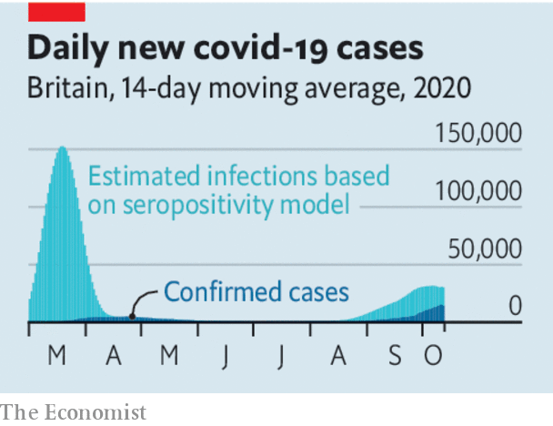

###### Going full circuit

# Britain should not resort to a new national lockdown 

##### The costs would outweigh the benefits 

 

> Oct 17th 2020 


Editor’s note: Some of our covid-19 coverage is free for readers of The Economist Today, our daily . For more stories and our pandemic tracker, see our 


IN ONE SENSE it marks the return of politics as usual; in another it is a sign of looming crisis. On October 13th Britain’s opposition Labour Party split sharply from the government, calling for a “circuit-breaker”, a two- or three-week national lockdown to cut the spread of covid-19. As Europe and America struggle with a surge in cases, other governments may also come under pressure to do the same. It would be a mistake. The benefits of a national lockdown no longer justify the costs. At this stage of the pandemic governments should focus on local measures.


The impulse to do something is understandable. New reported daily cases in Britain are at a record seven-day average of over 15,000 and are doubling every two weeks. Local leaders are angered by confusing orders from Whitehall (see ). No wonder Labour has seized on Boris Johnson’s faltering performance.


Backers of a short, sharp lockdown say it would save lives—perhaps 7,000 or so according to modelling for scientists advising the government. By cutting the virus’s spread, the National Health Service would be spared the sort of overload that caused so many deaths in Italy earlier in the year. Once the epidemic had been reset at a lower level, the tracing system might be able to deal more promptly with the daily burden of new cases, helping to lower the rate of infections.


A national lockdown makes sense only if a country is completely overwhelmed and underprepared—as at the start of the pandemic. Neither is true of Britain today. Although the recorded number of cases in Britain is over three times its peak in April, the comparison is misleading. For all the system’s faults, the daily volume of tests is over 20 times what it was then. Mild cases that would have gone unreported six months ago are now picked up (see chart). This helps explain why deaths, at around 450 last week, are still just 8% of what they were in April. The fatality rate will increase, because it lags behind cases by three to four weeks. But better treatments are also saving lives. In choosing to act, deaths are more important than cases.

 


It is not clear that a national circuit-breaker would have lasting benefits. The disease would start to accelerate again as soon as it was lifted. As the year draws on, people will spend more time indoors, where the virus spreads easily. The burden of proof is on the proponents of a circuit-breaker to show that the well-documented shortcomings of Britain’s tracing system could be fixed by a three-week reorganisation or by a temporarily lower caseload. Compliance is also in doubt. Although polls support tough action, Britons seem to make an exception for themselves. A recent paper finds that just 18% of those who should have isolated themselves in the summer stuck strictly to the rules. If people flout them, the circuit-breaker may be kept for longer than three weeks, lowering compliance still further.


It would also be economically ruinous. In April, at the height of the first lockdown, Britain’s output was one-quarter lower than it had been in February. The IMF argues that lockdowns may be worth it if they create an economy that can fully reopen for business. But nobody is suggesting that a short circuit-breaker could suppress the virus to that extent. And the trade-off would be even less worthwhile if you factor in the toll on mental health, the delay in treating other illnesses and the effects on long-term employment and education.


To get covid-19 under control Britain should focus on sustainable local measures: identifying vulnerable groups, finding ways to protect them, identifying trade-offs, instigating local testing and recruiting leaders to generate local support. A circuit-breaker sounds like a scientific solution to a runaway problem. The reality would be a costly mess. ■

