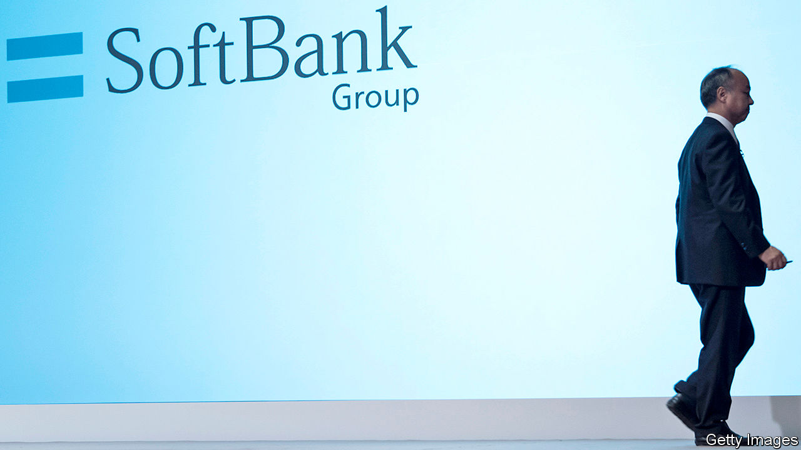

###### Technology investing

# The lessons from the Vision Fund 

##### Son Masayoshi has shown that the future of technology lies as much in Asia as in Silicon Valley 

 

> Oct 17th 2020 


“IF I’M GOING to do a fund it has to be big enough to disrupt the whole technology world.” So declared Son Masayoshi four years ago, on a trip to the Middle East to drum up cash for a new investment vehicle to take on Silicon Valley’s venture capitalists (VCs). His Vision Fund eventually raised $98.6bn and bought stakes in some of the world’s most exciting companies, including ByteDance and Uber. Yet as we explain this week, Mr Son’s mission has so far had mixed results (see ). Performance has been soggy, despite a boom in tech stocks, as the strategy of pouring money into private firms has at times become rather like spoiling perpetual adolescents. Instead, the Vision Fund’s most striking legacy may be that it has marked the start of a new era in which American capital and startups no longer call all the shots.


For decades an elite of VC funds in San Francisco have spotted promising startups and nurtured them to adulthood, in the form of a stockmarket listing or a takeover. The Vision Fund played by different rules. It dragged VC out of its Californian cul-de-sac. Its anchor investor was a Saudi Arabian sovereign-wealth fund, it was controlled from Tokyo and it paid as much attention to Asia’s tech scene as to America’s. It viewed capital as a weapon in a winner-takes-all struggle. By channelling vast sums to startups you could speed up time and help them reach critical mass more quickly while intimidating their rivals. The Vision Fund also tried to reinvent governance. It let firms stay in private hands for longer, as part of its global family of startups which could share ideas and co-operate or fight it out—the fund has bought stakes in 92 firms, some of which compete with each other.


How has the experiment fared? Having invested $82.6bn, the Vision Fund has so far made net gains of $8bn. Mr Son’s optimism about tech was spot-on but his fund has lagged far behind the NASDAQ tech index, which has risen by 99% since May 2017, when the fund was officially launched. That underperformance reflects flaws in its strategy. Throwing cash at firms raised valuations and encouraged entrepreneurs to fight damaging price wars, from ride-sharing to food-delivery. Mr Son’s freewheeling view of governance was a mistake. Without the scrutiny of public markets, egotistical founders went astray, most obviously at WeWork, a property firm. Bad bets had cost the Vision Fund $14.5bn by June this year. It proved hard to get the portfolio of firms to co-operate, or merge, especially given geopolitical tensions.


The tech industry is now rushing in a different direction, taking firms public so they can raise capital from diverse sources and face the discipline of institutional investors. Of the top 30 “unicorns”—private tech firms worth over $1bn—in 2018, over half have listed or are about to, including Ant Group and Airbnb. Many have used alternative techniques to go public, such as direct listings, which avoid the clunky initial-public-offering process. Mr Son’s fund will benefit as its firms leap into the public market at high valuations. But his second fund, Vision Fund 2, reflects a chastened reality, with only $3bn of assets and 13 investments so far, many of them small.


Although it has failed to turn tech investing into alchemy, the Vision Fund has shown that the VC establishment does not have a monopoly in dealmaking—so far this year 82% of VC deals in America have involved non-traditional investors, including sovereign-wealth funds and companies. And most important, by taking a global view and placing giant bets in India, South-East Asia and China, it has underlined that the future of technology lies as much in Asia as on America’s west coast. Like many startups, the Vision Fund has helped change the world—just not in the way it originally expected to.■

