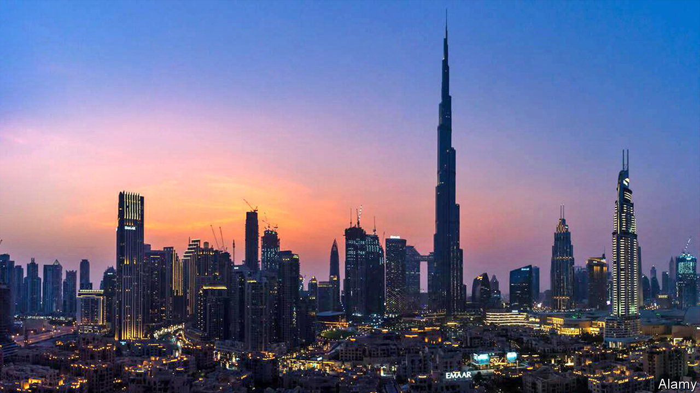

###### Old is gold

# Dubai hopes rich pensioners will fill empty homes 

##### But they won’t fix its flawed economic model 

 

> Oct 15th 2020 


YOU CAN find almost anything in Dubai—except old people. The migrants who run its economy are a young bunch; with residency tied to work, retirement usually means a flight home. The tourists dancing in nightclubs and lounging on beaches tend to be young, too. But the emirate may soon sprout some grey hairs.


In September Dubai announced a new residence visa for over-55s. Only the well-off need apply. Applicants must have a comfortable nest-egg or buy a property worth 2m dirhams ($540,000). The hope is that old folk who might settle in Portugal or Palm Beach will opt for the Persian Gulf instead. The scheme, two years in the making, could boost Dubai’s sputtering economy, which may contract by 11% this year.


Unlike most Gulf states, Dubai (part of the United Arab Emirates) does not rely on oil or gas. The black stuff accounts for just 1% of GDP. Instead it has banked on ceaseless building to fuel a service-heavy economy. The city can feel like a frenetic construction site: new hotels to draw more tourists, who create more jobs for migrant workers, all of which means more demand for malls and apartments.


Even before covid-19 arrived, though, Dubai was starting to look overbuilt. The property market is saturated: one website lists nearly 19,000 flats for sale and another 32,000 for rent. Average sale prices have fallen to 896 dirhams per square foot, estimates ValuStrat, a consultancy. That is the lowest level in more than a decade, 35% below the ten-year peak of 1,380 dirhams in 2014. Rental prices are dropping as well. Some tenants in the downtown financial hub have negotiated discounts of 20% to 25% on their contracts—even as they watch new high-rises spring up across the street.


The pandemic has thrown the engine of growth into reverse. Travel and tourism, for example, have collapsed. Dubai’s airport has mothballed one of its two main terminals. Passenger traffic was down 20% in the first quarter—before most countries went into lockdown—and further still in the second. Hotel occupancy rates in September, normally more than 80%, were just 45%. Emirates, the official air carrier, has already laid off more than 10% of its workforce. Layoffs will ripple across the economy, cutting demand for everything from private schools to happy hours.


When their economies slump, Gulf states epitomise the proverb that no news is good news. They are notorious for publishing indicators months or years late. One analyst recalls using data on power and water consumption to guess at Dubai’s economic growth. In September, though, the emirate offered a rare glimpse of its balance-sheet in a prospectus for a $2bn bond issue. The document listed Dubai’s government debt at 124bn dirhams ($34bn), less than 30% of GDP.


But the figure omits the debt held by government-linked entities. Though they borrow on commercial terms, they have the implicit backing of the state. One of the largest, Dubai World, needed a bail-out in 2009 to avoid defaulting on $59bn in liabilities. This year the government has stepped in only to help Emirates, which has received 7.3bn dirhams in aid. Some of these firms remain highly leveraged, though, with big investments in property, tourism and transport—all vulnerable to the pandemic. S&amp;P, a rating agency, put Dubai’s public debt at 148% of GDP if state-backed firms are counted.


Pensioners could soak up some of Dubai’s excess capacity. But they will provide only a temporary fix if Dubai continues to rely on new construction to drive growth. For years the economic model has been “If you build it, they will come.” That mantra may be due for retirement. ■

