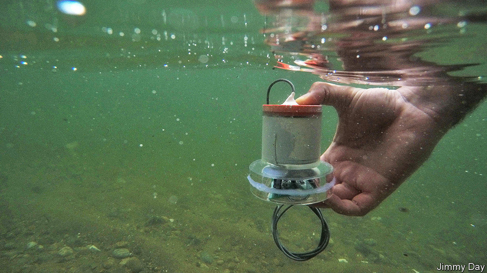

###### Good vibrations

# How to send underwater messages without batteries 

##### A new device extracts energy from ambient noise 

 

> Oct 17th 2020 


RADIO WAVES do not travel well underwater. That is why ships employ sonar rather than radar to plumb the briny depths. Messages broadcast through the ocean need to be sonic, too. For that purpose people often use acoustic modems, which can turn electronic signals into sound, and vice versa, like an old-fashioned acoustic coupler for a telephone.


Such instruments need power, though. And if they are sitting on the seabed, replacing their batteries is a serious chore. But Fadel Adib of the Massachusetts Institute of Technology (MIT) may have the answer. A device he has created and tested not only broadcasts and receives sound—it is powered by sound as well.


The core of Dr Adib’s invention is called a broadband resonator. Typically, an object resonates strongly at only one or a few frequencies. This is why a singer can shiver a wineglass into fragments by holding a particular note—but only that note, and no other. A broadband resonator, by contrast, can receive or transmit sound across a range of frequencies.


Dr Adib’s resonator consists of two nested hollow ceramic cylinders with a layer of polymer sandwiched between them. This structure has many interacting resonance modes. It is this that gives it its frequency range. The trick that turns it into a power source is that the ceramics are piezoelectric—meaning they can convert the vibrations of acoustic energy into electrical energy and vice versa. And, the ocean being a noisy place, there is a lot of acoustic energy around to convert. A device powered by a piezoelectric broadband resonator can thus constantly replenish its batteries without them having to be changed.


The resonator also, though, has a second use. It acts as an acoustic modem that receives instructions to and broadcasts data from the instrument it is part of. To prove this works, Dr Adib and his colleagues used a resonator-based acoustic modem to communicate 60 metres across the Charles river, which separates MIT’s home town of Cambridge from Boston—and, indeed, flows directly past the front of the institute. The Charles is nowhere near as noisy as the open ocean, so they had to supply the sound to power the resonator artificially, using an underwater loudspeaker. Thus supplied, however, the device was able to transmit data at a rate of 20 kilobits a second. This is about the same as a conventional acoustic modem.


Dr Adib has also, by attaching the resonator to an appropriate sensor, used it to transmit information about water temperature, acidity and salinity. Indeed, he sees sensors as an important market for the new devices. One application would be monitoring conditions in fish farms. Another would be in tracking tags for sea creatures—though the current minimum size of a resonator means this would, for the moment, be practical only for large animals such as whales.

Ring my chimes


Resonators could be employed, as well, as nodes in underwater communications networks—extending the range over which a message can be sent. And they might be used in underwater navigation beacons that would provide precise location data to submersibles unable (because signals from satellites are radio waves) to employ the global positioning system or one of its equivalents for the purpose.


More specifically, America’s navy, which is sponsoring the project, has plans to use resonator-powered devices as sentries. An array of such devices could calculate the range and direction of a source of sound such as a ship or submarine and send it back to base.


Dr Adib and his team are now working on extending the devices’ capabilities. Their immediate goals include communicating between pairs of them over a distance of a kilometre, and building networks that have hundreds of nodes.■

