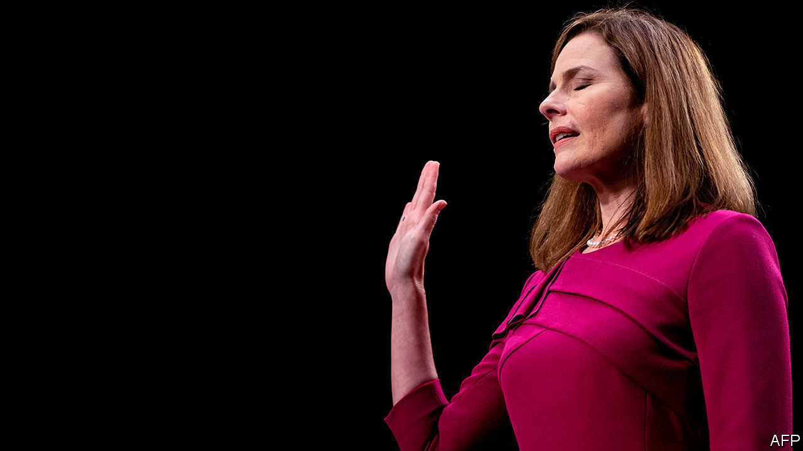

###### Hearing test

# Amy Coney Barrett’s arrival on the Supreme Court is inevitable 

##### But the politics of this may not be as good for Republicans as they hope 

 

> Oct 17th 2020 


SENATE CONFIRMATION hearings for Supreme Court nominees are an odd mix: bloviation and softballs; hopeless yet relentless inquiries into controversial cases; deflections and mini civics lessons from jurists in the hot seat. Judge Amy Coney Barrett’s endurance run before the Senate Judiciary Committee ticked these boxes. But President Donald Trump’s nomination of a deeply conservative appeals-court judge to replace the late liberal justice Ruth Bader Ginsburg in the fraught last stage of a historically divisive general election campaign brought new pique to the Hart Senate Office Building.


Democrats had no chance of averting a committee vote in Ms Barrett’s favour and—barring a quartet of new infections among Republicans—have little hope of stopping her when the full Senate votes in the coming weeks. But the ten Democrats on the 22-member committee put together an uncommonly unified resistance. Their message was aimed at voters rather than at Republican colleagues across the aisle.


The Affordable Care Act (ACA), the law Barack Obama signed in 2010, took centre stage. With a Supreme Court challenge to the ACA coming on November 10th, one week after the election, each Democrat probed Ms Barrett on whether she would vote to scrap it—and strip coverage from some 23m Americans—days after taking Ms Ginsburg’s seat. The interrogation was accompanied by stories and photos of sick constituents with pre-existing conditions who could be left without affordable coverage should the high court toss the law.


The line of attack is not without footing. In 2017, Ms Barrett criticised NFIB v Sebelius, the 2012 Supreme Court decision upholding the constitutionality of the law’s requirement that most Americans buy health insurance. When Chief Justice John Roberts anchored a 5-4 majority interpreting the mandate as a tax within Congress’s revenue-raising power, she wrote, he “pushed the Affordable Care Act beyond its plausible meaning to save the statute”. Juxtaposing Chief Justice Roberts with “staunch textualists” such as her mentor, Antonin Scalia, Ms Barrett then used a footnote to detail several other cases in which the chief “depart[ed] from ostensibly clear text” in order to achieve his “preferable result”. She also favourably quoted Mr Scalia’s condemnation of Chief Justice Roberts in Sebelius and in King v Burwell, as having turned the ACA into “SCOTUScare”.


Senator Amy Klobuchar paired this review of the Supreme Court’s two rulings on the ACA with Mr Trump’s 2015 tweet promising his judicial appointees would “do the right thing” and strike down the law. Ms Barrett insisted she had made Mr Trump no promises and was “not hostile” to Obamacare. She also pointed out that the new challenge, California v Texas, involves a question not at stake in the earlier cases: whether, if the now-toothless individual mandate (which fined people who chose to go uninsured) is unconstitutional, that pulls the rug out from under the entire ACA. Perhaps tellingly, in adjudicating a student-advocacy competition last month, she struck down the mandate but said it was “severable” from the rest of the law.


The perennial question of abortion rights also popped up. When Ms Ginsburg was asked about Roe v Wade in her hearings nearly three decades ago, she said the “decision whether or not to bear a child is central to a woman’s life, to her well-being and dignity”. If the government were to obstruct that decision, a woman would not be “a fully adult human, responsible for her own choices”. By contrast, Ms Barrett believes life begins at conception. In 2006 she signed a letter condemning Roe’s “barbaric legacy” and urging the restoration of “laws that protect the lives of unborn children”. When Senator Dianne Feinstein asked if this means Roe should be reversed, Ms Barrett replied: “I don’t have any agenda.”


Other than in her openness on abortion, Ms Ginsburg was tight-lipped in 1993—a “no hints, no forecasts, no previews” strategy Ms Barrett emulated. But Mr Trump’s third nominee may have dropped a few clues. She referred to half a dozen Supreme Court rulings as “super-precedents”, that is cases “so well-established that it would be unthinkable that [they] would ever be overruled”. Brown v Board of Education, the 1954 ruling that struck down segregation in public schools, is a super-precedent, she said. Roe is not—and is subject to reappraisal—because it remains controversial.


Ms Barrett was also asked about her likely role in election lawsuits. Declaring she would not be “used as a pawn to decide this election for the American people”, she declined to recuse herself from litigation that could affect the result. And when Senator Cory Booker asked how she regards Mr Trump’s let’s-wait-and-see approach to transferring power peacefully, Ms Barrett could not be pinned down. That’s “a political controversy right now”, she said. “As a judge I want to stay out of it.” And with that ACB was no longer merely emulating RBG. A senior judge who felt unable to utter some bromide in support of democracy for political reasons? It was unprecedented.■


Dig deeper:

Read the  and explore our , then sign up for Checks and Balance, our  and  on American politics.

