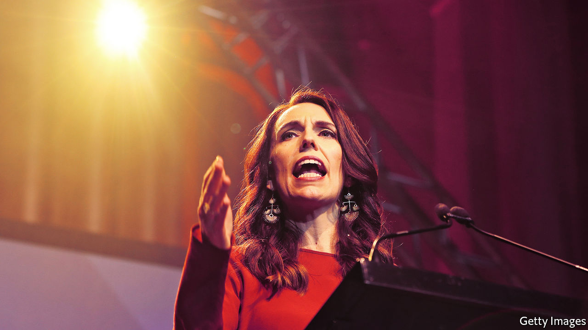
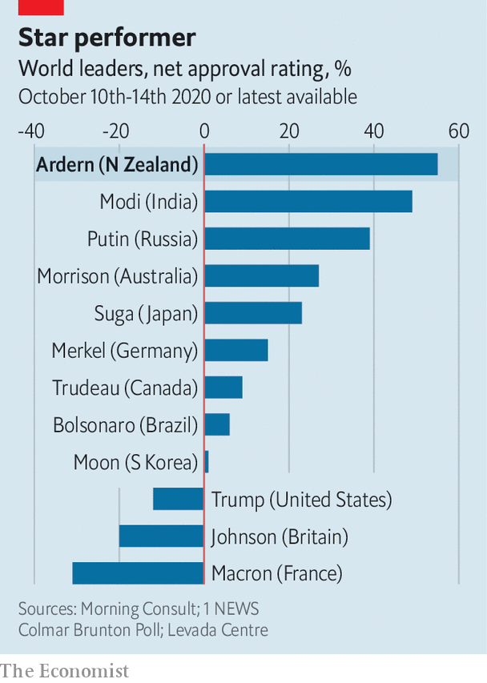

###### Labour day

# A hard task ahead for Jacinda Ardern’s new government 

##### New Zealand has kept out covid-19, but is not immune to its economic consequences 

 

> Oct 24th 2020 

EVERYONE KNEW that the Labour Party would win. But even its leader, Jacinda Ardern, seemed startled by its landslide victory in New Zealand’s general election on October 17th. Ballots must still be counted from prisoners and expats, but so far Labour has mopped up 49% of the vote, compared with 27% for the main opposition, the conservative National Party. New Zealand’s proportional voting system is designed to curb the power of big parties, by making it hard for them to govern without smaller coalition partners. Yet with an absolute majority in parliament (64 seats out of 120), Labour will be able to do just that.

Although she does not need them, the prime minister is now in talks with the Green Party’s ten MPs, to find what she calls “areas of potential co-operation”. They might not enter teha full-blown coalition, but the pair could form a looser partnership whereby the Greens vote with the government on certain issues, in return for a ministerial portfolio or two, says Neale Jones, Ms Ardern’s former chief of staff. The Greens’ co-leader, James Shaw, was climate-change minister in the last government. One idea is that he could be re-appointed to that post. Such an arrangement would have the appeal of keeping criticism at bay. What is more, Labour has lots of ministerial jobs to fill, now that it has a parliamentary majority. Many of its MPs are rookies, so experienced Greens could help fill the ranks.


Ms Ardern, New Zealand’s most popular leader in generations (and one of the world’s most popular—see chart) has avoided debate about what happens next. Her upbeat campaign focused on how well her previous government, a coalition with a populist party, New Zealand First, kept the pandemic at bay. New Zealand has all but suppressed local transmission of the virus, allowing Kiwis to have fun in crowds—a day after the election, 46,000 fans squished into a stadium to watch the All Blacks, the national rugby team, thrash Australia. But this does not mean that the country is immune to the economic symptoms of covid-19.

 


New Zealand’s small economy depends on the outside world. Since its borders closed in March, the foreign students and immigrants who power its growth have been shut out. The loss of tourists, who are normally its biggest source of export earnings, is devastating resort towns such as Queenstown. A wage subsidy, which saved vulnerable jobs in hospitality and retail, has just dried up. The government predicts that unemployment will almost double to 7.7% in the year ahead.

Kiwis strongly support their state of isolation. Although Ms Ardern intends to let in a trickle of “critical workers” and graduate students—and perhaps, at some point, visitors from Australia—government modelling suggests New Zealand will be closed until early 2022. Labour insists that it has other ideas to get the economy moving. The problem, says Jennifer Curtin, a political scientist at Auckland University, is that no one is quite sure what they are.

The party’s 29-page manifesto was released just four days before the vote. It vows to create jobs by investing in critical infrastructure. There will be more loans for small firms, and a NZ$311m ($206m) subsidy for companies which hire the jobless. To critics, this all seems rather bitsy. They gripe that Ms Ardern is better at making people feel warm and fuzzy than turning policies into action. In her first term plans for everything from a capital-gains tax to a light railway in Auckland fell flat.

Back then Labour was able to blame, often fairly, its conservative coalition partner for such failures. Now it bears sole responsibility. Left-wing voters will expect Ms Ardern to do something big about poverty and inequality—problems which she promised, but failed, to tackle in her first term. However, the conservative voters she has just won over will be wary of sweeping changes to tax or welfare. Ms Ardern promises to govern “for all New Zealanders”. But she cannot please everyone. ■

