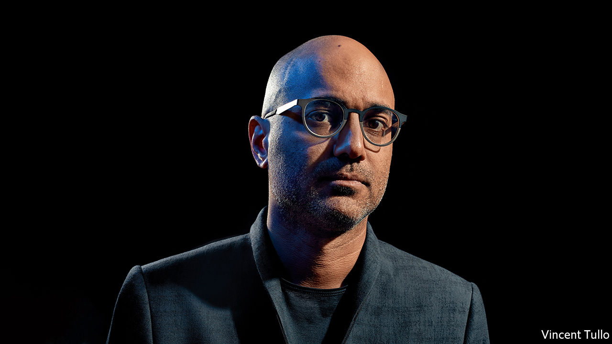

###### Made for you and me

# Ayad Akhtar is a bard of American discontent 

##### “Homeland Elegies” dwells on the question of belonging 

 

> Oct 24th 2020 

Homeland Elegies. By Ayad Akhtar. Little, Brown; 368 pages; $28. Tinder Press; £18.99.

AYAD AKHTAR is best-known for his fearless theatre plays about Muslims, America and finance, the first of which, “Disgraced”, won a Pulitzer prize. “Homeland Elegies”, his new novel, affirms his talent for storytelling and dazzling prose. This tale composed of many tales also delivers a blistering critique of America’s trajectory over the past 20 years.


Recently named president of PEN America, a literary and human-rights organisation, Mr Akhtar has written prolifically on American society. His first novel, “American Dervish”, was about Muslim life in the Midwest; this one follows his parents’ generation of Pakistani immigrants and their struggle to assimilate, a struggle that divides a father and his American-born son. Partly autobiographical, it is at once funny and furious, despairing and indignant.

The narrator, a prizewinning playwright like the author, kicks off his excoriating portrait of a dysfunctional country with a hilarious set piece on his father’s infatuation with Donald Trump. It is the 1990s and Sikander, a renowned cardiologist, is sent to treat the reality-TV star for a heart problem, and becomes his greatest fan. Yet as the book unfolds, America proves to be as gripped by “irrational paranoia” as Pakistan. Along the way the narrative takes dozens of detours: it is an enfilade of stories, succeeding one another like the rooms at the Palace of Versailles.

Personal and family episodes mix with riffs on economics and history, from Indian Partition to antitrust law and Islamic beliefs. Riaz, a hedge-fund manager, makes the narrator rich; a pro-Taliban “uncle” is killed by the CIA. Anti-Muslim prejudice bubbles up. When the narrator tries to donate blood on 9/11, a white American screams: “Nobody wants your fucking Arab blood.”

Again and again Mr Akhtar returns to the question of belonging, in both senses. Whose America is this really? Attacks on corporate power and Reaganomics round out his jeremiad from the left. But even readers whose politics differ will be enthralled. The registers somehow fit together, as Scheherazade meets Cassandra in a chain of stories and dreams. He has hit on an ingenious form for the snapshot age of Instagram, as he updates an enduring American drama: from rags to riches—and back again.

