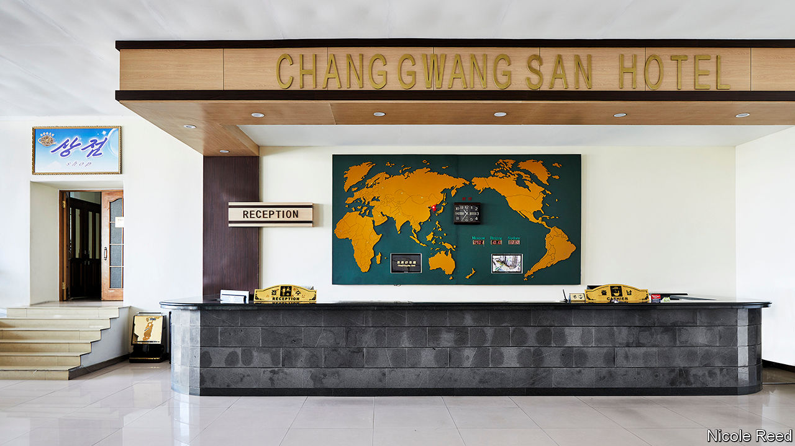
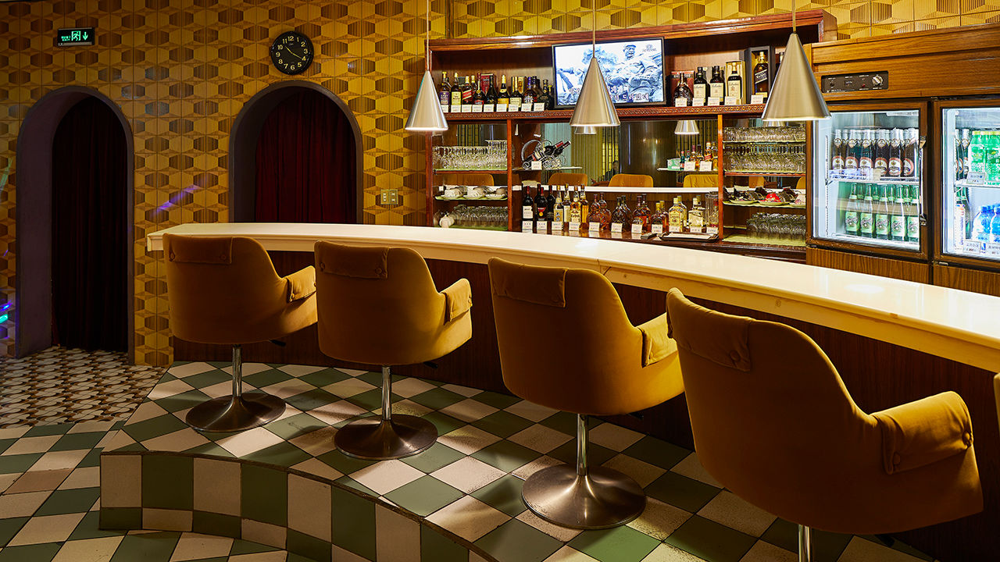
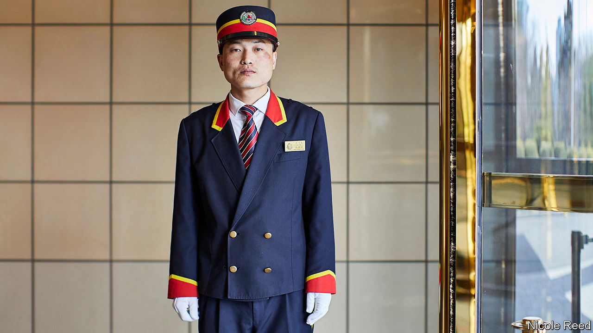

###### Despot decor

# The curious design features of North Korean hotels 

##### A book of photography offers an offbeat look at a little-seen city 

 

> Oct 24th 2020 

Hotels of Pyongyang. By James Scullin and Nicole Reed. Astral Horizon Press; 200 pages; £50.

AT THE BEGINNING of “Pyongyang”, a song of 2015 by the British band Blur, Damon Albarn, the vocalist, sings about looking down from his window “to the island where I’m held”. The line is a reference to the Yanggakdo Hotel, a 47-floor, 1,000-room monstrosity that sits on an island in the middle of the Taedong, the river that runs through the capital of North Korea.


Most Westerners who come to Pyongyang on organised tours are put up in the same grey tower, which is topped by a revolving restaurant. Though not quite “held” in the hotel, visitors are brought back there by their minders at the end of a day’s supervised sightseeing; wandering around the city by themselves is strictly forbidden. Even inside, it is important to observe the rules. In 2016 Otto Warmbier, an American student, was arrested after allegedly trying to steal a propaganda poster from a restricted area of the Yanggakdo. He fell into a coma in North Korean custody and died shortly after his release in 2017.

Such cautionary tales are not the focus of “Hotels of Pyongyang” by James Scullin, who leads tours of North Korea, and Nicole Reed, a photographer. A short foreword by Mr Scullin acknowledges the importance of hotels as propaganda showcases for the regime, but he stresses that after a few drinks with their guides at the bar, tourists might hear stories about the country that go beyond the party line. Anecdotes about the buildings accompany the images. The Pyongyang Hotel, for instance, is known for having the best coffee in town, as well as the most eye-wateringly expensive. (Mr Scullin does not mention that you have to wait at least half an hour for a cup.)

 


But the book’s main interest is in the unique design features of the hotels. Even those few Westerners who have ventured to North Korea are unlikely to recognise most of them (the vast majority of visitors to the country are Chinese). Because of the pandemic, North Korea has been off-limits to overseas tourists since the end of January. So, for the moment, those tempted to go—and the many more who never will—can get no closer to a Pyongyang hotel than Ms Reed’s engrossing pictures.

 


Taken during a trip in April 2019, mostly during the day when guests were on their sightseeing tours, the images are eerily devoid of people. That allows Ms Reed to concentrate on the eccentric details of the hotels’ decor. They all feature a curious combination of Soviet kitsch, pastel colours and individual quirks such as unexpected fairy lights or plastic plants.

Vast breakfast salons boast ballroom-style chandeliers, lurid wall-sized landscape paintings, exuberant tablecloths and ornate chairs. Karaoke parlours have tasselled curtains, elevated stages, marble floors and psychedelic upholstery. Two plastic dolphins dangle forlornly from the ceiling above a blue-tiled pool at the Sosan Hotel. And if there is ever a North Korean remake of “Mad Men”, the curvaceous, turquoise-topped bar at the Pothonggang Hotel would make a fitting set. ■

