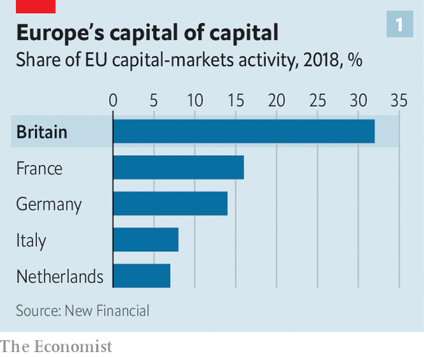
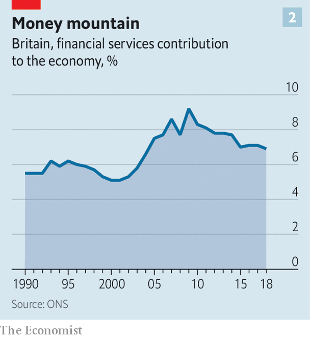
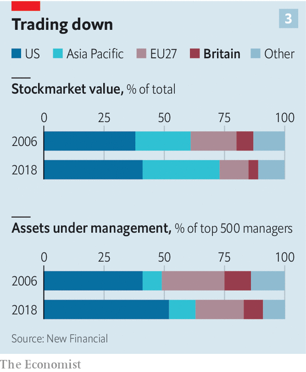

###### Financial services

# What Brexit will do to the City of London 

##### The damage will be noticeable but not disastrous 

 

> Oct 24th 2020 

THE FORTUNES of financial centres may swing less wildly than the markets they host, but swing they do. In the 2000s London threatened to knock New York off its perch as the world’s top financial centre. Michael Bloomberg, then mayor of the Big Apple, commissioned McKinsey to study how his city could repulse the attack in 2007. Today things look different. Brexit has robbed the City of London, the capital’s financial district, of much of its swagger. World-conquering ambition has given way to anxious defensiveness.

When the post-Brexit transition period ends and Britain leaves the single market on December 31st, financial links with the EU will become, in the words of its new financial-services chief, Mairead McGuinness, “less fluid”. That is putting it mildly. British-registered financial firms will lose the “passporting” rights that have long allowed them to sell funds, debt, advice or insurance to clients across the EU unimpeded, as if they were domestic. Thousands of jobs and well over £1trn of assets have already been shifted to continental Europe as City firms confront this new friction.


Brexiteers argue that a City cut free from the EU’s red tape can be a more outward-looking entrepot, with strengthened links to the rest of the world. For now, though, the headlines are all about what London is set to lose. Covid-19 has only added to the anxiety in the City. “It’s a ghost town, just like it is between Christmas and new year but without the drunks,” laments a banker.

This jolt comes after two decades during which London became the increasingly muscular heart of the EU’s financial body. Banks are natural consolidators, and many sought to do as much of their European business as possible from London. An analyst recalls an American banker saying, of his European operations, “If it’s not bolted to the floor we move it to London”.

 


As a result, London became the overwhelmingly dominant EU hub in international finance (see chart 1), and Britain a big net exporter of financial services, with a £44bn surplus in 2017. The sector’s share of GDP has grown, despite slipping back a bit after the financial crisis of 2007-09 (see chart 2). This activity is a big generator of tax revenue: financial-services firms pay around £75bn a year, or more than 10% of all tax receipts.

 


It might seem odd, then, that since the Brexit vote in 2016 governments have not considered the City a priority. But its support for Remain did not endear it to the Brexiteers who now run Britain—and who know that there are more votes in protecting fishermen than moneymen. Financial services are not part of the trade deal being negotiated with Brussels. Ministers took the view that the City is “big and smart enough to look after itself”, says Miles Celic, chief executive of TheCityUK, an advocacy group.

As a result, any deal on financial services is likely to be “very thin, a sort of ‘No Deal Plus’”, says William Wright of New Financial, a think-tank. That is what most financial firms and their regulators have long assumed would be the outcome. Much work has gone into minimising disruption, from the 16m insurance policies that Brits have with EU-based providers to the £76trn-worth of over-the-counter derivatives contracts between British and EU counterparties. This should ensure there is “no drama” on January 1st even if there is no deal, says a British regulator. “It will be more a broken-arm than broken-neck cliff edge. Some market disruption, perhaps, but not a financial-stability event.”

Britain was quick to grant EU financial firms access on existing terms for three years, after which they can seek longer-term “authorisation”. This was not reciprocated. With passporting gone, the best that British firms can hope for in the EU is “equivalence”—a poor substitute. This would allow British firms to serve EU clients only if Brussels deemed British regulations to be closely aligned with its own. Moreover, the access is limited and revocable at 30 days’ notice.

Worse, the EU seems minded to offer relatively unfettered access only in areas where not doing so could affect its own financial stability, such as critical market infrastructure. It has thus agreed to extend current arrangements for clearing euro-denominated derivatives, an activity dominated by London-based clearing houses. But even here the extension is only for 18 months, after which it will be reviewed. The EU is determined to build its own clearing capacity to reduce “excessive” reliance on British financial plumbing—though, as Sir Douglas Flint, chairman of Standard Life Aberdeen, a British fund manager, points out, how the 27 countries would share the risks of backstopping it remains to be seen. Tellingly, the London Clearing House’s (LCH’s) share of euro-swaps clearing has remained above 90% since the Brexit referendum, despite efforts by Eurex, a Frankfurt rival, to nab market share.

For many other activities, the level of access starting on January 1st remains unresolved. That is not least because the EU is using equivalence as a bargaining chip in the trade talks. European regulators are yet to decide, for instance, whether EU investors will be able to trade EU-listed stocks on British exchanges. The London Stock Exchange (LSE) says it will offer trading of EU-listed shares on the Dutch trading platform it owns if necessary.

In several key areas, equivalence has been all but ruled out. One is investment-banking sales and trading—bad news for the Wall Street giants that have long used London as a beachhead from which to serve wholesale clients across Europe. Another is retail banking. Some EU countries have already told British banks they won’t be able to serve customers there, forcing the closure of accounts.

Fund managers have another worry, related to “delegation”, the outsourcing model at the heart of the €18trn European fund industry. Thousands of funds are domiciled in places like Luxembourg or Dublin for tax or regulatory reasons, but are permitted to be managed from London, New York or Hong Kong. The EU’s markets authority recently cast doubt on this arrangement, suggesting it may be reviewed. This has caused consternation in Britain—whose fund managers oversee £8.5trn of assets, £2.1trn of which sit in EU-domiciled funds—and elsewhere. “Asset management is just as critical [as banks] to the City’s long-term future,” says Bernie Mensah, president of International at Bank of America. “If you can prise much of that industry away from London then you really start to tip the balance of power.”

The jobs toll

Brussels has always been clear what Brexit would mean if Britain left the single market: if you want to serve EU clients, as a rule it should be done from within the bloc. Its motives are complex. Playing tough is partly to do with deterring others from leaving the EU. It is also about regaining “economic sovereignty”. Some EU regulators worry about the implications for financial stability of having to rely on a third country for critical functions. Others see Brexit as a chance to renew the push for “capital-markets union”, a long-stalled project to deepen and integrate the EU’s fragmented markets, thereby lowering the cost of capital. And there is raw opportunism. “It does seem to me that some in the EU are seeking to weaponise the equivalence decisions for the UK as a third country in order to shift trading volumes in particular into the EU27,” says Kay Swinburne, vice-chair of financial services at KPMG’s British arm, and a former MEP.

EU regulators have made it clear that they want to see “substance” in EU subsidiaries. Banks are under pressure to move not just back-office staff but salespeople, traders and risk managers too. “Keeping the key staff in London, with a brass-plate operation across the water, is out,” says a British regulator. In response, banks have been moving employees in substantial numbers, albeit not the tens of thousands that City Cassandras predicted would migrate. According to EY’s Brexit Tracker, which monitors announcements by large banks and other financial firms, as of October 1st at least 7,500 jobs had left the City for the EU since the referendum. On top of this, firms have added, or plan to, over 2,800 new roles in EU subsidiaries.

These lost jobs add up to around 4% of the total in the City—hardly a devastating blow. But the actual number moving is higher; EY tracks only the 222 largest firms. And there is more to come. Some firms have been waiting to see the outcome of the trade talks before moving more staff. “We will see skeletal teams in the EU being fleshed out over coming months,” says John Liver of EY. With covid-19 complicating relocation, EU regulators have indicated that banks can finish transferring staff next year, as long as their intentions are clear. Hubertus Väth of Frankfurt Main Finance, the city’s financial cheerleader, says that in 2019 some 1,500 finance jobs moved from London to Germany’s financial capital. He expects another 2,000 to transfer as the pandemic fades.

Mr Wright estimates that around 90% of the big Wall Street banks’ European staff were based in London before Brexit, and expects the number to have fallen to 80% by the time the dust settles. Morgan Stanley is reportedly looking for a new London HQ with at least 600,000 square feet, down from its current 800,000. How much of the reduction is down to covid-induced downsizing and the rise of home working, as opposed to Brexit, is unclear.

As for assets, banks have announced the shifting of £1.2trn-worth, equivalent to 14% of British-based banks’ total assets, in preparation for Brexit; more may have been moved unannounced. Nicolas Véron of Bruegel, a think-tank, reckons that more than 20% of British banking assets could eventually go.

Barclays is transferring £150bn—over 10% of its domestic balance-sheet—to Ireland, making it the largest bank there. JPMorgan Chase is moving €200bn, over 7% of its global assets, to Germany. When asked by Bloomberg if 20-25% of the wholesale revenue JPM generates in Britain could end up elsewhere, the bank’s head of Europe, Viswas Raghavan, replied, “You are in that zip code.” Lost business means lost tax revenue: Stephen Jones of UK Finance, a lobby group, told a House of Lords committee in February that of the £37bn-38bn that banks contribute directly and indirectly to the Exchequer, £3bn-5bn is “at risk”.

Estimating the final toll is guesswork. New Financial reckons that a quarter of the City’s business is EU-linked and half of that may have to relocate. A similar lack of clarity hangs over the City’s £55bn-65bn in revenue from other parts of the world. No one knows what proportion of that is routed through London only because of its soon-to-disappear frictionless access to the EU.

The City still has charms

Despite Brexit, London retains several advantages over EU financial centres, from its language and legal system (which governs many financial contracts) to the rich corporate ecosystem of lawyers, accountants, consultants and public-relations experts entwined with the City. London is also—no small matter—the worldliest of the continent’s world cities.

This makes it attractive not just to big banks, but also to hundreds of smaller firms that “see advantages Paris and Frankfurt struggle to reproduce”, says Daniel Pinto, the Anglo-French founder of Stanhope Capital, a boutique investment firm. Paris, he says, is still seen as “wanting to penalise, not promote, the financial sector”, despite its strenuous efforts to woo business from London. Meanwhile, foreign institutional investors, from American endowments to Middle Eastern sovereign-wealth funds, “have an almost cultural attachment to London and will still want to invest through it if they can”. Moreover, London is streets ahead of European rivals in several fast-growing sectors, such as green finance and fintechs. For firms in these domains, “If you want to see 20 investors who are genuinely invested in your area, London is still the place, and we don’t see that changing,” says Mike Reid of Frog Capital, a VC firm that invests in fintechs.

Regulation might also be an advantage in the future. Some worry that standards may be allowed to slip to boost Britain’s competitiveness. The Bank of England rejects this (one of its mantras is “divergence doesn’t necessarily mean dilution”). It stresses a change in style rather than substance: making rules smarter by letting regulators, rather than lawmakers more detached from the industry, craft more of them. Improving on the EU’s one-size-fits-all-27 financial rule book is not the most fiendish of challenges. The aim is to rewrite it so it is “more open to innovation while no less attentive to financial stability”, says a British official, citing clunky European rules for small banks and the constraints of the Solvency 2 insurance directive as areas to work on. Ms Swinburne expects Britain to seek to align regulation more closely with America and Asia.

 


The EU, meanwhile, suffers from a lack of cohesion. The huge variation in its member states’ tax and insolvency laws is a formidable barrier to creating a unified capital market, for instance. The bloc is also riven with division over what type of financial sovereignty it wants. “It’s a delicate balancing act. The more it wraps its arms around EU borders and says activity has to take place within them, the less competitive and less connected to global flows its financial services will be, and costs will rise,” says Andrew Pilgrim of EY. Even America, the financial hegemon, has never sought to gain full control of its financial flows and currency.

Also hamstringing the EU is a lack of co-ordination in taking on London. Its financial centres compete with each other. When Paris hustles to lure asset managers, for instance, it looks to poach from Luxembourg and Dublin as well as London. “There’s no one place where they [the EU] are amassing their efforts,” says Eva Kingston, a financial headhunter. As a result, expertise is diffuse: Frankfurt is strong in banking; Amsterdam in trading platforms; Luxembourg and Dublin in fund administration; Paris comes closest to being an all-rounder but is far from world-class. In a recent global ranking of financial centres it came 18th, just ahead of Washington, DC.

There are also questions over banks’ longer-term commitment to a Britainless EU. They are being forced to relocate business against their will. “Allocating more capital to the euro zone right now feels odd, what with negative interest rates and an undynamic economy,” says a senior City figure. It does not help that the EU27’s share of global banking, insurance and capital-markets activity has been falling since before the global financial crisis: from 20% in 2006 to 13%, while America’s share has remained stable at around 40% and Asia’s has jumped from 18% to 28%. “Anyone for a market that’s relatively small in global terms, shrinking and inefficient?” asks another banker, acerbically.

 


Some bankers may find ways around the diktat that they serve EU clients from within the bloc. The LCH has suggested that, faced with “forced fragmentation”, some firms might try “to reroute trades via different entities”. A central banker says: “Never underestimate the financial sector’s ability to do the business it wants, where it wants, despite regulators putting lines on maps. Arbitrage is in its DNA.”

Even if London stays well ahead of European wannabes, however, it faces intense competition from elsewhere. It remains locked in a battle with New York for top spot. Asian markets are growing fast and becoming more self-sufficient in raising capital. China has hosted more of the IPO boom of 2020 than London, partly thanks to its fast-growing, Nasdaq-style market for tech stocks. “The big risk for London is not the EU but that in the not too distant future Asia doesn’t need it,” says Mr Wright.

The full impact of Brexit won’t be clear for years. Large parts of the future relationship between the City and the EU will be thrashed out only at the end of temporary extensions, such as that for clearing, says Simon Gleeson of Clifford Chance, a law firm. In the meantime, technology, along with covid-19 and home-working, is making the question of location-based regulation, long fundamental in finance, increasingly vexed. All of which, says Jan Putnis of Slaughter and May, another law firm, “makes Brexit look almost quaint”.■

