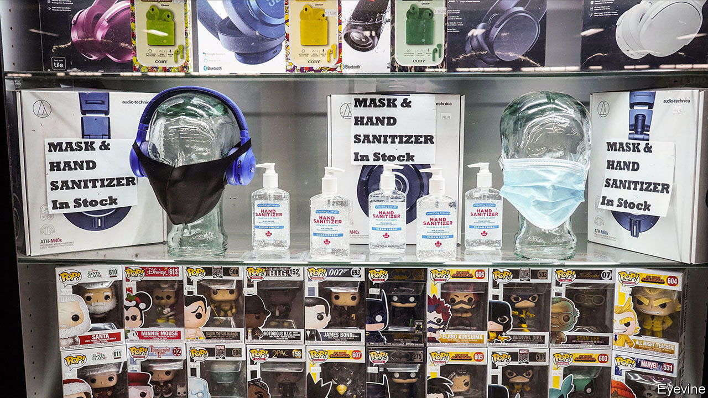

###### Disaster profiteering

# Price gouging: a cautionary tale 

##### New York City’s new rules show the difficulties of regulating prices 

 

> Oct 22nd 2020 

UNSCRUPULOUS TRADERS use a crisis to charge exorbitant prices. Politicians, wanting to protect consumers, crack down on profiteers. But how to work out what price is too high, and what redress is appropriate? The story of your correspondent’s local corner shop offers a cautionary tale.

This type of shop was once familiar in New York, but has largely been squeezed out by chains and bank branches. The owner is an immigrant who opens early and closes late. In crises the shop stocks the products that customers need. When flooding from Hurricane Sandy caused a blackout in 2012, it sold batteries, torches, candles and board games. During the pandemic it has been piled high with boxes of sanitiser, bleach, masks and gloves.


Stocking up comes with risks. Acquiring inventory is costly. Demand drops off when normality returns—unwanted board games linger in the back of the shop. And this time, the rules changed. In March a woman bought a box of masks (each mask costing $2), and then said she was from the city’s office of consumer affairs, and charged the shopkeeper for violating new price-gouging rules. Two days later, says the shopkeeper, another inspector charged the shop again, this time offering guidance on the right prices. Masks should cost no more than $1; gloves selling at $19.95 should sell for only $14.95. Each package marked above the permitted price would be fined $500. There were many packages.

Most economists oppose restrictions on price gouging not because they like fat profits, but because higher prices lead to more supply. Indeed, in many places sanitiser and face-masks are now ubiquitous and cheap. Then there is the tricky question of what counts as price gouging—in a pandemic. New York City banned price rises of more than 10% from pre-pandemic levels. But what if the shop had not sold the items before? And why 10%? Price increases “in excess of an amount reflecting normal market fluctuations” were banned. But what, in March, was normal?

In response to a summons, the shopkeeper went twice to court, enduring the security check and the queues, only to find that, because of covid-19, it was not in session. The first time, a guard explained that the summons had been mistakenly sent by computer. Another defendant in a different case said that she had tried calling several times to ask if the court was sitting, but had not got through. (She would have been presumed guilty had she not shown up.)

Shortly before a rescheduled hearing, the shop’s proprietor received an offer to settle the first charge for a little over $7,000. That is much more than his monthly profit, he says from behind the plastic screen now distancing him from customers, looking glumly at a stack of legal papers on his counter. But the fines would be ruinous.

New York City’s consumer-protection agency says it has issued more than 14,600 citations. The shopkeeper will settle, but worries that he may have to pay again for the second charge. Justice in the Big Apple has been opaque and costly—and raises the question of who precisely is being gouged.

