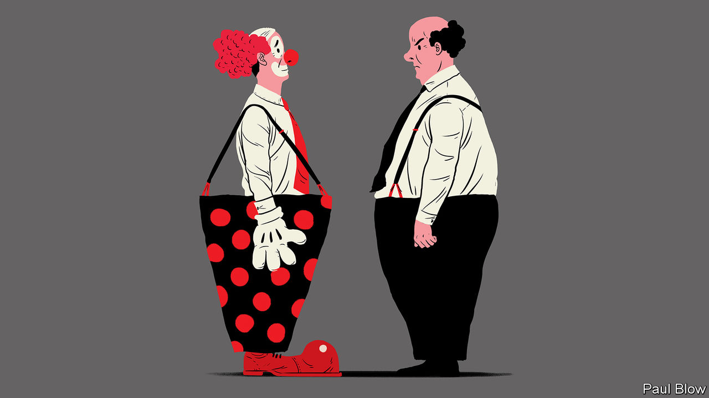

###### On the Uyghurs, Venus, Catholic voters, Zoom meetings

# Letters to the editor 

##### A selection of correspondence 

> Oct 24th 2020 


 The Uyghurs: China responds

The Economist’s articles on Xinjiang made groundless accusations against China’s policy and was a gross interference in China’s internal affairs (“”, “”, October 17th). The issues you raised have nothing to do with human rights, ethnic groups or religions, and everything to do with fighting violent terrorism, separatism and extremism. Extremist forces have carried out thousands of violent attacks in Xinjiang. For this reason its government has taken resolute action to crack down on such violence, in accordance with the law. The deradicalisation measures have curbed terrorist activities; there has not been a single attack for over three years. Feeling more safe, these measures have won the extensive and heartfelt support of people from all ethnic groups in Xinjiang.


You described the region’s vocational education and training centres as akin to concentration camps and re-education camps. They are neither of these. They are useful and positive explorations of preventive and deradicalisation measures. The centres were established to address the root causes of extremism and to prevent further terrorist activities. They fall in line with the principles embodied in a number of international documents on counter-terrorism, such as the UN Global Counter-Terrorism Strategy. In nature, they are no different from the Desistance and Disengagement Programme in Britain, community corrections in the United States, or deradicalisation centres in France.

At these vocational education and training centres, those who have been led astray by extremism or who have committed minor crimes learn the common language, legal knowledge and vocational skills. This helps them break with extremism. The constitutional and legal principles that respect and safeguard human rights are strictly followed. The trainees’ dignity, freedom, right to use languages of their own ethnic groups, customs and habits, and freedom of religious belief are all fully respected.

A few anti-China organisations invented the lie that nearly a million Uyghurs are detained. Their absurd conclusion is based on interviews with only a handful of people, and some news reports from an extremist organisation outside China, which therefore lacks any factual basis. An online video, which is said to have been authenticated by Western intelligence agencies, is used as proof that a large number of Uyghurs are imprisoned. Actually, the video shows the transfer of a group of prisoners at the Kashgar Detention House, which is a normal judicial practice.

It is also a lie that forced sterilisation is carried out in Xinjiang. A family-planning policy was introduced to all areas of Xinjiang in 1992 to comply with the national population law and achieve the balanced and sustainable development of the population. Between 2010 and 2018 the Uyghur population soared by 25%, the local Han population by just 2%.

As for the so-called victims of prosecution in some online videos, their true identities are not what they claim. The truth is, they are either “East Turkistan” elements engaged in anti-China and separatist activities, or actors trained by anti-China forces in America and other Western countries to spread rumours about China.

Xinjiang is purely China’s internal affair. Human rights in the region continue to develop and progress. From 2014 to 2019, GDP in Xinjiang grew at an average annual rate of 7.2%. The incidence of poverty has fallen to 1.2%. You have turned a blind eye to our previous clarifying statements and are spreading fallacies, fanning the false charge that China is engaged in a “crime against humanity”.

We urge The Economist to address this negative impact, respect the facts, and write objective and impartial articles on Xinjiang.

ZENG RONGSpokesperson of the Chinese EmbassyLondon

 


Volcanoes on Venus

Reporting on the possibility of “” (September 19th) in the clouds of Venus, you said that for “billions of years the Sun has been growing brighter, thus changing the boundaries of its habitable zone” and that on Venus “it prompted what atmospheric scientists call a ‘runaway greenhouse effect’, boiling away the seas which many scientists believe to have graced the planet’s youth.”

There have long been serious problems with this hypothesis. Around 4.2bn years ago Venus had approximately 40% more incident solar radiation than Earth receives today. The proposed mechanism to keep the planet cool via clouds is rather robust against increasing solar brightness through time. For this reason there is a growing consensus that it is not the increasing brightness through time that may have changed Venus from a happy habitable world to its present hellscape today.

Earlier this year my colleagues and I proposed that widescale volcanism was the trigger, and that Earth has been (thus far) fortunate to escape a similar fate.

MICHAEL WAYNASA Goddard Institute for Space StudiesNew York

 


Religious orders

I enjoyed reading your article about American Catholicism and the election (“”, October 3rd). But just as parishioners’ voting patterns are not monolithic in either a liberal or conservative way, neither is the clergy voicing their opinions. Cardinal Joseph Tobin of Newark, for example, said in a carefully worded statement, “I think that a person in good conscience could vote for Mr Biden. I, frankly, in my own way of thinking have a more difficult time with the other option.” There are countless other such examples.

Catholics should not be instructed to vote a certain way, nor should they allow a single issue to dominate their thinking. This is explicitly stated in “Forming Consciences for Faithful Citizenship”, the American bishops’ teaching document on voting. There is strong evidence that this guidance is being adhered to. The creator of the “hell video” you mentioned received a public rebuke from his superior bishop, and Bishop Thomas Tobin’s comments earned a rebuke from Cardinal Blase Cupich of Chicago. All this shows that Catholic social teaching does not neatly align with a single political party’s views.

JOE MORANPhiladelphia

 


Streaming humour

complained that you cannot make jokes during Zoom meetings (October 3rd). Yes you can. Forget raising the blue-hand signal, looking for a pause in the conversation. The chat function is perfect for jokes. The beauty is that you can chat with a single person privately, a bit like passing notes in school. A word of warning. It is all too easy to select the “Reply to everyone” option when responding to a private message, which can be a little embarrassing.

SUROOR ALIKHANGeneva

I was astonished to read that staff at The Economist use the “raise hand” feature on Zoom instead of just talking over each other. How polite.

ANDREW MOLDOVANVancouver

