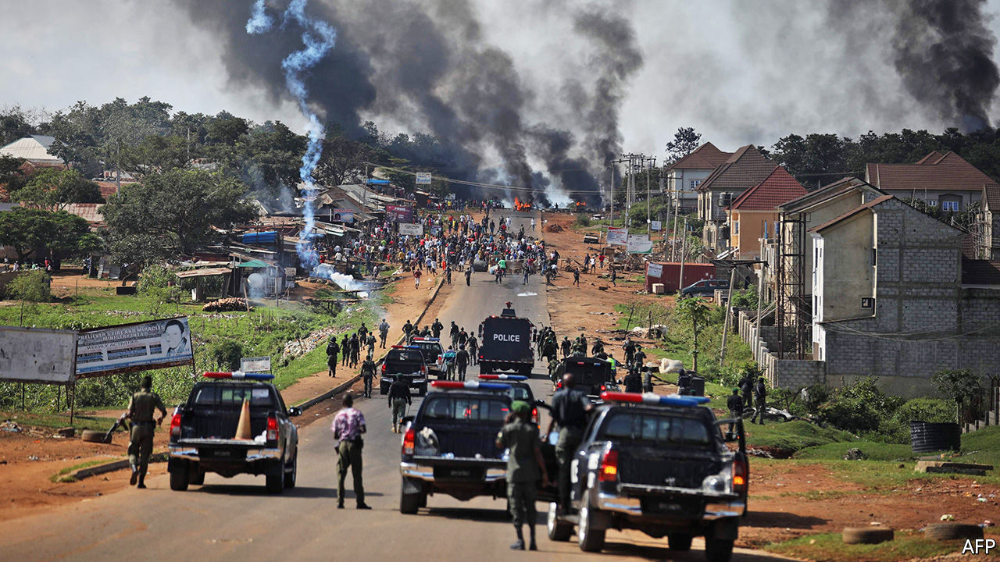

###### The young have had enough

# Peaceful protesters against Nigerian police violence are shot 

##### The army showers bullets on a demonstration in Lagos 

 

> Oct 21st 2020 

THE SOLDIERS waited until it was dark. They took down CCTV cameras. They turned off street lights. Then they started shooting, automatic gunfire ringing out late into the night. Their targets were young people kneeling peacefully in the street, waving the Nigerian flag. They were protesting against police brutality.

The killing on October 20th of at least 12 protesters in a wealthy part of Lagos, Nigeria’s commercial hub, was not the first time that the country’s security forces had fired on a crowd of demonstrators. In 2015, for instance, the army killed hundreds of Shia Muslim protesters, most of whom were unarmed, in Zaria, in the northern state of Kaduna. The officers and men responsible have never been punished. But the latest bloody episode, and the protests that preceded it, may mark a turning point for Africa’s most populous country.


The protests started in early October after the killing of a young man, allegedly by members of the Special Anti-Robbery Squad (SARS), a police unit with a reputation for brutality. In 2016 Amnesty International, a watchdog, accused it of routinely torturing people to extract confessions or extort money. A follow-up report in June documented 82 cases of murder, torture, extortion and theft by SARS members since the start of 2017, sometimes under the supervision of high-ranking officers. Amnesty said that not one member of the unit had been prosecuted for these crimes.

The difference this time was that bystanders pulled out their phones and recorded the murder. Videos spread from phone to phone on social media, sparking demonstrations that have stirred up young Nigerians, crossing lines of ethnicity and religion. Because the protests were leaderless, the government has no one to negotiate with, or to buy off. That made them especially dangerous to a state unaccustomed to its citizens demanding accountability. A “previously silent majority has now been awakened”, says Idayat Hassan at the Centre for Democracy and Development, a think-tank in Abuja.

Few expected the protests to last this long. Previous demonstrations fizzled out after minor reforms, such as the government adding an F (for Federal) to the SARS acronym and centralising its command. This time people stayed on the streets, even after the government promised to disband SARS. Sensing their power, the activists demanded that corrupt cops be prosecuted. They also want wider police reforms and better governance in general.

The state’s initial response was to truck in pro-government thugs to attack protesters. Many are thought to come from the country’s north, which is where President Muhammadu Buhari draws much of his support. The gangs, who arrived in police vehicles and set about their mayhem in full view of the men in uniform, also attacked businesses belonging to people from other parts of the country in an apparent bid to stoke up regional tensions. When that failed to quash the demonstrations, the government called in the army.

Yet instead of crushing the protest movement, the killings in Lagos have provoked a violent response. After videos of the massacre spread on social media, crowds set fire to the family home of the governor of Lagos, Babajide Sanwo-Olu. They also torched a police station, public buses and the offices of a newspaper and television channel linked to Bola Tinubu, a ruling-party politician who is widely expected to run for president in 2023.

Mr Buhari appealed for calm, but said nothing about investigating the shootings or prosecuting those responsible for them. That may be because, as he told the Nigerian Bar Association in 2018, human rights “must take second place” to “national security and public interest”. But Nigerians have heard enough excuses. ■

