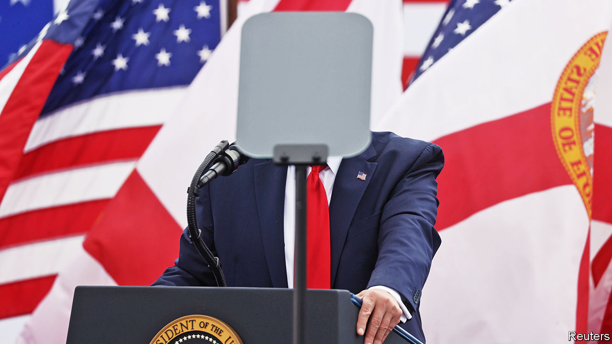
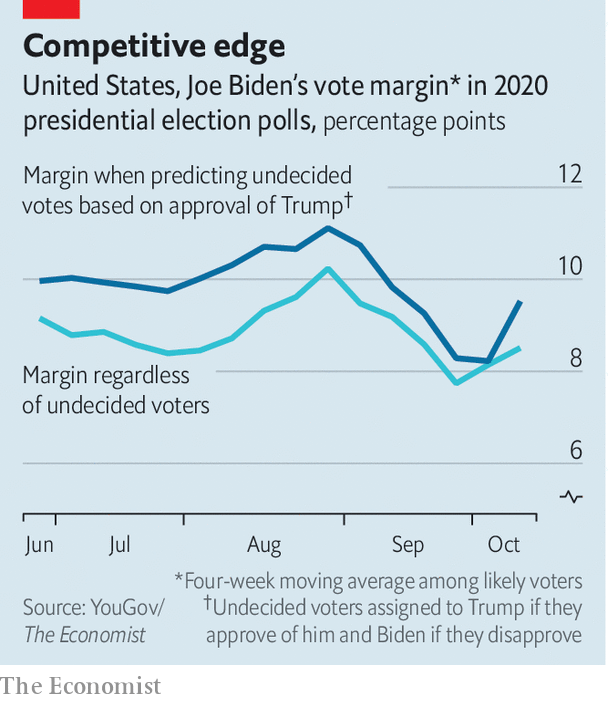

###### The known unknowns

# If Donald Trump were to win re-election, how would he do it? 

##### We think the president will lose. Here is how we could be wrong 

 

> Oct 24th 2020 

AROUND THIS time four years ago, on October 28th 2016, the then director of the FBI, James Comey, announced the discovery of new emails that might be pertinent to his investigation into Hillary Clinton. Her polling lead in mid-October had been almost as big as Joe Biden’s is now. Twelve days later she was giving a concession speech. Election day is closer than it was when Mr Comey made his intervention—quirks of the calendar mean this year’s falls on November 3rd rather than November 8th, which is when Donald Trump won four years ago. So Mr Trump is running out of time to catch up. Still, that recent precedent has Americans wondering what they might be overlooking this time.

Mr Biden holds a large polling lead: The Economist’s forecast accordingly gives him a comfortable 92% chance of victory. In the 8% of our simulations where the president wins the electoral college, Mr Trump’s route to victory is almost identical to the path he took in 2016. If he wins his adopted home state of Florida, holds states he won handily—including Arizona, Georgia, Iowa, North Carolina, and Texas—then Pennsylvania and either Michigan or Wisconsin, both of which he won last time, would put him over the top. Polls suggest that path is unlikely, but polls underestimated Mr Trump’s strength in battleground states four years ago.


Mr Biden’s lead has also been remarkably steady, rarely dipping below five or above ten points. But this election is taking place during a pandemic, which is already changing how people vote (see ). With less than two weeks left before polls close in America, what are the contest’s biggest remaining uncertainties?

One is whether the Republican gains in voter registration in key states will matter. During the epidemic Republicans have been canvassing in person more than Democrats, many of whose traditional registration sites, universities and churches, have been closed or restricted in much of the country. In both Florida and Pennsylvania, Republicans have registered over 100,000 more voters than Democrats since March. The Republican advantage in Arizona since mid-August exceeds 30,000.

Normally, party registration and voting are not tightly correlated. Kentucky and West Virginia, for instance, both have more registered Democrats than Republicans, but are all but guaranteed to back Mr Trump. We calculated the relationship between changes in Democratic registration and vote share in Florida from 2004 to 2016 and found there wasn’t one.

 


One factor that caused forecasts to flop in 2016 was that undecided voters broke late for Mr Trump. Could that happen again? It could. Yet this year there appear to be far fewer undecided or third-party voters: just 6% in our Economist/YouGov poll, compared with 14% at this point in 2016. They seem likely to favour Mr Biden, because they are younger and less white than the average voter who has decided. And they do not seem well-disposed towards the president. Just 31% of undecided voters approve of the president.

A different kind of uncertainty concerns election day itself. Mr Trump has urged his supporters to “go into the polls and watch very carefully”. Read one way, this exhortation is not alarming. Poll-watchers are a routine presence. Both parties are training and deploying thousands of them. Rules vary between states, but generally political parties or campaigns can appoint, register and train voters to watch for irregularities.

Watchers are not supposed to interact with voters, though. If they believe a voter is ineligible, they are supposed to tell a poll worker (challenged voters can still cast provisional ballots, which will be counted once the voter proves his eligibility), and challenges generally require a rational basis—not race or age, for instance.

But many read Mr Trump’s remark as a call for voter intimidation. During the first presidential debate he declined to denounce white supremacists, calling on the Proud Boys, a group with a history of violence, to “stand back and stand by”. Devin Burghart, who heads the Institute for Research and Education on Human Rights, says that armed groups in Georgia, Michigan, Pennsylvania and Wisconsin have discussed going to polling places. “They show up in body armour with AR-15s,” warns Mr Burghart. “They felt emboldened by Trump’s calls during the first debate and will make sure they show up.”

Only about 40% of voters plan to cast ballots in person on election day, though, a record low. Amid all America’s early voting, there have been just two small kerfuffles at voting sites. A group of chanting Trump supporters in Virginia formed a line that voters had to walk round, and a woman claiming to be a poll-watcher for the Trump campaign tried to get into an election office (which is not a polling place). If this was a co-ordinated effort, it was rather pathetic. Moreover, election officials and police officers say they are prepared for the threat.

The last big uncertainty concerns the acceptance and counting of ballots. Many worry that posted ballots will be rejected at higher rates than in-person votes. Because Democrats appear likelier than Republicans to vote by mail this year—and because remedying a rejected postal ballot is harder than doing so in person—ballot rejections could disproportionately help Mr Trump.

Evidence of widespread rejections is thin so far (see ). In North Carolina, 1.3% of mailed ballots have been rejected, down from 2.6% in 2016—though in a high-turnout election, a single percentage point means hundreds of thousands of votes. Rejection rates are higher for African-Americans: this year black North Carolinians have cast 17% of postal ballots, but make up 42% of rejections.

As for counting, a poll taken in September showed that two-thirds of Americans do not expect to know the contest’s winner on election night—a sign that messages about delayed results have sunk in. But delays will not be evenly spread. Florida will probably have a result on November 3rd. But neither Wisconsin nor Pennsylvania will begin counting postal ballots before election day. And the Supreme Court has let stand a Pennsylvania law requiring postal ballots received up to three days after polls close to be counted. If, once again, it all comes down to fine margins in the Midwest, Americans may not know who their next president is for another month.■

Dig deeper:Read the  and explore our , then sign up for Checks and Balance, our  and  on American politics.

