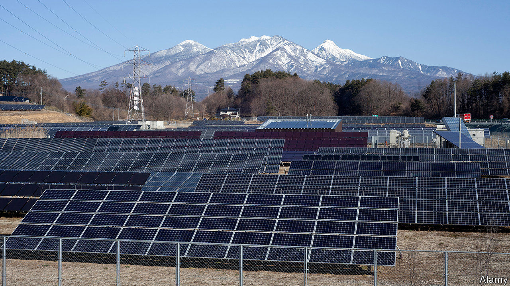
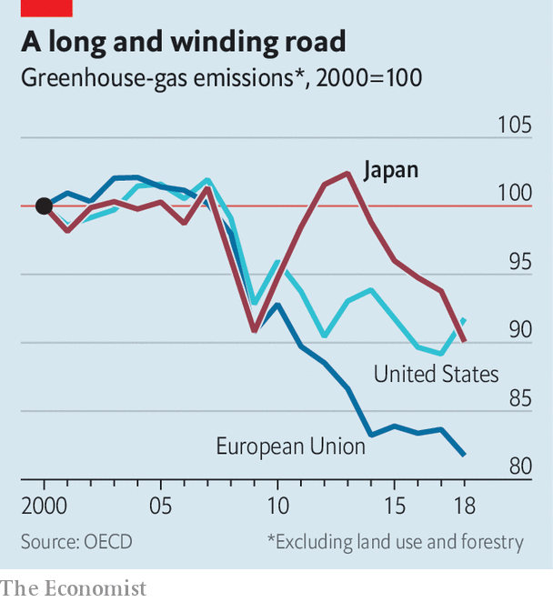

###### Not a carbon copy

# Japan promises to be carbon-neutral by 2050 

##### But the government has yet to produce a plan to reach the goal 

 

> Oct 29th 2020 

SUGA YOSHIHIDE, Japan’s new prime minister, came to office in September promising continuity with his predecessor, Abe Shinzo. But in one way he has already distinguished himself: during his first speech to the Diet as prime minister, on October 26th, he promised to reduce Japan’s net emissions of greenhouse gases to zero by 2050, breaking with Mr Abe’s foot-dragging on climate change. That brings Japan, the world’s third-biggest economy and fifth-biggest emitter, with a relatively poor record on emissions cuts (see chart), in line with Britain and the European Union and slightly ahead of China, which last month promised zero emissions by 2060.

Japan had previously pledged to be carbon neutral by an unspecified date in the second half of the century. That woolliness had confused bureaucrats and investors alike. The new goal is clearer, but Mr Suga will have to prove it is not just an empty pledge. “The government doesn’t yet have a clear vision as to how to achieve the target, but the target is a way to start the conversation,” says Kameyama Yasuko of the National Institute for Environmental Studies.


There are reasons to be optimistic. By the time of Mr Suga’s speech, more than 160 local governments, representing 62% of the population, had already pledged zero emissions by 2050, up from just four a year ago. Many leading Japanese companies, from consumer brands like Sony and Panasonic to industrial firms like Sumitomo Chemical, have adopted ambitious emissions targets. Even Keidanren, a powerful business lobby that is a bastion of heavy industry, has started talking about decarbonisation. “The energy-intensive industries that oppose climate mitigation have become a minority,” says Ms Kameyama.

 


The targets set by other countries seem to have influenced Mr Suga. “It’s kind of shameful for Japan to be lagging behind China,” says Sugiyama Masahiro of the University of Tokyo. Joe Biden has promised to make America carbon-neutral by 2050 if elected president; Japanese officials do not want to be left bucking a global consensus. (Two days after Mr Suga’s announcement, South Korea also pledged to be carbon-neutral by 2050.)

The obvious first step is to raise targets for renewable energy. The government currently projects that 22-24% of electricity will come from renewables in 2030, along with 20-22% from nuclear, 26% from coal and 27% from natural gas. Those benchmarks are set every three years by a committee convened by the Ministry of Economy, Trade and Industry (METI). Discussions on the next iteration began in October; they will conclude by the summer. The assumption is that the target for renewables will jump. “In the past, they developed energy policy first, then thought about climate reduction policy—this time the order is reversed,” says Ms Kameyama.

In the first half of the year, amid decreased demand for power in the covid-19 pandemic, Japan reached the current target for 2030, generating 23% of its power from renewable sources. Pressure groups want the target lifted as high as 50%. Such a rapid shift would require not just huge investments, but also changes in the rules to make it easier to access the grid. Incumbent power companies are sure to resist.

The rest of the energy mix is the subject of similar debate. In July METI, typically a defender of fossil fuels, announced plans to shut 100 inefficient coal plants by 2030. Yet 17 new coal plants are still due to be built in the next five years. Putting a stop to that, as Mr Suga’s goal almost certainly entails, would require the government to stick its oar in. So too would rehabilitating nuclear power. Nuclear plants account for just 6% of electricity generation, down from 25% before the Fukushima disaster in 2011. Restarting plants that have been mothballed since then would be popular with power companies, but not voters, who see nuclear energy as dangerous.

Japan also has ample scope to cut emissions in construction, transport and industry. “It is a myth that Japan is an energy-efficient country,” argues Ohbayashi Mika of the Renewable Energy Institute (REI), a think-tank in Tokyo. Single-pane windows and thin walls are commonplace. A government survey in 2015 found that only 8% of housing met the latest conservation standards, while 35% had no insulation at all. Japanese carmakers pioneered hybrid vehicles, but have been slow to make purely electric cars. The steel industry, which accounts for 48% of industrial emissions, is a laggard: only 24% of its output is made in cleaner electric furnaces, compared to 40% in Europe and 68% in America.

In his speech Mr Suga spoke loftily of the power of innovation. But REI reckons that whereas the EU has directed 30% of its covid-19 stimulus package towards climate-related projects, in Japan the figure is less than 0.2%. Mr Suga reportedly plans to unveil new stimulus measures soon—a chance, perhaps, to prove his concern for the environment. As Mr Sugiyama puts it, “If you’re serious, show us the money.” ■

For more coverage of climate change, register for The Climate Issue, our fortnightly , or visit our 

