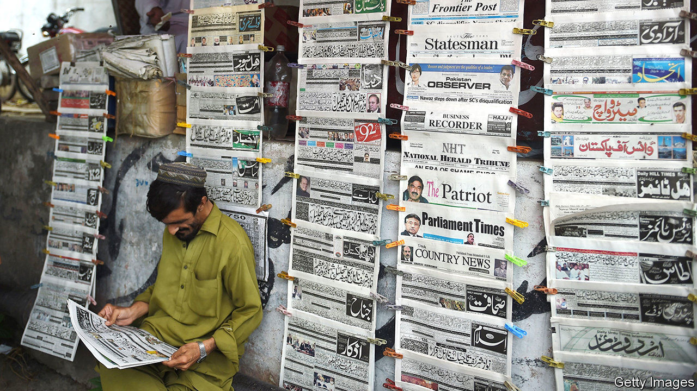

###### News whose printing causes fits

# Pakistani journalists find ways to get their stories out 

##### But embarrassing the generals who run Pakistan carries big risks 

 

> Oct 29th 2020 

WHEN MATIULLAH JAN was abducted in July outside the school where his wife works, footage from security cameras captured much of what happened. A group of men jumped out of three cars and forced the freelance journalist into one of them before zooming off. At least one of the assailants wore a uniform and carried a gun. What appeared to be a police car and an ambulance drove off with the attackers.

This week the authorities informed a court that they had not been able to ascertain who had kidnapped Mr Jan, who was released unharmed 12 hours later. That, Pakistanis assume, is because Mr Jan was kidnapped by the armed forces, over which the civilian government has little control. The army has lots of ways of discouraging journalists from reporting on awkward topics. Phone calls or WhatsApp messages from unknown numbers will instruct them to let certain subjects be. Colleagues will pass on friendly advice. If all else fails, an abduction or beating by mysterious assailants usually does the trick. Owners of media outlets are also pressed to skirt certain topics and to silence or dismiss pesky reporters. Those who resist find that advertising dries up or, in the case of outspoken broadcasters, their channels are simply taken off the air.


Hearteningly, though, Mr Jan and others have carried on reporting, and have found ways to communicate their findings outside the cowed media. In early October Mr Jan posted an interview on his YouTube channel with Bashir Memon, a former head of the Federal Investigation Agency, Pakistan’s answer to the FBI. Mr Memon alleges that before his retirement last year he was summoned to the “highest office” and instructed to file trumped-up terrorism cases against opposition activists.

By the same token, Ahmad Noorani, a veteran investigative journalist, had to use his own website to publish a report in August on the business empire of the family of Asim Saleem Bajwa, a retired general who now heads the China Pakistan Economic Corridor (CPEC) Authority, a government agency supervising a vast network of infrastructure investments tied to China’s Belt and Road Initiative. At the time of publication, General Bajwa also advised the prime minister, Imran Khan, on matters related to the media.

The report revealed that the general’s brothers, wife and sons had amassed business interests worth tens of millions of dollars as he rose through the ranks. Mr Noorani did not allege any corruption on the general’s part, but did point out that none of the holdings in question had been mentioned in the general’s official declaration of assets.

Newspapers and television channels at first ignored Mr Noorani’s and Mr Jan’s reports, but they spread like wildfire on social media nonetheless. In the end, the mainstream media aired the stories. General Bajwa, who disputes several elements of Mr Noorani’s report, eventually resigned as Mr Khan’s aide, although he remains the head of the CPEC Authority.

The internet and social media are not a panacea for Pakistan’s embattled reporters. Mr Noorani’s website has suffered from cyber-attacks. Allegations that he is an Indian agent have scared off some collaborators and donors. He is hesitant to return from America, where he is on a fellowship, because he has received death threats. In 2017 he was badly beaten. The authorities were not able to identify his attackers. ■

