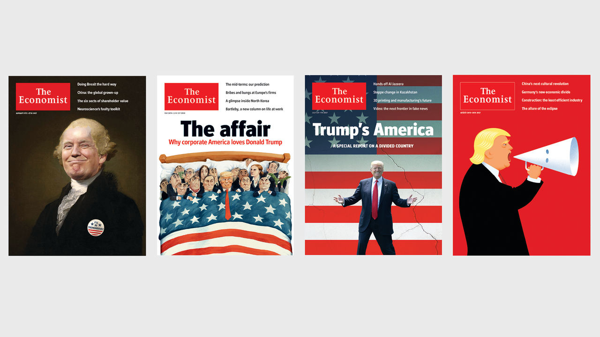
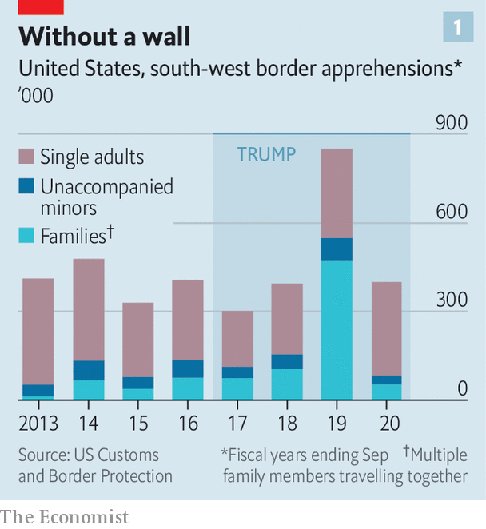
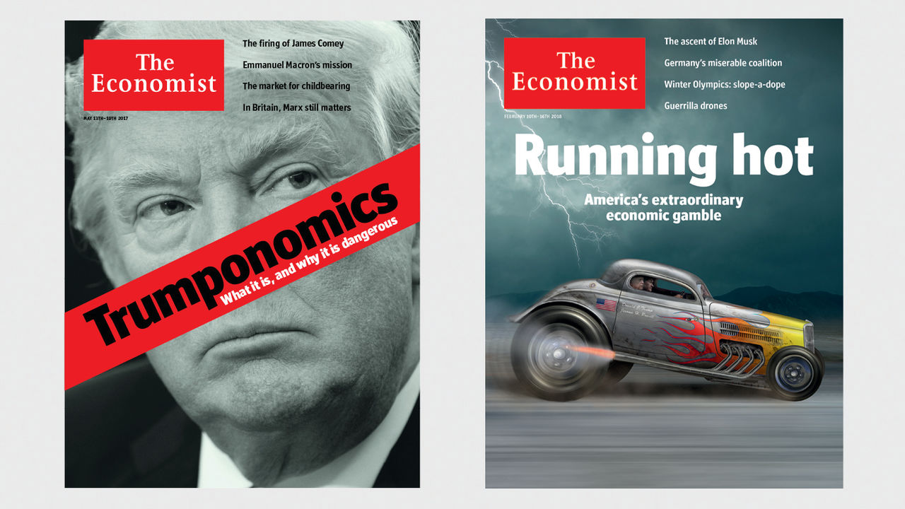
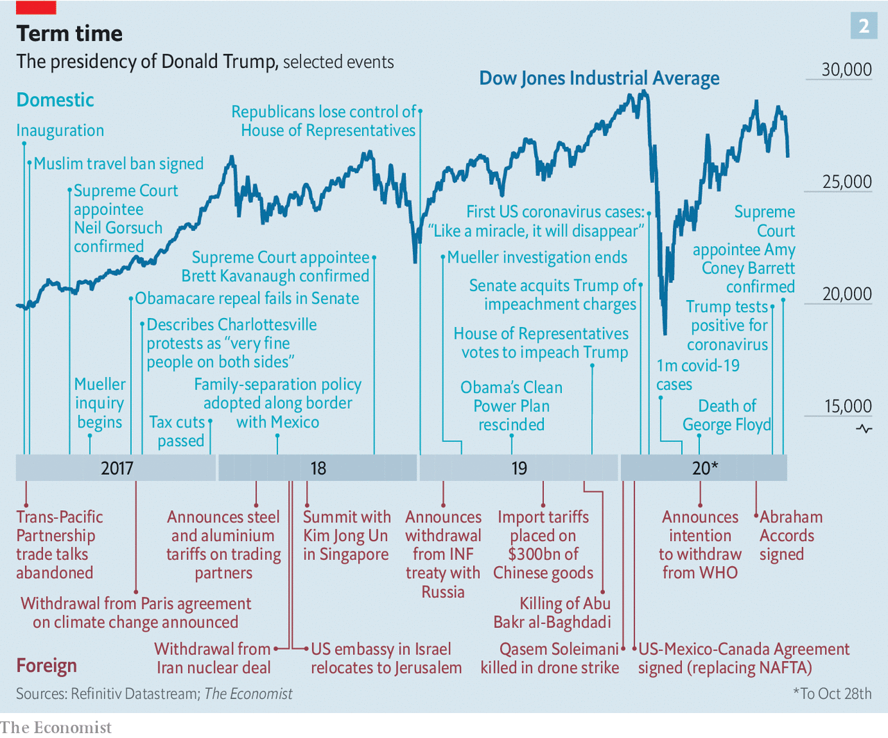
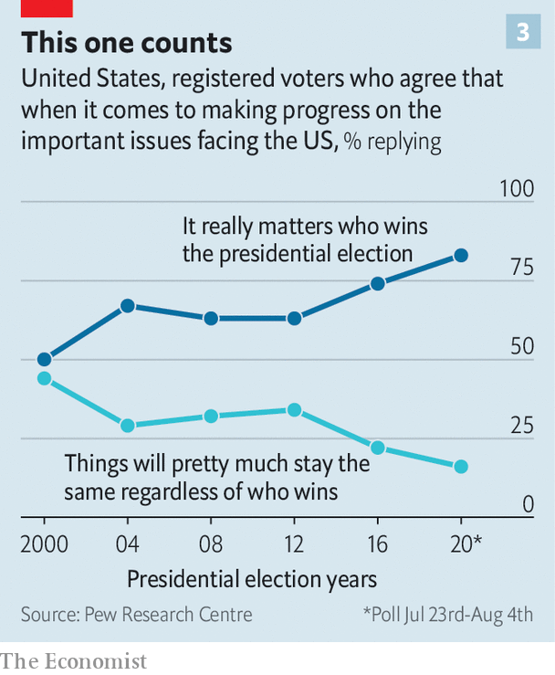
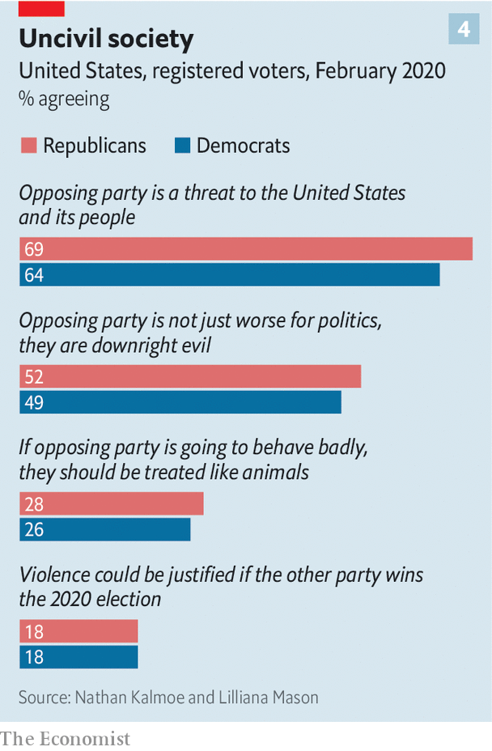

###### The Trump audit part I: domestic

# President Trump has had real achievements and a baleful effect 

##### Three judges, a tax cut, an ever-more-divided nation and an undrained swamp 

 

> Oct 29th 2020 

AMERICA HARDLY feels great again. There are 11m fewer people working than in February. Barely more than one-third of pupils are attending school normally. Hunger and poverty have risen; the memories of a turbulent summer of protests and racial unrest are still raw. Official figures show 227,000 people dead due to covid-19; excess-mortality data suggest the true total is over 300,000. And both caseloads and hospitalisations are surging for a third time. On October 23rd America recorded nearly 84,000 new cases, the highest daily tally so far.

The mismanaged epidemic, more than anything else, seems likely to cost President Donald Trump his job. As The Economist went to press our election model gave him less than a 5% chance of winning.


Were it not for the epidemic, though, Mr Trump might be on the brink of re-election. In 2016 he told voters he would keep the economy growing; until the epidemic hit it had done just that. Growth never quite reached the lustrous annual rate of 4% he promised, but it did do better than many had forecast, and his tax cut in 2017 turned out to be a well-timed fiscal stimulus. At the end of last year unemployment was at its lowest level for half a century. The wages of the less well paid were rising swiftly.

What was more, he had made good on other parts of his agenda. Trade deals he disliked had been abandoned or rewritten, tariffs had been slapped on countries accused of stealing jobs and immigration had fallen dramatically. He had appointed two conservative justices to the Supreme Court, a number which he has now brought up to three. “Promises made, promises kept” is one of the slogans of Mr Trump’s re-election campaign. The president tells outright lies with remarkable frequency. But in this he is stretching the truth no further than any politician might.

If Mr Trump does indeed lose the election, it seems likely that his main legacies will be the further polarisation of America’s politics, a guide to how the country’s democratic norms can be subverted and serious damage to its reputation overseas (see ). But the past four years have also seen achievements beyond that sad litany. Some of them are distinctive, not all are bad and some may prove long-lived.

Give the public a song and dance

In 2016 Mr Trump distinguished himself not just in how he talked but also in what he said. Like all Republicans since Ronald Reagan he was in favour of tax cuts, deregulation, conservative judges, safer streets, stronger armed forces and lower government debt; he was against Obamacare and open borders.

But on many issues he stood out as unorthodox, extreme or both—and in so doing captured voters’ imaginations in a way that his rivals did not. He pledged to deport all 11m undocumented immigrants in the country and build a wall on the border with Mexico. He derided the party’s foreign-policy and free-trade orthodoxies as failures, and held that trade deficits were purely a sign of weakness and poor negotiating—which, as the master of the deal, he could set right. He bashed Wall Street and was against making Social Security and Medicare, the pension and health-insurance programmes for the elderly, less generous. He mocked and disparaged not just his opponents, but also revered Republicans such as the late Senator John McCain (a “loser”).

Given that disparagement it is ironic, if not surprising, that many of his achievements have been those of a generic Republican. His tax cuts, indeed, look modest measured against those of other first-term Republican presidents. According to the Tax Foundation, a think-tank, the Tax Cuts and Jobs Act of 2017 reduces the government’s annual revenue by $150bn, or 0.7% of current GDP, over ten years. They were thus smaller than the tax cuts made under George W. Bush in 2001 (about 1.5% of GDP) or under Reagan in 1981 (2.6%). Mr Trump’s cuts included some welcome reforms, such as a curb on the deduction for mortgage interest and state and local taxes, but no deep rewriting of the tax code.

Mr Trump’s judicial appointments, too, were those that any other Republican might have made, given the chance. That he got that chance was thanks to Mitch McConnell, the Senate majority leader, who held up the confirmation of a number of Barack Obama’s judicial nominations—most notably that of Merrick Garland for the Supreme Court in March 2016. The resultant backlog allowed Mr Trump to follow the recommendations of the Federalist Society, a fraternity of conservative jurists, in appointing about 30% of the federal judiciary. Sandra Day O’Connor, Antonin Scalia and Anthony Kennedy—the three justices whom it took Reagan two terms to put on the bench—shaped the court’s rulings for decades. It is likely that Neil Gorsuch, Brett Kavanaugh and Amy Coney Barrett will do so too.

When it comes to deregulation Mr Trump can credibly claim to have outdone all predecessors. He pledged to eliminate two old regulations for every new one. He now boasts that the ratio he has actually achieved is 22 to one. The list of those scrapped is inflated with some pretty small fry; rules on Uruguayan mutton, Japanese persimmons and the like. But it is undoubtedly true that the pace of new regulation has slowed dramatically. Since Mr Trump’s inauguration, the estimated number of federal rules has grown very slightly, by 0.5%. That is one-twelfth the pace of growth during the Obama and Bush years.

In some areas losing rules was beneficial; in few was it fundamental. In finance, for example, though some rules were streamlined, Dodd-Frank, the sweeping law passed after the Great Recession to rein in banks, was not thrown out (although the Consumer Financial Protection Bureau, a watchdog agency set up by Elizabeth Warren, was effectively neutered). The exception was environmental regulation, which has been thoroughly savaged.

Of the 225 major executive actions in a studiously catalogued list of the Trump administration’s deregulations 70—a clear plurality—are environmental rollbacks. These are rules that will increase the amount of lung-damaging fine-particulate matter belched by coal-fired power plants, methane leaked by oil and gas wells and carbon dioxide emitted from the exhaust pipes of cars with new, less ambitious fuel-economy standards. When the White House claims to have saved $51bn—0.25% of GDP—in regulatory costs it ignores all such debits on the other side of the ledger.

On the signature issues which set the Trump campaign apart from the Republican establishment, the successes look more vulnerable to revocation. Take immigration. Xenophobia was the raison d’être for his campaign in 2016, which he launched with a speech warning that Mexico was sending rapists and drug-dealers across the border; later on, Mr Trump called for a “total and complete shutdown of Muslims entering the United States”. His administration’s aggressive restriction of migration was therefore no surprise, even if the shock of seeing children alone in detention camps because of a policy of family separation caused an outcry

What is perhaps less appreciated is the degree to which it has succeeded. The “Muslim ban” issued in the first days of his presidency ran afoul of the courts and had to be reworked; the border wall Mr Trump promised has not been built, let alone paid for by Mexico. But eligibility criteria for asylum have been tightened, and asylum-seekers at the border must now wait in Mexico while decisions are made. “It may not be the physical wall that Trump initially touted, but there is now a bureaucratic wall that expels every unauthorised immigrant on the southern border,” says Sarah Pierce, an analyst at the Migration Policy Institute. In its revised form the Muslim ban remains in place, with little dissent.

 


Apprehensions at the border with Mexico have risen to their highest level in 12 years (see chart 1), and in 2019 there were 360,000 deportations. That was not a record—there were 432,000 in 2013—but it was more than there were in 2016, and the share of the deported who had no criminal records, 14% in 2016, had risen to 36%. The administration also increased the bureaucratic hurdles faced by those trying to immigrate legally. Applications for temporary visas and permanent-residency permits have both declined by 17% since 2016. The annual ceiling of refugee admissions has been slashed. The White House recently proposed just 15,000 admissions for 2021, compared with 85,000 admitted in 2016.

A pile of debris

In the trade arena Mr Trump renegotiated NAFTA, abandoned the nascent Trans-Pacific Partnership, imposed tariffs on aluminium and steel and launched a trade war with China. By his own standards, the benefits were sparse. Though the bilateral trade deficit with China has fallen, America’s trade deficit with the rest of the world was steadily increasing even before covid-19 sent it through the roof. Tariffs have helped some targeted industries, but at great cost. American consumers are reckoned to have paid $900,000 for every steel-industry job saved. Manufacturing employment seemed to slump after tariffs with China went into effect in 2018, though Mr Trump’s advisers insist that in the long term the policy will reverse that.

 


Other promises went unkept, most obviously and predictably the pledge on the debt. Rather than putting America on the path to eliminating its national debt in eight years, as he said he would, Mr Trump saw the budget deficit steadily increase over the first three years of his administration. The rise was not as marked as those seen in the first terms of Reagan and George W. Bush, but the starting point was higher. After covid-19 hit the deficit jumped far further; America’s debt is set to exceed its GDP.

 


Nor was Obamacare repealed and replaced. Mr Trump has been promising to publish a serious health-care plan imminently for his entire tenure, during which the share of Americans without health insurance rose from 8.6% in 2016 to 9.2% in 2019. He eventually laid out something of a second-term health-care agenda on September 24th, when he declared in an executive order that under an “America-first” plan it will “continue to be the policy of the United States…to ensure that Americans with pre-existing conditions can obtain the insurance of their choice”. If a lawsuit against Obamacare that the Supreme Court will hear on November 10th goes the way the plaintiffs want, though, that coverage guarantee will disappear—and that is the side Mr Trump’s Department of Justice is taking in the case.

Mr Trump also wooed voters with a promise to “restore law and order” to cities that he portrayed in his inaugural address as crippled by “American carnage”. Crime in American cities was actually at a low ebb at the time. But after the tumult of a long summer of protests over racial injustice, some of them violent, they hardly seem safer. Preliminary estimates from the FBI suggest that 2020 will see a 15% increase in the murder rate nationwide. Mr Trump’s most notable legislative achievement in this area was signing the First Step Act, which seeks to reduce incarceration and reform prisons; it was a priority of his son-in-law, Jared Kushner.

And the swamp was not drained. Instead it spread to previously dry land as institutional watchdogs and ethical norms were swept away and new species moved into the murk. It was in these fetid waters that the administration pursued what Steve Bannon, a former senior counsellor to the president, called the “deconstruction of the administrative state”. A weakened and destabilised state apparatus, in which independent inspectors-general are removed or sidelined, the civil service is less independent and personal loyalty paramount is just the sort of government that Mr Trump wants.

How much of that which Mr Trump has done will outlast him should he lose office? The judges and the change in the tone of politics seem the strongest candidates. Beyond his slim legislative record much of what he has done has been accomplished through executive order and changes to regulation which could, in principle, be straightforwardly reversed.

 


On immigration, for example, the Muslim ban, family separation and the reduced refugee ceiling would be revoked at the very beginning of a Joe Biden administration. But the fact that things can be reversed does not mean that everything will be. It is hard to imagine the Democratic president completely unwinding the new asylum rules on the south-west border, which would undoubtedly invite a new surge of migrants. And there will be other scarring. Prospective immigrants may look elsewhere to study or start businesses even if the country seems welcoming again.

There would be a more thorough attempt to undo loosened environmental protections. But this could be complicated by Mr Trump’s judicial legacy—the courts he leaves behind will probably take a cagier attitude to constraints on business. And as with immigration, there will be scarring that is not easily reversed. People whose lungs were damaged by fine particles will not be cured spontaneously. According to calculations by the Rhodium Group, a research outfit, greenhouse gases equivalent to 1.8bn tonnes of carbon dioxide will be emitted over the coming 15 years solely because of Mr Trump’s deregulations.

 


When it comes to the body politic, the scars run deep. The bitterly divided country of the 2016 campaign is more bitterly divided than ever. Voters tell pollsters they see the stakes in this election as greater than those in any before (see chart 3). A remarkable 73% of Americans say Republicans and Democrats cannot agree on basic facts. There is a detectible rise in new strains of extreme partisanship. Data from the Voter Study Group, a research outfit, show one in five Americans saying that violence could be justified if the other party wins the impending election—a minority, but one that has increased markedly since 2017. Surveys by Lilliana Mason and Nathan Kalmoe, two political scientists, reveal disturbing levels of antipathy for fellow Americans: 60% of voters think members of the other party constitute a threat to America, more than 40% would call them evil, and 20% think they are animals (see chart 4).

This trend towards the hyper-partisan predated Mr Trump and went a long way towards explaining his election. He in turn has amplified it—both “a product and an accelerant of the partisan doom loop” in the words of Lee Drutman, a political scientist. In 2016 party affiliation had already come to dominate where Americans live, where they got their news and even whom they married. But to carry that tendency through to what would seem to be basic public-health measures—80% of Biden supporters say they have always worn masks in the previous week compared with just 43% of Trump supporters—took a gift for division unlike any before.

Mr Trump’s decision to rule as the leader of a faction, rather than the whole nation, has been supported by the Republican Party’s base and much of its elected elite. The unconvinced have mostly kept silent on the matter. This has allowed him to trample the norms of politics and good government in any number of ways, from a culpable lack of response to the devastation wrought on Puerto Rico by Hurricane Maria to describing protests against neo-Nazis in Charlottesville, Virginia, as having “very fine people on both sides” to seeing people tear-gassed to enable a photo opportunity. The most pertinent of these outrages at the moment are his attempts to delegitimise the election result. Almost 40% of Republican voters say they do not think the upcoming election will be fair; half of Democrats are worried that there will not be a peaceful transition if Mr Biden wins.

If Mr Trump were to keep his address on Pennsylvania Avenue, what then? There is no real programme for four more years of a Trump presidency. The Republican Party chose to eschew a party platform this year; in its place the campaign released a bombastic list of bullet-pointed aspirations such as “Drain the Globalist Swamp by Taking on International Organisations That Hurt American Citizens”. Without a majority in the House, Mr Trump would be able to pass little if any significant legislation. But the administrative and regulatory changes brought about in the past four years would be taken further, as would the erosion of standards in public life. And the divisions he both embodies and exacerbates would become yet more destructive. ■

Dig deeper:

Read  of our audit of Donald Trump’s presidency, in which we examine his role in foreign affairs. Although some of his criticisms of the world order have merit, he has left it in worse shape than he found it.

Read the  and explore our , then sign up for Checks and Balance, our  and  on American politics.

