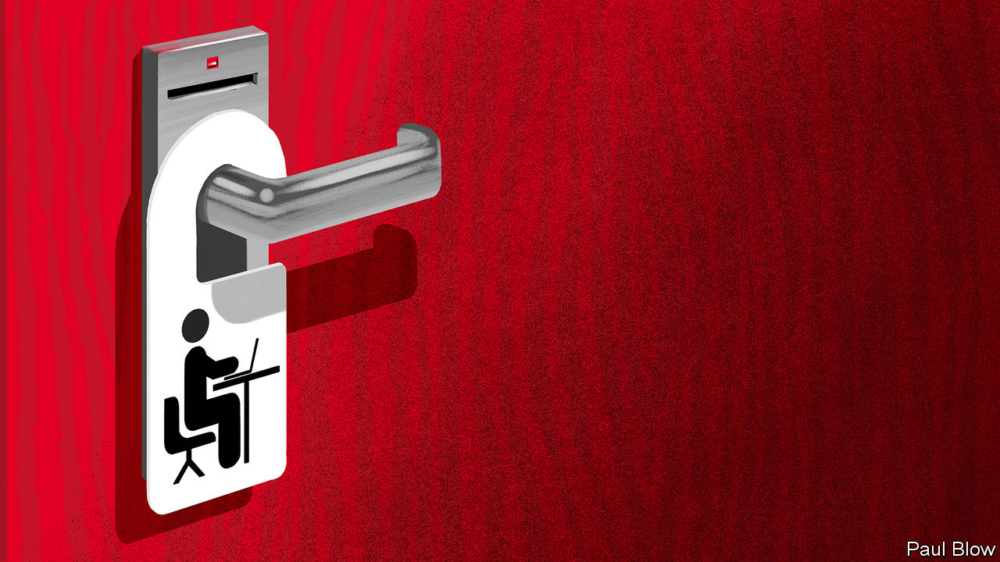

###### Bartleby

# How hotels are trying to attract remote workers 

##### Luxury with your laptop 

 

> Oct 29th 2020 

THE BUSY worker looks at the clock on her laptop and discovers that it is nearly 1pm. Time for lunch. So she picks up the phone and asks to speak to room service. A hot meal appears 20 minutes later; no need to bother with the cooking or washing up.

If that vision appeals, you could be a potential customer for one of the many hotel groups that are trying to induce people to rent a room for use as an office. The idea makes a certain amount of sense. Hotel rooms are short of guests during the pandemic; some workers may find it too difficult (or boring) to sit at the kitchen table every day.


The big chains are rushing to test out the size of this market. Hilton has launched a new service called Workspaces in America, Britain and Canada which gives workers the chance to use the gym or swimming pool (where available) and complimentary bicycle hire. The Wyndham chain is offering worker packages at hotels in California, Florida and South Carolina.

Hotels have long made good money out of the business market, catering for business travellers, conferences and team get-togethers. They have also recognised that they need a good Wi-Fi signal to appeal to laptop-toting businesspeople. But renting rooms by the day has traditionally been aimed at a rather different slice of the market from the solitary desk jockey.

Bartleby wrote part of this column in Sofitel St James, a luxury hotel in the heart of London’s West End. This certainly would be an excellent bolthole, for those who can afford it—£299 ($388) a day, with breakfast, lunch and a cocktail available for another £50. Your columnist’s suite offered a lounge with a desk, printer and shredder, plus a four-seater table, two comfy chairs and a sofa. Nice little touches included extra pens, sellotape, scissors and a stapler. All the staff wore masks and kept a safe distance. The place was extremely quiet, which aided concentration.

Nice as these facilities were, they would almost certainly be beyond the budget of an ordinary worker who might be looking to escape the builders or the children during school holidays. A cheaper Sofitel option is available at £199 but that would still require a company’s expense policy to be incredibly generous. If you are fully employed, you can probably retreat to the office for no extra cost. And if you are a freelance worker, you may simply head for the nearest coffee shop, where seating, subject to social distancing, can be obtained for the price of a few cappuccinos.

Another option for British workers is the traditional pub, with some trying to drum up business by offering “hot-desking” packages. One hostelry in Warrington, a town in the north-west of England, is offering a £12 daily package with a meal, unlimited coffee and an internet connection. (Whether a pub would be a great place to concentrate is another matter; an open-plan office looks like a Trappist monastery by comparison.)

Few Britons live far from a pub. By contrast, though Bartleby enjoyed the luxurious accommodation, his visit to St James’s required a lengthy trip. For many workers, the absence of the daily commute has been one of the big bonuses of lockdown. So hotel rooms are most likely to appeal to workers if they are a short distance away, meaning that they need to be in the suburbs rather than the city centres. Suburban hotels will also be a lot cheaper. Hilton offers a work package in a Hampton hotel in west London at a bargain £45 a day.

Even then, the market is likely to be a niche product. Being at home allows workers to have all their chosen comforts (books, snacks, favourite tea) to hand. They will be there if delivery or maintenance men come to call. And sitting alone in a hotel room, good as it may be for concentration, is more likely to increase a sense of isolation than being in the more familiar surroundings of one’s own house.

Still, on occasion a bit of isolation might be welcome, just as authors retreat to a cabin to finish their manuscripts. Workers who have a big project to finish might relish a hotel break, especially if their office does not have the covid-19 protocols in place to ease their fears. Hotels might also be a good place to conduct job interviews, provided that companies respect government social-distancing rules.

For humble drones like Bartleby, however, home will continue to be the office of choice, even if it means doing the washing up. Indeed, time to stop writing and fill the kettle.

Editor’s note: Some of our covid-19 coverage is free for readers of The Economist Today, our daily . For more stories and our pandemic tracker, see our 

