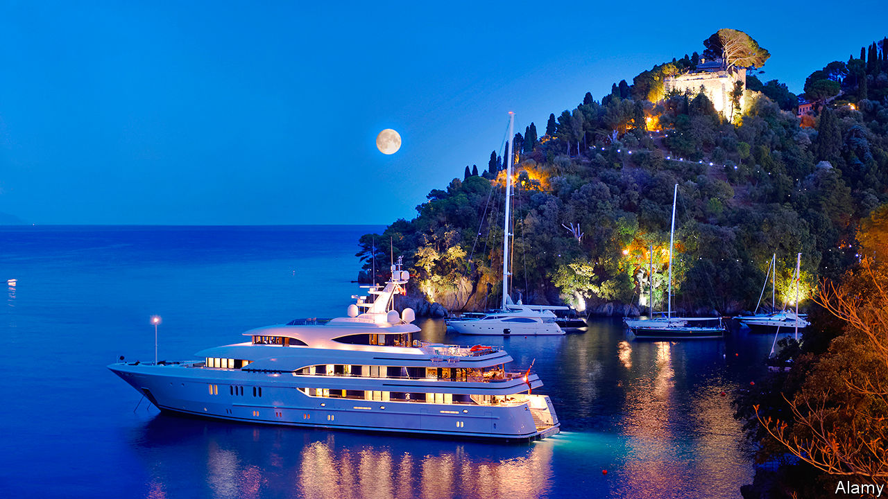

###### Rich pickings

# A flat-tax scheme is luring the wealthy to Italy 

##### Many are Britons fleeing Brexit 

 

> Oct 31st 2020 

AH, ITALY! “The school as well as the playground of the world,” as one of E.M. Forster’s characters described it: cities packed with the greatest Western art and architecture, ravishing landscapes, delicious food and a sunny climate. What a place to live—but for the tax, levied at 23% from the first euro earned and at progressively higher rates up to 43% on income over €75,000 ($89,000).

But a small number of very rich people—ultra-high-net-worth individuals, in the jargon of private offices and estate agents—are living the Italian dream while paying what, for them, are modest taxes. Several hundred belong to a scheme in which they pay an annual €100,000, plus €25,000 for each member of their family. The flat rates, which apply only to non-Italian income, are valid for 15 years. After that, unless the programme is renewed, its beneficiaries will become subject to Italy’s normal regime. Cristiano Ronaldo, a Portuguese football star, is said to be among those who have made use of the scheme. In 2018, the year after it came into force, he surprised the footballing world by transferring to an Italian side, Juventus.


Introduced by Matteo Renzi’s centre-left administration, the programme is one of several southern European ploys to lure wealthy foreigners. Some have proved intensely controversial. On October 20th, the European Commission opened infringement procedures against Cyprus and Malta over their investor citizenship schemes, after two Cypriot parliamentarians were filmed agreeing to the issue of a passport for a fictitious Chinese person with a money-laundering conviction.

Last year Greece brought in a scheme which, like Italy’s, involves a €100,000 flat tax, but requires applicants to invest €500,000 in Greek assets and spend half the year in the country. Portugal cast its net wider with a ten-year tax holiday on foreign-sourced income aimed at luring retired people. But after protests from some in the EU the government tightened the rules this year, making the unearned income of new arrivals subject to a 10% levy.

Italy also runs programmes for the less well-heeled: incentives to lure back highly qualified Italian expatriates and a 7% tax over six years on the pension and investment income of foreigners who settle in the poorer south of the country in towns of fewer than 20,000 inhabitants.

“The flat-tax scheme is not just an isolated measure, but part of a trend,” says Giulia Cipollini of Withers Studio Legale, a law firm in Milan. In 2019 Italy approved 421 flat-tax applications, against 264 the previous year. “Britain is the jurisdiction from which the largest number of people have relocated,” she says.

Some are Britons fleeing Brexit. Others are citizens of third countries who had been enrolled in Britain’s “non-dom” scheme. Savouring an insalata caprese in a posh restaurant in rural Tuscany, a French citizen cited one of the Italian scheme’s lesser-known provisions: exemption from gift and inheritance taxes. “That, for most of us, is the reason for switching,” he says.

Whether he and others like him will benefit Italy in the long run will depend on how much of their wealth trickles down to the rest of the population. But they are already having an effect: booking private jets for long weekends in Sicily, mooring their super-yachts in Italian marinas, restoring Florentine palazzi to their former glory and hosting inspirational events for young entrepreneurs. As an Italian proverb has it, amor fa molto; il denaro fa tutto—love does much; money does everything. ■

