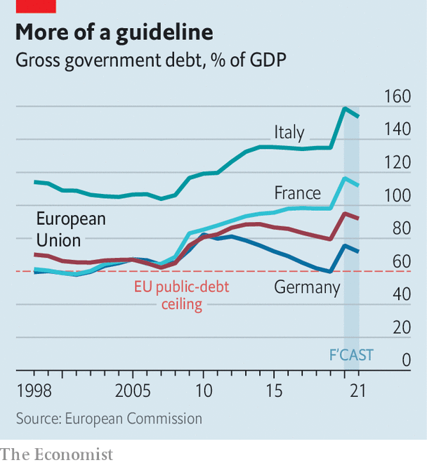

###### The fiscal question

# What next for the EU’s fiscal rules? 

##### The suspension of its rule book could offer space for a wider rethink 

 

> Oct 31st 2020 

THE SCHLESWIG-HOLSTEIN question, a 19th-century diplomatic teaser, was said to be so complicated that of the three people who had ever understood it, one had forgotten it all, another was dead and the third driven mad. Readers of the European Commission’s 108-page “Vade Mecum” on the Stability and Growth Pact (SGP), the European Union’s fiscal rule book, might sympathise. Over the years the rules have sprouted a head-spinning array of exceptions, interpretative possibilities and get-out clauses. No finance minister in Europe fully understands them, says a Brussels insider.

Yet at the heart of the EU’s rules lie two simple figures, anchored in the Maastricht treaty of 1992: governments should aim to run budget deficits no higher than 3% of GDP and to cap the public-debt stock at 60% of GDP. As countries prepared to enter a monetary union without a central fiscal authority, rules were needed to bind the hands of the spendthrift. The quid pro quo for strict rules was a politicised process of enforcement. In 2003 France and Germany exceeded the deficit threshold and then cowed the rest of the EU into letting them escape unpunished; an early blow to the rule book’s credibility from which some say it never recovered. No country has ever faced the fines that notionally apply to serious miscreants.


The fiscal rules have been periodically tweaked over the years. Brussels shifted away from headline targets to focus on “structural” deficits that sought to strip out the effect of the business cycle. But conjuring reliable estimates in real time has been impossible—often forcing governments to tighten prematurely. In 2011 members agreed that debt levels over the 60% limit should be cut by one-twentieth each year. The “fiscal compact”, passed at the urging of Germany in 2012, obliges governments to try to keep structural deficits close to zero. In 2015 the commission clarified the cases in which exemptions could be granted, including structural reforms with up-front costs, and public investment.

All this gave birth to the monster Europe knows today. This proliferation of rules has enabled more nuanced negotiations between the commission and governments, argues Gregory Claeys of Bruegel, a think-tank in Brussels. The price is a loss of accountability and transparency. The commission might instruct a finance minister, accountable to a national parliament, to shave a few points off their deficit while dangling the prospect of later invoking an escape clause—and a few months later, when the cyclically adjusted deficit has been recalculated, say something different. “That’s when you start debating, should I tell the prime minister or should I just ignore the blighters?” says Thomas Wieser, a former euro-zone official. Mistrust is further fostered by governments that often find it easier to blame slow growth on the constraints of Brussels rather than their unwillingness to reform.

In February the European Commission announced another review of the rules. Covid-19 put it on ice, but could also affect its outcome. The SGP is suspended until the end of 2021, in order to allow governments facing plummeting revenues and huge social bills to run large deficits. That offers space for a broader debate. Italy’s government, with a debt load nearing 160% of GDP (see chart), will hardly be expected to cut it by five percentage points a year. And with monetary policy running out of ammunition, fiscal policy will have to do more for the recovery.

 


For some, the rules have wholly outlived their usefulness. In a new paper Olivier Blanchard, a former chief economist of the IMF, and two co-authors say that in a world in which nominal growth is likely to exceed interest rates for a long time, debt burdens can be sustainable at levels far higher than could have been imagined when the Maastricht treaty was being written. The authors suggest replacing the tangle of rules with looser “standards”, and applying a debt-sustainability test to countries’ budgetary plans.

Such far-reaching schemes stand no chance of becoming reality—and not only because they would mean reopening the EU’s treaties. A more moderate proposal, advanced among others by the European Fiscal Board, an advisory body to the commission, calls for a simpler framework: a debt “anchor” (which some suggest could be higher than 60%), and a spending rule that would cut excessive debt but adjust the pace of belt-tightening when growth is slow. The commission itself wants to distinguish better between investment and current spending.

France in particular is pressing for changes. But few matters are as divisive among the EU’s members as fiscal policy. And the debate will only begin in earnest next year. For now the EU is focused on implementing a €750bn ($880bn) recovery plan it agreed in July. Some hope this fund could prove a stepping stone to the sort of permanent European fiscal capacity that would render rules for national governments less relevant. But that is an argument for another day. ■

