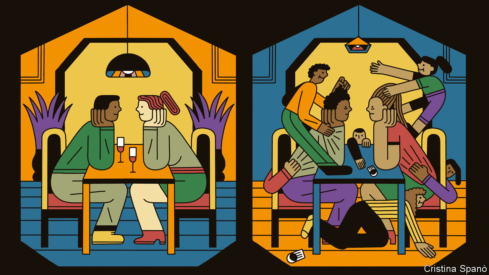
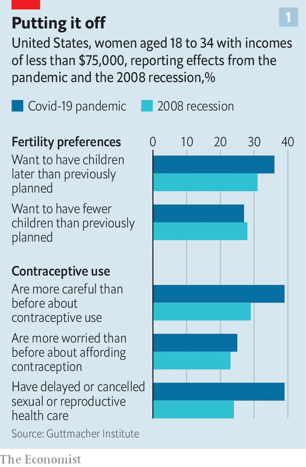

###### Baby boom, baby bust

# The pandemic may be leading to fewer babies in rich countries 

##### And perhaps more in poor ones 

 

> Oct 28th 2020 

WHEN KAMPALA went into covid-19 lockdown, singletons in the Ugandan capital were looking for “lockdown partners”, says Allan Creed, who works in digital marketing. He and his friends couldn’t get to their local shops to buy contraceptives. Mr Creed has been relying on free condoms doled out by the United Nations Population Fund (UNFPA) via a local motorbike ride-hailing app called SafeBoda. But three of his friends now have unplanned pregnancies in the midst of their university degrees. “We were not moving, we were not working, nothing was happening, so you had a lot of time on your hands,” the 26-year-old explains.

Meanwhile in wealthy Singapore, where contraception is easy to come by, young people who were already reluctant to start a family before the pandemic are even more so during a global recession. The government is trying to coax people into reproducing with a one-off grant of S$3,000 ($2,200) for having a child in the next two years on top of pre-existing payments and savings schemes. For Keith, even that doesn’t make up for the cost of becoming a father. “I know that me and my wife will have a very good time in the next 30, 40 years without kids,” the 36-year-old says. “Do we want to risk that?”


It is too early, by a few months at least, to be sure what the effect of covid-19 will be on fertility rates. But different patterns seem to be emerging in rich and poor countries. Few women want to have a child in a time of uncertainty. In the rich world many are holding off starting a family or adding to it. But in the poorest places, where women often have less choice in the matter, a baby boom may be in the offing. Governments are already trying to adapt. It is not just Singapore trying to boost birth rates. Japan’s new prime minister, Suga Yoshihide, last week called for health insurance to cover in vitro fertility treatment. Japanese government figures showed an 11% fall in new pregnancies in the three months from May relative to last year.

In poor countries mass displacement is adding to sexual activity. In refugee camps, where people rely on informal work that dried up during lockdowns, transactional sex is expected to rise. When India announced an abrupt lockdown in March millions of urban workers lost their jobs and fled to their home villages across the country, and in Nepal, Bangladesh and beyond. They were reunited with lovers they usually see just a few times a year over public holidays. That could be enough to throw off population forecasts, says Vinit Sharma of the UNFPA. “We had not expected so many couples to be together for such a long period of time,” he adds.

More sex doesn’t necessarily mean more babies. But covid-19 has disrupted supply chains for contraception. Poor people rarely buy several months’ worth of contraceptives at once. Even a short break can lead to unwanted pregnancies. Data from health facilities in India show that between December and March the distribution of contraceptive pills and condoms dropped by 15% and 23%, respectively. Insertions of intrauterine devices for long-term birth control also tumbled.

The Guttmacher Institute, a pro-choice think-tank, points out that the strain placed on health-care systems in developing countries by covid-19 is likely to disrupt sexual-health services. It estimates that a fall of 10% in the use of such services in 132 low- and middle-income countries will mean that 50m more women will not get the contraceptives they need this year, leading to 15m unintended pregnancies. It estimates that 28,000 mothers and 170,000 newborns will die, and there will be an extra 3.3m unsafe abortions.

In the rich world, by contrast, women tend to have greater control over family planning. This means that anxiety caused by the pandemic looks likely to cause a sharp decline in birth rates. A survey by the Guttmacher Institute of American women aged 18 to 34 in families earning less than $75,000 found that a third want to get pregnant later or have fewer children because of covid-19 (see chart 1). A paper published by the IZA Institute of Labour Economics predicts a 15% drop in America’s monthly births between November and February, 50% larger than the decline following the 2007-09 financial crisis.

 


Covid-19 threatens to speed up a decades-old trend towards smaller families in rich countries. In Singapore the fertility rate (ie, the number of children that a woman can expect to have during her lifetime) was 1.14 (far below the replacement rate of 2.1), even before the pandemic. When New York City went into lockdown, many people stopped fertility treatment. Some hospitals did not allow partners into delivery rooms. The prospect of going through birth alone put some women off starting a family, according to Brian Levine, founder and director in New York of CCRM Fertility, a network of fertility clinics in America and Canada. “You’re not going to see a bunch of people being born in December and January because [people] were home and bored and having sex,” he says. “They were home and bored and scared.”

Women are worried about catching covid-19 while pregnant, since medics say it is possible to pass the virus on to an unborn child. Others have found themselves taking on a disproportionate share of housework during the lockdown and can’t face looking after a newborn, too. “It’s not people saying they don’t want kids—it’s them saying they can not and should not,” says Karen Benjamin Guzzo at Bowling Green State University in Ohio.

At Planned Parenthood, the country’s largest provider of abortions and reproductive services, the number of medical abortions has gone up. Gillian Dean, who works in obstetrics and gynaecology for the group in New York, says patients are terminating pregnancies they would have continued in other circumstances. “I’ve had patients who are frontline workers, who are the only people in their homes who are employed, and they feel like they need to do everything they can to not step away from the workforce right now,” Dr Dean says.

Evidence from an outbreak in 2015-16 of Zika, a disease that causes birth defects, suggests covid-19 won’t have a uniform impact across the developing world either. In Brazil, a middle-income country where half of all pregnancies are unintended in normal times, the number of births dropped after Zika hit. This is a sign that many women managed to obtain contraception (or illegal abortions). Births fell furthest in the north-east, where the Zika epidemic struck first and hardest, according to research led by Letícia Marteleto at the University of Texas at Austin. This year, with covid-19, it is black women and other minorities in Brazil who find it hardest to access health care, even after taking account of their poverty.

In May Malu Sícoli, a lawyer in São Paulo, Brazil’s largest city, decided to stop trying for a baby until the pandemic subsided. Days later she found out she was already pregnant. Memories of Zika added to her anxiety about having the child. “The first time I went for a prenatal screening I was sick with nerves,” she says. “I was nervous about being on the street, let alone in a medical clinic, a laboratory, a hospital.”

The big question is how long-lasting the impact on birth rates will be. History suggests the decline in birth rates could be rapidly reversed. Those who conceived unplanned babies during the pandemic might have fewer children later in life. Women in rich countries who put off pregnancy might start trying again once the jitters around covid-19 calm down. Fertility fell after the 2003 Severe Acute Respiratory Syndrome (SARS) outbreak in Hong Kong and Hurricane Katrina in America (see chart 2), but recovered soon after. The 1918 Spanish flu epidemic also led to a baby bust the next year, but birth rates increased again in 1920. The effect held globally, suggesting it was not just the end of war driving the resurgence. Couples were having the babies they put off.

 


In New York there are already signs that couples are trying for sprogs once again. Edward Nejat, a fertility doctor at Generation Next Fertility in Manhattan, saw a drastic drop-off in patients in March that he puts down to uncertainty. His practice did not close but 95% of his patients chose not to pursue treatment during the first wave. He is now seeing more patients than before the pandemic. “For most people this was a pause,” he says.

But that might not always be possible. In southern Europe the effects of the last economic crisis are still being felt among a generation that reached adulthood then, who have struggled to find stable jobs or buy homes. For those now in their late 30s, biological clocks are ticking, says Francesca Luppi of Università Cattolica del Sacro Cuore in Milan. Recent research by Ms Luppi found 29% of 18- to 34-year-olds in Spain and 37% in Italy who were planning to have a child in 2020 in January had abandoned those plans by March.

Government policy has a role to play here. Besides trying to tackle the pandemic itself, states can seek to ease the economic hardship that covid-19 has caused. They can also subsidise access to contraception, giving women more control of family planning. And they can craft policies for education and child care that make it easier to start a family.

Disasters, like Tolstoy’s unhappy families, are all disastrous in different ways. Comparing covid-19 to past wars, pandemics or natural catastrophes is only so useful. Never before has the world faced such widespread lockdowns for such a long period of time. While people may be more nervous about having children during a crisis, being thrust indoors and banned from mixing with other households might nonetheless make them want them more, suggests Rachel Snow, head of the population and development branch at the UNFPA. “Maybe we’re going to see a new appreciation of family life.” ■

Editor’s note: Some of our covid-19 coverage is free for readers of The Economist Today, our daily . For more stories and our pandemic tracker, see our 

