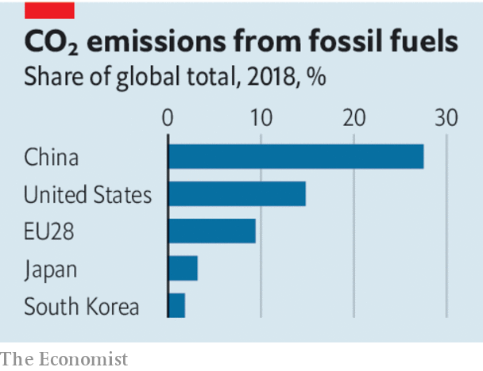

###### Green innovation

# Innovation is an essential part of dealing with climate change 

##### More is needed 

 

> Oct 31st 2020 

GOVERNMENTS ARE lining up to set new climate targets for the middle of the century. This week Japan said that it would eliminate all greenhouse gases (see ). In the past month or so China and South Korea have declared that their economies will be carbon-neutral, meaning that they will put no more carbon dioxide into the atmosphere than they take out. In March the European Union unveiled a “net-zero” plan of its own. Britain and France have enshrined their targets into law. A victory next week for Joe Biden could put America on a similar path.

Targets are easier set than met. Today around 85% of the world’s industrial energy comes from fossil fuels. Getting consumption to near zero will involve enormous economic shifts. It will require huge changes in how energy is generated and used. And it will also require a sustained barrage of innovations to improve how steel or cement are made, say, or how buildings are designed and managed.


The world’s green-innovation machine likes to make a big noise about its successes. The share prices of firms with climate-sustaining technologies have soared. Tesla’s value has reached $385bn, overtaking the combined total of the next three biggest carmakers. The value of BYD, a Chinese competitor, has more than tripled this year. This month NextEra, a clean-power utility, surpassed ExxonMobil to become America’s biggest energy firm. In the past four years venture-capital (VC) deals have more than doubled (see ).

 


Yet nowhere too little capital is being channelled into innovation. Spending on R&amp;D has three main sources: venture capital, governments and energy companies. Their combined annual investment into technology and innovative companies focused on the climate is over $80bn. For comparison, that is a bit more that twice the R&amp;D spending of a single tech firm, Amazon.

One of the world’s most pressing problems thus receives perhaps just 4% of the global total spent on R&amp;D. Governments are falling short of their targets. VC investment in green startups accounts for about a tenth of all VC investment and firms which sell goods or services that cut emissions made up just five of the top 100 firms in this year’s public-listing bonanza. The private sector’s record on climate innovation has been a hit-and-miss affair, at best. Having boomed in the mid-2000s, green VCs went bust a few years later.

What can be done? The first step is to think clearly about the division of labour between governments and the private sector. Governments need to get involved in several ways, because the market on its own will not do enough to bring about the shift from fossil fuels. It starts with the state funding not just basic research but also some development and the deployment of technologies. Some projects are too risky, too large, or both, to be countenanced by private investors on their own.

In practice that means the government should expect to foot some or all of the bill for new nuclear power plants, new charging grids for electric vehicles, or thorough investigations of new technologies such as geoengineering. Governments also need to enact policies that encourage greener consumption. Pricing carbon is an essential step, forcing firms, and ultimately consumers, to bear the cost of their emissions, and in turn leading investors to allocate capital more efficiently.

The good news is that governments may be at last changing their tune. Carbon taxes are spreading and will soon cover over a fifth of global emissions. A slice of the EU’s €750bn ($880bn) recovery plan is likely to be directed towards R&amp;D that is related to reducing greenhouse-gas emissions and their effects. If he is elected on November 3rd, Mr Biden plans to spend $300bn on R&amp;D over four years, with an emphasis on renewable-energy technology. At the moment, the federal government spends less than $7bn a year on such green R&amp;D.

The private sector still has a crucial role to play. Investors and entrepreneurs are best at commercialising new ideas, from efficient grids to hydrogen-powered forklift trucks. The public markets provide a vast source of capital for more mature firms, helping them scale up fast, as Tesla has demonstrated. Yet so far the asset-management industry has stuck to marketing its green credentials in superficial ways. In the latest quarter the net inflows of cash into “sustainable” funds, which often track the shares of big firms that have little effect on climate change, were twice the size of the annual investments into green VC.

More companies and billionaire-backed funds are eyeing up climate-friendly VC. But institutional investors, who have far larger sums to play with, need to embrace the opportunity, too. The forthcoming energy transition will be one of the biggest business opportunities of the next decades. Instead of piling into Tesla’s shares 17 years after the company was founded, investors should be striving to find the next superstar.■

For more coverage of climate change, register for The Climate Issue, our fortnightly , or visit our 

