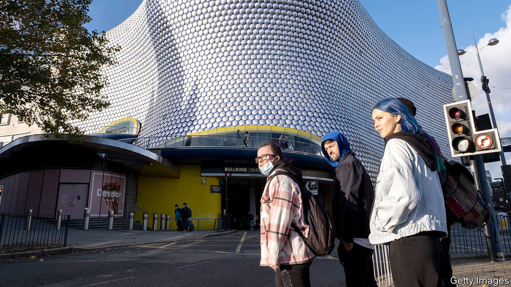
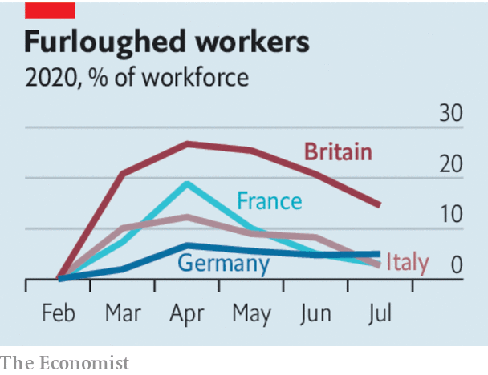

###### The zombification of Britain

# Why Rishi got it wrong 

##### Britain’s chancellor should not have extended the furlough scheme 

 

> Oct 29th 2020 

IMAGINE IF, 20 YEARS ago, the British government had vowed to protect every job in the country. Today an extra 30,000 Britons would be working as high-street travel agents, 30,000 or so would earn their crust by repairing fax machines, and 40,000 would still be stacking shelves and ringing the tills in Woolworths, a chain of stores that went bust in 2009.

Allowing obsolete jobs to wither and new ones to blossom is one of the main ways in which capitalist economies get richer and more productive. Governments interfere with this process of creative destruction at their peril. That is why the direction that Britain is taking in its efforts to mitigate the economic effects of the pandemic is so mistaken.


Since March Britain has been shielding workers and their families from the ruinous effects of the pandemic primarily through its furlough scheme, which pays 80% of workers’ salaries. Britain’s approach is similar to that of other European countries, but its scheme is more generous than those elsewhere. In the deepest days of lockdown, close to 10m workers—a third of the labour force—were benefiting from it. More than twice as many Britons remain furloughed as Italians, Germans or French.

Until recently Rishi Sunak, the chancellor of the exchequer, had been planning to introduce a stripped-down replacement for his furlough scheme. But at the last minute, as it became clear that infection rates are rising alarmingly fast across large parts of the country, the chancellor changed his mind and opted instead to continue with an adjusted scheme that is due to start on November 1st and is almost as generous.

 


Under the new rules, workers need put in only 20% of their normal scheduled hours, and the government will cover half their normal pay. For companies that have been forced to close by government restrictions, the scheme will pay two-thirds of workers’ salaries.

Politically, Mr Sunak’s move is shrewd. The opposition Labour Party can hardly criticise a policy that it itself had called for. And by making it easier for bosses to keep workers on the books, Britain will for the time being sweep the pent-up rise in unemployment under the carpet. That, in turn, will blunt the criticism coming from those on the right wing of Mr Sunak’s Conservative Party, who worry that restrictions on movement and socialising are strangling the economy.

But the about-turn makes it more likely that the government will protect jobs for which there is no demand. The economy is changing fast. Fewer sandwich-sellers will be needed in city centres in future, since more people will work from home. The growth of online shopping, and the decline of the bricks-and-mortar sort, has accelerated. At least 1m jobs supported by the new furlough scheme, representing about 3% of the workforce, are unlikely to survive in the long run.

The cost of supporting these jobs, which is probably around £1bn a month, is a problem in itself. But in a world in which the budget deficit is that size every day it is a minor one. What is more worrying is the likelihood that the government is retarding economic recovery by discouraging the reallocation of workers from dying industries to growing ones. It is leaving the country stuck with the post-pandemic equivalent of fax-repairmen and Woolies’ sales staff.

America is doing better. Across the Atlantic, politicians have focused less on preserving jobs than on preserving incomes, posting stimulus cheques to households and temporarily bumping up unemployment-insurance payments (these have since lapsed, but after the election Congress will probably decide to reintroduce them). Earlier this year, government top-ups were worth $600 a week, so generous that seven out of ten unemployed Americans earned more from benefits than they had done when they were still in work.

This largesse has given people the financial security to experiment with new ways of earning money. As the economy has reopened, America has seen an explosion of small-business creation, with laid-off workers finding gaps in the market. Europe’s economic recovery is weaker than America’s, and Britain lags still further behind. The furlough scheme, which encourages workers to cling to old jobs rather than looking for new ones, is almost certainly part of the reason.

It is not too late to change course. The government should wind down the furlough scheme, as it had planned to, and follow the American example. It should not just cancel a planned reduction in the value of universal credit, but sharply increase its value, so as to ensure that workers whose jobs disappear earn the same as those who stay on furlough. If so, they would get 85% of their previous earnings in benefits, up from 55% at present. That would allow the necessary reallocation of resources without forcing people into penury.

Build it to last

In the spring, when it was still unclear how long the pandemic would last, Britain was right to try to hold the economy in suspended animation. Now that the world knows the impact of covid-19 will be deep and enduring, the task for politicians is to protect workers, and leave the market to work its magic. ■

Editor’s note: Some of our covid-19 coverage is free for readers of The Economist Today, our daily . For more stories and our pandemic tracker, see our 

