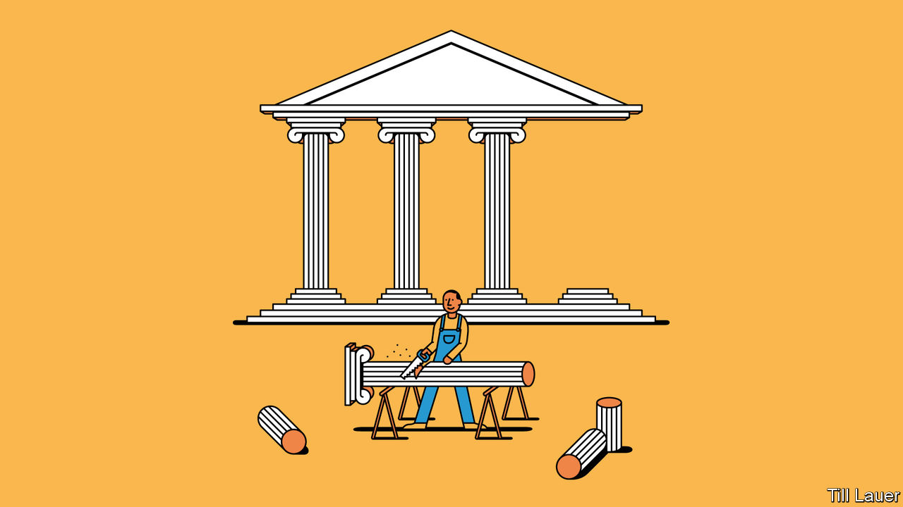
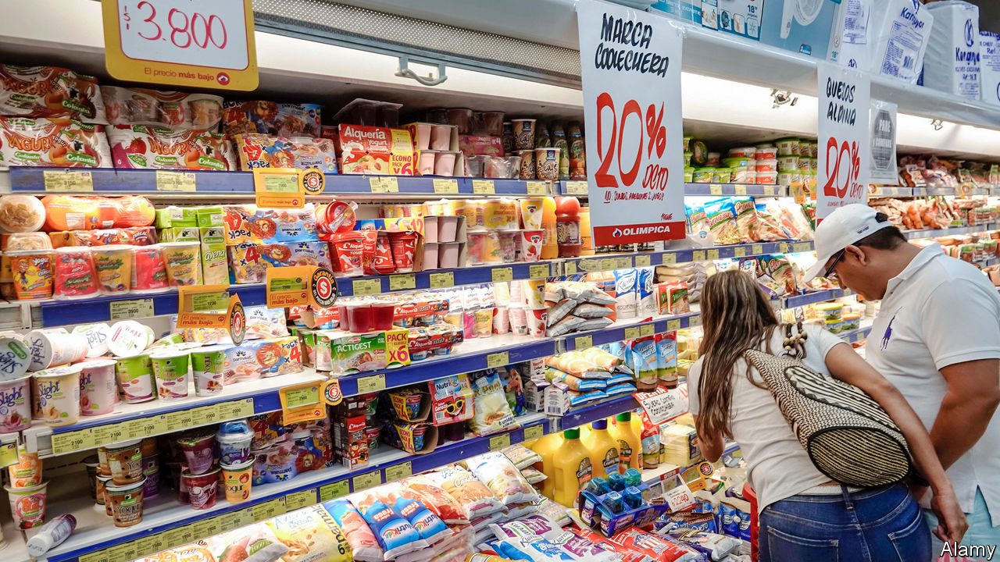
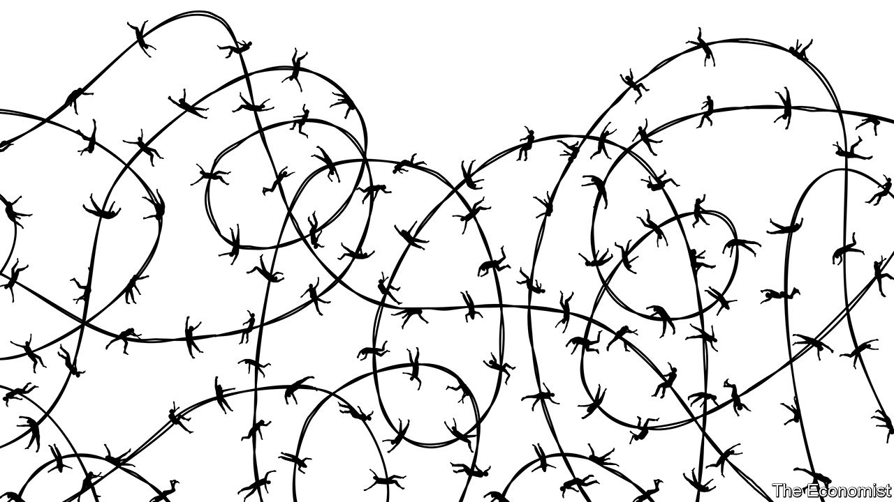
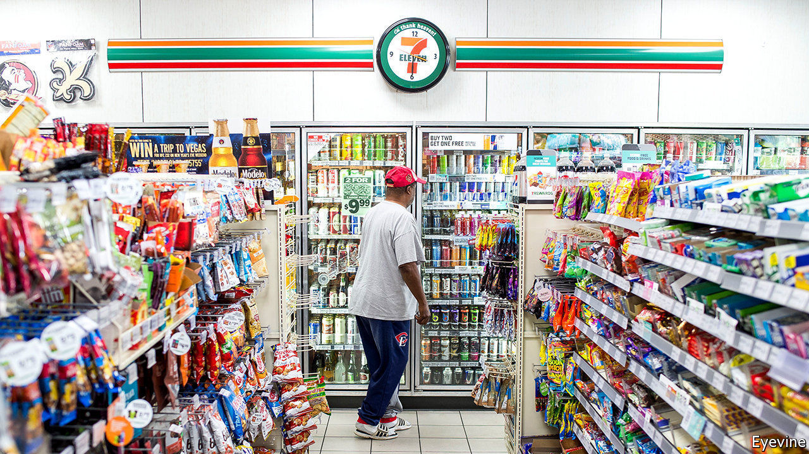

###### On Indonesia, Colombia, human rights, Nagorno-Karabakh, CEOs, the Arctic, beer

# Letters to the editor 

##### A selection of correspondence 

> Oct 31st 2020 


 


Indonesia’s politics

It is said that Javanese dynasties rarely last 100 years. This must have been on the mind of President Joko Widodo, or Jokowi, when, as Banyan described, he pandered to the country’s elite to form a grand coalition to govern an unruly country (). In such a fractured country as Indonesia, leaders must contend with entrenched power bases, then cultivate patronage networks of their own if they are to govern at all.


Aspiring reformers who do not play by these rules risk following in the footsteps of Abdurrahman Wahid, toppled as president by a hostile parliament, or of Jokowi’s erstwhile ally, Basuki Tjahaja Purnama (“Ahok”), jailed under a dubious and politically charged sentence for blasphemy. Disgraced reformers are hardly useful to their constituents. Courting the opposition allowed Jokowi to defang the Islamists without jailing anyone, making his job slightly more manageable. Moreover, his economic programmes are not anti-democratic in their own right; they are in line with his campaign promise, which is what the people voted for.

In a region where aspiring despots eliminate term limits or imprison critics, it is rather disingenuous to say that Indonesia is sliding back into authoritarianism. After all, the country is a flawed democracy at best. It is simply remaining one. These point not to Jokowi’s contradictions, but to Indonesia’s.

ELANG ADHYAKSAJakarta

 


A tax burden on the poor

Even though Colombia’s value-added tax (VAT) rate has increased over the years, the share of taxes to GDP has stayed about the same, even falling slightly under Alberto Carrasquilla, the finance minister (, October 17th). The reason the list of exempt items is so long is that this is seen as the best way to reduce the impact of the tax on the poorest people (though salmon, for example, is classified as a basic staple). In reality, the payment of VAT does not reach much beyond commerce; the government has not even been able to implement the tax electronically.

The real issue in Colombia is that taxes, especially direct taxes like income tax, are not levied on the richest portions of society and the solution has been to try to increase the number of people, namely the poorest, who pay VAT.

CAMILO BLANCOFormer economic adviser to the Colombian congressBogotá

 


Wither human rights

Sadly, your assertion that human rights are universal feels more like wishful thinking than proven fact (“”, October 17th). Certainly there is lots of international human-rights machinery, established at the high point of Western power. But all recent studies show that its grip is weakening. On a huge range of core issues—the death penalty, treatment of gays and women, protection for religious and other minorities, democracy, freedom of speech—the nations of the world are making their own, often illiberal, choices whatever the West may think.

Your demand that the West act against Chinese persecution in Xinjiang spotlights the policy dilemma this poses. The Western view that it has the moral right to interfere in other countries’ often deplorable human-rights practices is running out of political road. Such action is becoming counterproductive (Turkey, Russia, India) even when it is not glaringly inconsistent (Saudi Arabia, Egypt) or simply disastrous (Iraq, Libya, Syria). China is the perfect case in point. We could easily turn a confrontation that at the moment is principally about such issues as trade and technology into something much less negotiable, and so more dangerous, about ideology.

Back in 1648 the powers of the day laid the basis for 250 years of carefully constrained competition by adopting the Westphalian principle under which countries did not interfere in each others’ internal affairs. It wasn’t perfect. But its collapse at the start of the 20th century gave us two catastrophic world wars and 40 precarious years on the nuclear tightrope. Perhaps we should revive it.

TONY BRENTONCambridge

Nagorno-Karabakh

Thank you for drawing attention to the situation around the Armenia-Azerbaijan Nagorno-Karabakh conflict in “” (October 10th). However, Nagorno-Karabakh is not a disputed territory. It is an integral part of Azerbaijan, together with seven adjacent regions, occupied and ethnically cleansed by Armenia. Various UN Security Council resolutions demand the immediate, unconditional and complete withdrawal of Armenian occupying forces from the territories of Azerbaijan. The map in your article is falsified. The real map of Azerbaijan, showing Nagorno-Karabakh within its internationally recognised borders, can be found on the website of the UN’s cartographic department.

We categorically reject the allegations on the use of Syrian mercenaries. Azerbaijan’s armed forces are ranked 64 according to Global Firepower in terms of military strength and are perfectly capable of providing every protection Azerbaijan needs. Armenia, however, is ranked 111.

We have had no problem rallying our people. On July 15th, amid yet another Armenian aggression against Azerbaijan along the international border, an estimated 30,000 people gathered in Baku’s Azadliq Square demanding mobilisation and war to bring an end to the occupation of Azerbaijan’s territories. The international community should not expect to resolve this conflict by simply calling for a ceasefire, unless it addresses that occupation, and upholds international law.

TAHIR TAGHIZADEAmbassador of AzerbaijanLondon

Clear the decks* Buttonwood’s keen observations on successful endowment investing () bring to mind claims of a long-standing Yale Endowment Investment Committee Chair, with whom I worked for many years. He would jokingly state that his most important task in the role was to keep the other members of the committee out of the way of the chief investment officer, David Swensen. Except he wasn’t joking.

JOHN WEBSTERWootton-by-Woodstock, Oxfordshire

 


Where the land runs out

“”, (October 3rd) alas promulgated a challengeable superlative in citing a description of Moffen Island, off Spitsbergen, as being “the last spot before the North Pole”. In so far as the Svalbard archipelago is concerned, that claim more assuredly goes to the island of Rossoya, which lies within a small cluster of seven islands (Sjuoyane) that constitute part of the Nordaust Svalbard nature reserve.

It was among these rocky outcrops that the Royal Navy’s first attempt at reaching the North Pole became beset in ice in 1773. And it was within hailing distance of the four-man party of the British Trans Arctic Expedition that made landfall in 1969 to complete the first crossing of the surface of the Arctic Ocean from the northernmost point of contiguous land in the New World (Point Barrow, Alaska) to the northernmost land of the Old World (the Sjuoyane Islands).

KEN HEDGESSole surviving member of the four-man crossing party of the British Trans Arctic ExpeditionBarrie, Canada

 


The beer necessities of life

Milk, beer and sweets were listed as “basic necessities” supplied by corner shops, which are thriving during the pandemic (“”, October 17th). Two of the three can hardly be considered necessities. Sweets are bad for you, and many people live perfectly happily without drinking milk.

COLIN MILLSBasel, Switzerland

* Letters appear online only

