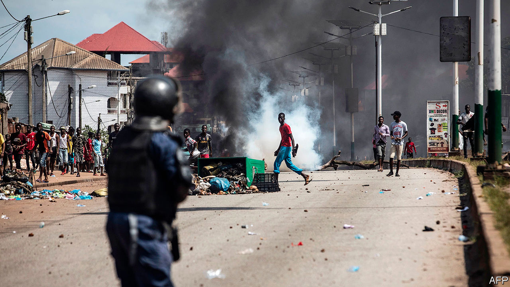

###### Ballots and bloodshed

# A disputed election leads to violence in Guinea 

##### The president, Alpha Condé, has won a third term—but he has little to celebrate 

 

> Oct 31st 2020 

“LONG LIVE democracy, long live peace,” said Kabinet Cissé, the head of Guinea’s electoral commission, as he announced on October 24th that Alpha Condé had won a third term as president. But on the streets of Conakry, the capital, there was little sign of peace—perhaps owing to a lack of democracy. Wounded protesters lay next to charred vehicles. A fleet of police trucks surrounded the house of Mr Condé’s rival, Cellou Dalein Diallo, who was trapped inside for over a week after the vote on October 18th.

This is a crisis many saw coming. In March the 82-year-old Mr Condé, who has ruled for almost a decade, pushed through a new constitution that allowed him to run for two more six-year terms. Dozens of people were killed by security forces during protests about a referendum on the changes. Guineans harbour other grievances, too. Most of the country’s 13m people are poor, despite the presence there of the world’s largest reserves of bauxite, from which aluminium is refined.


The election pitted Mr Condé against Mr Diallo for the third time. Both draw support from their ethnic groups; Mr Condé is Mandinka, Mr Diallo is Fulani. The voting itself was relatively calm. The trouble started the next day, after Mr Diallo claimed victory, citing photos his party had apparently taken of results posted outside polling stations. When his supporters began celebrating in the streets, the authorities cracked down. Soon the parties became protests and the government sent in the army.

The state admits that 21 people died in the days after the vote (including members of the security forces, it says). The opposition claims at least 30 people, including children, have been killed. More than 100 have gunshot wounds. They were not just struck by stray bullets, says Ilaria Allegrozzi of Human Rights Watch, an advocacy group: “Some of them were clearly targeted.” As information trickles in from outside the capital, the death toll could rise.

Fatou Bensouda, the chief prosecutor of the International Criminal Court (ICC), says those perpetrating or inciting violence are “liable to prosecution either by the Guinean courts or the ICC”. But that seems unlikely. For decades Guinea’s security forces have killed with impunity. As the electoral commission prepared to announce the results, the internet was shut down and international phone calls cut off.

It is difficult to say who really won the election. Officially, Mr Condé gained 59% of the vote. But four electoral commissioners (affiliated with the opposition) released a report detailing “serious anomalies”. In one of Mr Condé’s strongholds turnout was listed at over 100%, they say. Elsewhere votes were not counted because of alleged irregularities. The European Union also questioned the result. Mr Diallo claims there has been “massive fraud”. He says he will take his case to the constitutional court, though he doubts its independence.

A delegation from the United Nations, ECOWAS (a regional bloc) and the African Union arrived in Guinea on October 25th hoping to mediate a solution to the crisis. But they lack credibility. ECOWAS said little when Mr Condé changed the constitution, and called the election lawful. “I do not expect much from these emissaries who, in reality, have always sided with Alpha Condé,” tweeted Mr Diallo, after meeting the delegation. “Let us continue our mobilisation in the streets...NO RETREAT!”

As The Economist went to press, things had calmed down—but they could easily heat up again. Guinea has a history of ethnic trouble. Last week in Conakry a man was stoned to death by Condé-supporting youths, says Amnesty International, a watchdog. His apparent crime was being of the wrong ethnicity in a government stronghold. Outside the capital there are reports of score-settling along ethnic lines.

A deal that might keep things calm looks remote—and “will not be enough to prevent another violent political crisis in the years to come”, says Gilles Yabi of the West Africa Think Tank in Senegal. If Mr Condé had just respected the constitution, democracy might have taken root. His decision to run again, says Mr Yabi, may have set the country back decades. ■

