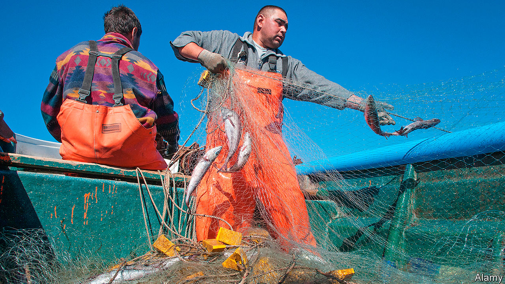

###### Fishing

# Stopping some fishing would increase overall catches 

##### You can have your hake and eat it 

 

> Oct 31st 2020 

IN 2018, THE most recent year for which relevant data are available, people consumed more fish than they did either pork or beef or poultry. Humanity’s appetite for the sea’s bounty has more than doubled since 1990. Fish, whether wild caught or farmed, now make up nearly a fifth of the animal protein that human beings eat.

In this context, running the world’s fisheries efficiently might seem a sensible idea. In practice, that rarely happens. Even well-governed coastal countries often pander to their fishing lobbies by setting quotas which give little respite to battered piscine populations. Those with weak or corrupt governments may not even bother with this. Deals abound that permit outsiders legal but often badly monitored access to such countries’ waters. And many rogue vessels simply enter other people’s fishing grounds and steal their contents.


The demand side of the equation, then, has many problems. But there may be a way to improve the supply side: increase the area where fishing is forbidden altogether.

This paradoxical approach, which involves the creation of so-called marine protected areas (MPAs), has already been demonstrated on several occasions to work locally. Valuable fish stocks off Apo island in the Philippines increased significantly after a no-take reserve was created in 1982, and similar results have been forthcoming off the coasts of Florida, South Africa and St Lucia. Extrapolating from these examples, Reniel Cabral of the University of California, Santa Barbara and his colleagues have, as they describe in the Proceedings of the National Academy of Sciences, built a model which explores the idea of extending MPAs elsewhere. If the right extensions are picked, their model suggests, designating a mere 5% more of the world’s oceans as MPAs—which would triple the area protected—could increase the future global catch of the 811 species they looked at by more than 20%. That corresponds to an extra 10m tonnes of food a year.

The idea that restricting fishing would permit more fish to be caught may seem counterintuitive, but the logic is simple. Fish in MPAs can grow larger than those at constant risk of being pulled from the ocean. Larger fish produce more eggs. More eggs mean more fry. Many of these youngsters then grow up and move out of the safe zone, thus becoming available to catch in adjoining areas where fishing is permitted.

Dr Cabral and his team based their calculations on data they compiled for 1,338 stocks of fish and marine invertebrates. For each they mapped the geographical range, mobility and population growth of the local species, and assessed the sustainability of present-day fishing levels. That let them create a model of the ocean from which the impact of changes in fishable area could be assessed. Working at a fairly coarse resolution—each pixel corresponding to a square of ocean 55km across—they discovered that a small, well-aimed increase in the size of MPAs brought substantial benefit.

Less is more

Though MPAs work their magic on all sorts of fishing grounds, Dr Cabral’s model suggests they are especially beneficial for the worst-managed areas, most of which are tropical—and in particular for overfished species such as Atlantic horse mackerels, Japanese anchovies and Argentine hake (the catch pictured on the previous page).

They also have the virtue of simplicity. The setting of quotas is open to pressure to overestimate of how many fish can safely be caught. And different species need different arrangements, making management harder. The breeding habits of the fish concerned must be monitored, and good estimates made of their numbers. This is difficult enough for countries with well-developed fisheries-research establishments. For those without such it is little more than guesswork. And the problem is made yet more complicated by the fact that tropical ecosystems are more speciose and thus harder to understand and manage than those in temperate climes.

Setting the rules for an MPA is, by contrast, easy. You stick up a metaphorical sign that says, “No fishing”. Knowing who is breaking the rules is easy, too. If your gear is in the water, you are fishing illegally.

There are, Dr Cabral and his team readily admit, limitations to their model. Not all fish stocks are equally well recorded, meaning many pertinent species escaped the analysis. Including these would more than double the underlying tonnage of catch being looked at, and might reasonably be presumed to add to the increase in yield that the model already predicts. Also, though good data exist about the movement of fish around the world’s oceans, where they spawn is less well understood. As spawning grounds are prime sites for MPAs, this uncertainty muddies the waters.

The researchers’ hope, though, is that—perhaps inspired by this study—some governments will now think it worthwhile to conduct more detailed investigations of their own. If a bit more protection results in a lot more fish, everybody wins.■

