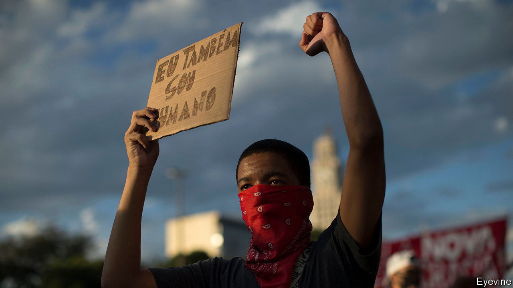

###### Each race, a new race

# Thousands of Brazilian politicians are changing racial identities 

##### Some candidates do so more than once 

 

> Oct 29th 2020 

BRAZILIAN POLITICIANS hop like frogs among more than 30 political parties. Like chameleons, some change their skin colour, too. More than 42,000 candidates in local elections scheduled for November 15th are running as members of a different race from the one they declared in 2016. Thirty-six per cent changed from white to brown (pardo, mixed-race, usually with black ancestry); 30% from brown to white; and 22% from brown to black (preto) or vice versa. Fewer switched from white to black, black to white, or to or from the less-common categories of indigenous and Asian (amarelo). Aloisio Gama, a candidate for city council in Guarulhos, in São Paulo state, ran as white in an election in 2014, black in 2016 and brown in 2018. This year, he is running as indigenous.

Racial categories are fluid in Brazil. It was the last country in the Americas to abolish slavery (in 1888), but did not pass segregation laws or bar interracial marriage. Today, a third of unions are across racial lines. Many Brazilians like to think their country is a “racial democracy”, where discrimination is rare. Yet stark disparities persist. Non-whites earn less. They are more likely to be shot by police and less likely to win elections. Nearly half of candidates in national polls in 2018 were black or brown, but they won just 18% of seats. 


To close the gap, the Supreme Court ruled last month that parties must award public campaign funding and airtime to black and brown candidates. If 30% of a party’s candidates are black or brown, that share of spending must go to their campaigns. Some crossovers might covet this cash. “Many people who are socially white become pardo when it’s politically advantageous,” says Márcio André dos Santos, a political scientist at Unilab, a university in the north-east. But there are other reasons. 

Comparing statewide elections in 2014 with local ones in 2016, Andrew Januscz of the University of Florida found that candidates’ racial changes reflected shifts in their constituencies. Candidates competing in a municipality that is darker than their state were more likely to change from white to black or brown. In whiter municipalities they tended to choose a lighter category. This may explain why nearly a third of this year’s repeat contenders changed to white, despite the possible financial boost to black and brown candidates.

Race-shifting politicians are also responding to the temper of the times. The number of people declaring themselves black or brown in surveys by the government has recently risen much faster than the population. This suggests that millions of Brazilians, including politicians, are changing how they see themselves. Decades of anti-racism campaigning and, more recently, affirmative-action policies helped bring that about.

They brought new challenges. University quotas for brown, black and indigenous students led to arguments. Students reported each other for feigning blackness. Expulsions followed, and some admissions panels started judging applicants on physical features like nose-width and hair type—a method uncomfortably similar to the old South African “pencil test”. (If a pencil placed in your hair stayed there, apartheid officials deemed you black.)

Politicians who change their racial self-description are also facing scrutiny. Some blame paperwork errors. Rodrigo Maia, the speaker of the lower house of Congress, said he didn’t intend to change his race from white to pardo in 2018. Caio Miranda, who is running for re-election as a São Paulo city councilman, says his party listed him as white by mistake in 2016. His grandfather was part-black, and he has come to see himself as non-white. When he ran for congress in 2018, he called himself pardo. The battering he has taken on social media is unfair, he says. He is not taking money from the public fund, and so does not benefit from the Supreme Court’s judgment. “No one has the right to decide who is white and who isn’t,” he says.

Civil-rights activists support the new campaign-financing rules. This year, for the first time since electoral authorities began asking about race in 2014, there are more black and brown candidates than white ones. But the policy may have unintended consequences. One risk is fraud. Another is that a party could spend all the money reserved for non-white candidates on a single person. It could skirt the rule by having no black or brown candidates. The rule is well intended, but may not level the playing field, says Bruno Carazza, the author of a book about campaign finance. 

He thinks parties should have to spend a minimum amount on all candidates. That would irk incumbents. Mr Miranda advocates excluding pardos from racial preferences, though many consider themselves to be negro, an unofficial classification whose meaning is akin to “black” as the word is used in the United States. Luiz Augusto Campos, of the State University of Rio de Janeiro, thinks that candidates’ adverts should reveal whether they benefit from race-based funding. Whether a politician is “Afro-convenient” can be hard to determine, he says. “Let the voters decide.”■

