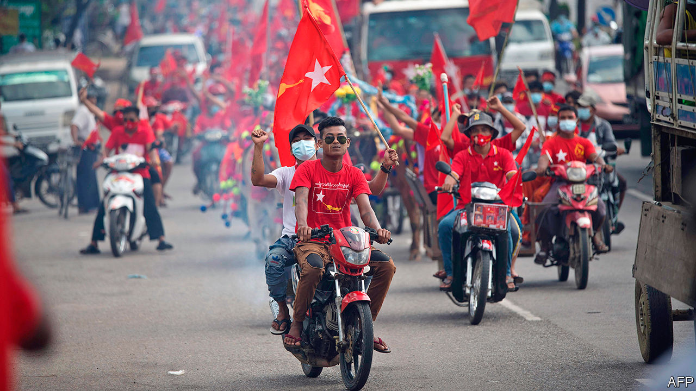
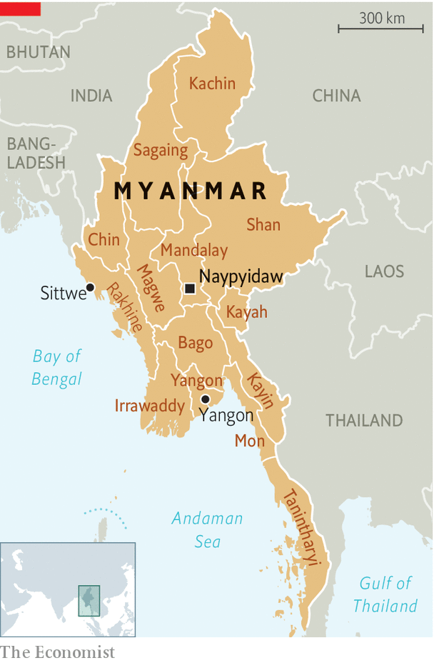
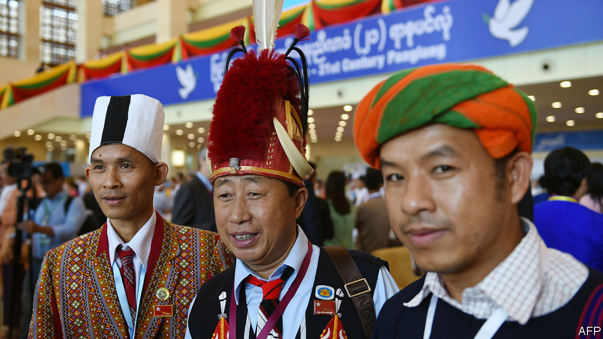

###### False start

# Aung San Suu Kyi was supposed to set Burmese democracy free 

##### Instead she has clipped its wings 

 

> Nov 7th 2020 

THE MEMORY of Myanmar’s most recent election, in 2015, still cheers Kyaw Zayya. Even if he had not been covering the results as a journalist, he would have gone to the headquarters of the National League for Democracy (NLD), which swept the polls, to celebrate the end of more than 50 years of military rule. Like so many of his fellow citizens, he placed his hopes in Aung San Suu Kyi, the long-persecuted leader of the NLD, who promised to bring peace, prosperity and democracy. “We had been suffering for decades under the military regime, so we were eager to see changes,” he says. “I was very delighted.”

On November 8th Myanmar will vote again. This time Mr Kyaw Zayya will not be taking part. He belongs to a small but growing number of Burmese who have decided to abstain because they are bitterly disappointed with the NLD. He is outraged that the commission administering the election, which is appointed by the government, has cancelled the vote in parts of the country that it says are too dangerous. In fact, not all the areas in question are plagued by violence. And the cancellation disproportionately affects ethnic minorities, many of whom are unlikely to vote for the NLD. Some 1.5m voters have been disenfranchised, out of a voting-age population of roughly 35m, although the commission has reinstated polling in a few spots.


The “no-voters” join a swelling chorus of discontent. It includes activists and journalists hounded by the authorities, ethnic minorities brutalised by decades of violent conflict and workers left behind by rapid but uneven economic growth. Then there are the Rohingyas, a persecuted Muslim minority who have been ghettoised in squalid refugee camps on either side of Myanmar’s border with Bangladesh after a series of pogroms led or cheered on by the army. The majority of Burmese still revere “Mother Suu” and will probably return her to power. But neither she nor the NLD have proved the champions of liberal ideals that many imagined them to be. In the eyes of a growing number of Burmese, Ms Suu Kyi, having kindled the flame of democracy, is now smothering it.

The wild hopes borne aloft by Ms Suu Kyi’s victory were always bound to collide with gunmetal reality. For one thing, Ms Suu Kyi presides over a system designed by the generals towards the end of their half-century in power, which preserves a big and inviolable role for them in government—what they call “discipline-flourishing democracy”. The constitution gives them control over their own affairs, as well as the right to appoint the ministers of defence, the interior and borders. A quarter of the seats in the national and regional parliaments are reserved for members of the Tatmadaw, as the armed forces are known. It also controls a majority of seats on the National Defence and Security Council, which can declare an emergency. Ms Suu Kyi has no control over the Tatmadaw and, in particular, cannot force it to cease hostilities against the various ethnic insurgencies that have long racked the country.

Ms Suu Kyi naturally wants to release her government from these manacles. In March the NLD put forward several constitutional amendments, among them one that would gradually reduce the number of seats in parliament reserved for military appointees. But the generals had foreseen such a move. Constitutional amendments need the support of more than three-quarters of MPs. With a quarter of the seats, the Tatmadaw can block any it does not like—and so it did.

Within these restrictions, Ms Suu Kyi has tried to nibble away at the Tatmadaw’s authority. She has given the previously meek anti-corruption commission some teeth and repealed a few repressive laws. She has refused to convene the security council. She has also taken the power to appoint bureaucrats in the national and local governments away from the Ministry of the Interior.

Nonetheless, the only institution capable of returning the army to the barracks is the army itself, and it will not do so until it is convinced that the civilian government is both capable of governing and committed to protecting the Tatmadaw, writes Andrew Selth of Griffith University in Australia. “Discipline-flourishing democracy is the only game in town,” says Ian Holliday of the University of Hong Kong.

But even in areas where Ms Suu Kyi has unfettered authority, she is no liberal. Take the NLD. She runs it like the Tatmadaw ran the country: with an iron fist. “There is no democracy in the party,” says Thet Thet Khine. She should know: a member of the NLD for seven years, she was sacked from the executive committee in 2018 for publicly criticising government policy. (She later quit the party to form one of her own, which is contesting the election.) Ms Suu Kyi does not delegate and is not cultivating a fresh crop of leaders, even though she is 75 and has no clear successor.

Ms Suu Kyi’s authoritarian streak extends to the government’s relations with civil society. It has repeatedly attempted to muzzle its critics in court. In 2017 two Reuters journalists, investigating violence against the Rohingyas, were sentenced to seven years in jail for breaking a colonial-era national-security law. According to Athan, a local watchdog, the government has filed 251 suits against its critics, twice as many as under the previous army-backed government. The NLD’s spokesman, Monywa Aung Shin, points out that many of these cases were initiated by army-run ministries. Yet the NLD has sued critics of Ms Suu Kyi, and could easily repeal the laws used to silence journalists and activists if it so pleased.

The government’s litigiousness has had a chilling effect. The press is less free now than it was during the final years of military rule, says Zeya Thu, the editor of The Voice Journal. “We are scared,” says Saw Alex Htoo, an activist.

Ms Suu Kyi is also not proving the ally many minorities hoped. She spent years working with political parties that champion assorted ethnic groups as they struggled against their common enemy, the Tatmadaw. She promised to defend their rights and to broker an end to the many small wars that have raged around the periphery of the country, in areas inhabited mainly by ethnic minorities. To that end, she has held several inconclusive peace conferences.

 


But Ms Suu Kyi does not have “any clear vision” of what a less centralised, federal state might look like, argues Hla Myint of the Arakan League for Democracy (ALD), which advocates for Rakhines, an ethnic group from the state of the same name (see map). During the NLD’s failed attempt to amend the constitution, ethnically based political parties recommended more than 3,000 changes, many of them related to devolution. The NLD did not endorse a single one. And just like the military-backed government that preceded it, the NLD appointed one of its own as the chief minister of Rakhine state, even though the Arakan National Party (ANP), another Rakhine party, won a majority in the state election in 2015. “We don’t see any difference so far between the previous and current government when it comes to their style of governing our Rakhine state,” says Hnin Yu She of the ALD, which split from the ANP in 2017.

Ethnic minorities are also upset because the peace process is flagging. Fighting between the Tatmadaw and the Arakan Army (AA), a Rakhine guerrilla outfit, has escalated dramatically since 2019, to become the most serious conflict in the country in decades. Fighting also smoulders in Kachin and Shan states. Ms Suu Kyi is not primarily responsible, in that she cannot control the army. But she stood mutely by when it ruled out the prospect of negotiations by declaring the AA a terrorist group in March and when it excluded it from its covid-19 ceasefire. She seems not to wish to broaden her dispute with the Tatmadaw by questioning its handling of insurgencies.

In 2013, when she met Ben Rhodes, an adviser to Barack Obama, he underscored the importance of ending the country’s many conflicts and evinced concern about Rohingyas. He says she replied, “We will get to those things. But first must come constitutional reform”—for which she needs the acquiescence of the army. “The NLD’s first priority”, says Mr Saw Alex Htoo, the activist, is “to make peace with the military, not peace with the country”.

Minorities are losing faith not just in Ms Suu Kyi but in the political system itself. Aung Kaung Moe (not his real name) is a Rakhine student activist who was recently jailed for protesting against an internet blackout in the state. Your correspondent asks if he has ever considered going into politics. Yes, he says, often. But sometimes he wonders if he would not be better off throwing in his lot with the Arakan Army. Ethnic parties’ success at the polls does not translate into real political power, he says: just look at how unfairly the NLD treated the ANP. By contrast, ethnic groups like the Wa who seize territory and successfully defend it are able to carve out autonomous enclaves. “In Myanmar, in the reality, [ethnic armed organisations] are more powerful than the ethnic electoral political parties,” says Mr Aung Kaung Moe. The AA, which is wildly popular among Rakhines, governs swathes of northern Rakhine state, he notes. Many young Rakhines have given up on the idea of a federal union. Now they dream of independence.

In the border regions, where most minorities live, Ms Suu Kyi has been knocked off her pedestal. In the heartland, where Bamars, the country’s biggest ethnic group, predominate, support for “Mother Suu” is strong. But even here, cracks have begun to appear. More than twice as many Burmese surveyed by the Asian Barometer Survey (ABS) last year prioritised the economy over democracy. At first glance, there is much for them to be cheerful about. Until covid-19 struck, growth had averaged 6.2% since 2015. The share of the population in poverty fell by half between 2005 and 2017. A middle class is emerging.

 


But growth is still slower than in the final days of the military regime (see chart). The IMF reckons that the economy is underperforming by a percentage point or two, owing to weak domestic demand and sagging foreign investment. Many Burmese have yet to see the prosperity that Ms Suu Kyi promised. One in four remained poor in 2017, according to the World Bank. The precariat is growing. Nearly half of those polled by the ABS last year were worried about losing their livelihood, more than twice as many as in 2015. Some 54% said they were unable to access basic services, such as water, public transport and health care, up from 48% five years ago. “Gains from the economic reforms and growth under the NLD government have yet to be widely perceived by ordinary citizens,” the authors of the survey wrote.

Part of the problem is the government’s lack of capacity. When the NLD took up residence in Naypyidaw, the army-built capital, Ms Suu Kyi stuffed the cabinet full of the party faithful—men (and they are all men) whose only qualification was their loyalty to her. Their ineptitude, combined with an inert bureaucracy staffed by ex-soldiers, left the government floundering and unable to achieve anything much.

Matters have improved somewhat as incompetent ministers have been replaced with technocrats. Yet the government still has few tools to help the poor, according to Gerard McCarthy of the National University of Singapore. It “inherited a really skeletal social safety net”, he says, and its capacity to improve matters is limited. Tax revenue has hovered at around 7% of GDP since 2016, less than half the average in South-East Asia. Myanmar’s covid-19 stimulus amounted to a miserly 3.4% of GDP, also far below the regional average.

 


The NLD discourages the poor from relying on the state, argues Mr McCarthy. For decades it has cleaved to the idea that people are morally obliged to help themselves and others through acts of charity, an ethic born of both Buddhism and necessity. During the austere years of army rule, political organisations were outlawed and there was no public safety net. People in need could turn only to charities. But this ideology is in growing conflict with the expectations of the public, a majority of whom believe that democracy should lead to better public services, according to the ABS.

Just five years after civilians took power, Burmese have muddled and ambivalent views about their hard-won political freedoms. Although 87% of those surveyed by ABS say that they support democracy, two-thirds believe it does not effectively promote economic growth or maintain order. People also harbour wistful thoughts about military rule. Nearly half support a role for the Tatmadaw in politics—up from 39% in 2015. Confusingly, 56% also back military rule, compared with 48% five years ago.

Younger, rural Bamars who care about the economy and security are more likely to admire the men in uniform. They are less likely “to remember the really bad times,” notes Bridget Welsh, one of the authors of the ABS report. What they do remember is that Thein Sein, an ex-general who began the process of opening up the country, was a better steward of the economy than Ms Suu Kyi. These Burmese believe that Muslims pose an existential threat to the country’s survival, and that the army is necessary to repel them and keep order in a fractious nation, says Mr Holliday. The surveys he conducted with Roman David, of Lingnan University in Hong Kong, suggest that a growing minority of the Burmese population do not see democracy and army rule as antithetical to each other, but as systems of governance that can co-exist. Ms Suu Kyi, in other words, is undermining her own legacy. ■

